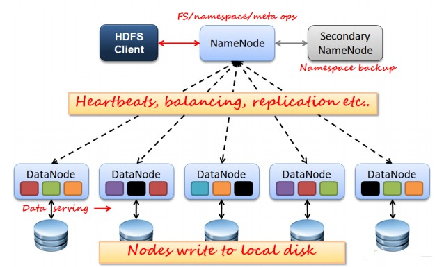
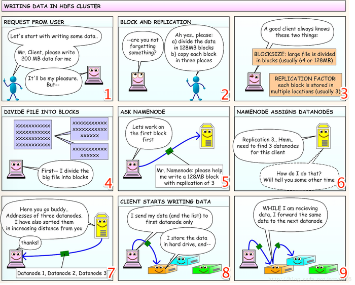
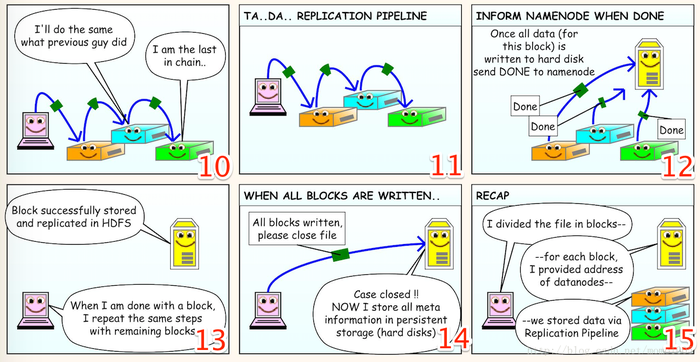
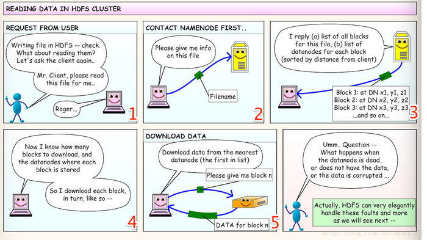
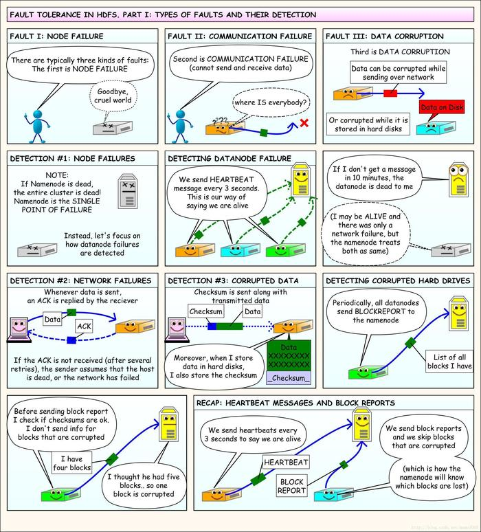
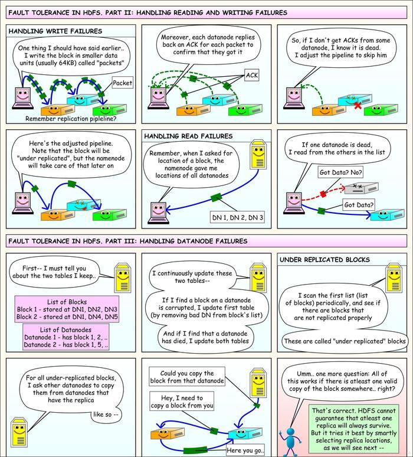
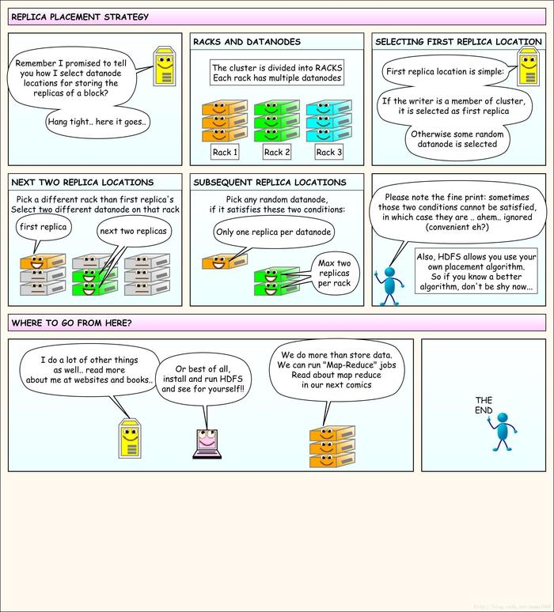

# HDFS相关概念及原理

HDFS 是 Hadoop Distributed File System 的缩写，是 Hadoop 使用的文件系统。

和我们 Windows 和 Linux  的操作系统一样，HDFS 也是我们用来存放文件和数据的系统，有着和Linux相似的目录结构，支持 `ls`、`mkdir`、`get`、`put`、`delete` 等命令。

HDFS 与一般操作系统的文件系统的不同之处是其存储文件的方式，它并不将所有文件存放在同一节点之上，而是将文件分成固定大小的块（`Block`，默认为 64M 或 128M ），并复制多份（默认的副本系数是 3 ），存放到不同的机器之上。

这样做的好处是如果一台机器宕机，我们还可以从其他的机器上获得相应文件的副本，保证了文件系统的高可用性，并且可以同时使用多台机器的存储空间，可以存放更多体积较大的文件。

下面我们要通过明确几个角色，并通过它们来了解HDFS运行的过程。

## 1. HDFS的三种节点

HDFS节点主要有三个角色：NameNode、SecondaryNameNode 以及 DataNode 。其关系如下图所示：

### 1.1 NameNode介绍

NameNode中存放的内容包括了文件的命名空间（namespace）、文件Block的映射关系等，NameNode内存中存储的是`fsimage`和`fsedit`。

> `fsimage`是元数据的镜像文件，包括文件系统的目录树。
>
> `fsedits`是针对文件系统操作的修改日志。

NameNode还负责文件副本策略的配置以及和客户端的交互，处理客户端的读写请求。

### 1.2 SecondaryNameNode介绍

SecondaryNameNode是NameNode的辅助，分担NameNode的工作，但不是一个热备份，也就是说，NameNode挂掉之后SecondaryNameNode不能马上替换NameNode提供服务。

每隔一定时间SecondaryNameNode会从NameNode那获取`fsimage`和`fsedits`，并进行合并，完成后推送给NameNode。可以辅助恢复NameNode。

### 1.3 DataNode介绍

DataNode根据NameNode的安排，存储客户端发送过来的Block。负责文件实际的读写。

### 1.4 Client客户端的工作

首先，文件分块的工作是由客户端完成的。

它与NameNode交互，得到文件的位置信息；与DataNode交互，从DataNode处读取或写入实际的数据。

## 2. HDFS文件读写

### 2.1 HDFS写流程

1. 客户端：用户首先将**分块大小**和**副本数量**告诉 Client ，Client 根据以上参数将文件进行相应的分割。（对应 1-4 图）
2. Client 首先发送第一个 Block 。Client 首先将分块大小和副本数量告诉 NameNode，NameNode 会从所有的 DataNode 中找出相应数量的 DataNode 组成一个有序的列表返回给 Client。（对应 5-7 图）
3. Client 将文件数据以及从 NameNode 处得到的列表发送给第一个 DataNode。 DataNode 会按照列表内容将文件继续传给下一个 DataNode。类似一个 PipeLine，每个 DataNode 接受到一点数据就把它存到自己的硬盘上，并将它传递给下一个 DataNode，直到最后一个 DataNode。**数据的发送会以更小的单位 packet 进行发送（大小为64K）**。
4. 当一个 Block 的数据已经完全写入到 DataNode 的硬盘上之后，就会给 NameNode 发送一个确认。当 NameNode 收到所有的 DataNode 的确认信号之后，向 Client 发送一个确认，Client 继续发送下一个 Block。
5. Client 发送完所有的 Block 之后，通知 NameNode，这时 Namenode 已经存储了文件的元数据，也就是文件被拆成了几块，复制了几份，每块分别存储在哪个 DataNode 上。

上述流程可以看下面的漫画：

### 2.2 HDFS读流程

1. 首先 Client 告诉 NameNode 希望读取的文件的文件名。
2. NameNode 会返回每个文件被拆成了多少个 Block，每个 Block 都在哪个 DataNode 上，并且这些 DataNode 也是根据距离排序好的。
3. Client 根据 NameNode 发回来的信息去相关的 DataNode 上去取相应的 Block，组成完整的文件。

### 2.3 错误处理

#### 2.3.1 节点故障

就是HDFS中的一个节点宕机引发的错误。

如果是 NameNode 发生了故障，那么 HDFS 则无法再对外提供服务，这是一个单点故障的问题。

而对于 DataNode 来说，每个 DataNode 每3秒就需要向 NameNode 发送一个心跳信号，如果 NameNode 在10秒内没有收到某一个 DataNode 发送来的心跳信号，则将这个 DataNode 标记为已经死亡。

#### 2.3.2 网络通信故障

这种情况也是可以检测出来的。

无论什么时候一个节点发送数据（ packet ），接受节点都需要回复一个 ACK，如果发送节点没有收到 ACK，那么就可以检测出网络故障的情况。

#### 2.3.3 通信或者磁盘存储造成的数据错误问题

每当数据发送的时候，都会在数据的后面加上一个 CheckSum，节点接收到数据之后会检查这个 CheckSum，在将数据存放进磁盘的时候也会将这个 CheckSum 存放到磁盘当中。

DataNode 会周期性的向 NameNode 发送 BlockReport 来报告当前节点中存放的节点的情况。而 DataNode 在发送这个报告前会先检查 CheckSum，如果一个 Block 未通过检查，那么 DataNode 就不会上报这个 Block 的信息，NameNode 就可以以此获得错误 Block 的相关信息。

以上三种错误可以看下面的漫画：

#### 2.3.4 节点挂掉的时候造成的读写问题

在写时，如果一个 DataNode 收到了 packet，那么它会向 Client 回复一个 ACK（注意这里是每个 packet 回复一个 ACK，而在前面写入过程中是每一个 Block 写完会发送一个 ACK 给 NameNode）。

如果写入的时候 Client 一直收不到其中某些 DataNode 的 ACK，Client 就会判断这个 DataNode 已经故障，而调整 Client 持有的 DataNode 列表，去除掉故障的节点。这个时候这个 Block 就会一直处于 `under replicated` 的状态，稍后 NameNode 会处理这个情况。

而如果在读的时候 DataNode 挂掉了，Client 直接向列表中的其他 DataNode 请求相应 Block 就可以了。

#### 2.3.5 NameNode 对节点故障的处理

首先我们要知道 NameNode 维护了两个列表： **Block 列表** 和 **DataNode 列表**。Block 列表中存放了每一个 Block 位于哪台 DataNode 上；DataNode 列表中存放了每个 DataNode 中的 Block 信息。

如果 NameNode 发现某个 DataNode 上的某个 Block 发生了错误（CheckSum 校验未通过），那么就会从 Block 列表中将这个 Block 项中对应的 DataNode 删掉。

如果 NameNode 发现某个 DataNode 故障了，那么就会直接将这个 DataNode 从 DataNode 列表中删掉。

如果发现某个 Block 处于 `under replicated` 状态的话，NameNode 就会通知另外一个 DataNode 从一个拥有这个 Block 的 DataNode 上获取这个 Block，完成这个复制的过程。

以上部分可以看下面的漫画：

### 2.4 备份规则

之前说 Client 向HDFS中写数据的时候 NameNode 会给其分配相应数量的 DataNode，并且会将这些 DataNode 按照距离的远近进行排序后发送给 Client。

那么这个分配的规则是怎样的呢？可以看下面的漫画：

# 参考博客

[1] [经典漫画讲解HDFS原理](https://blog.csdn.net/scdxmoe/article/details/50904881)

[2] [【Hadoop学习】HDFS基本原理](https://segmentfault.com/a/1190000011575458)

[3] [深入理解HDFS的架构和原理](https://blog.csdn.net/kezhong_wxl/article/details/76573901)
