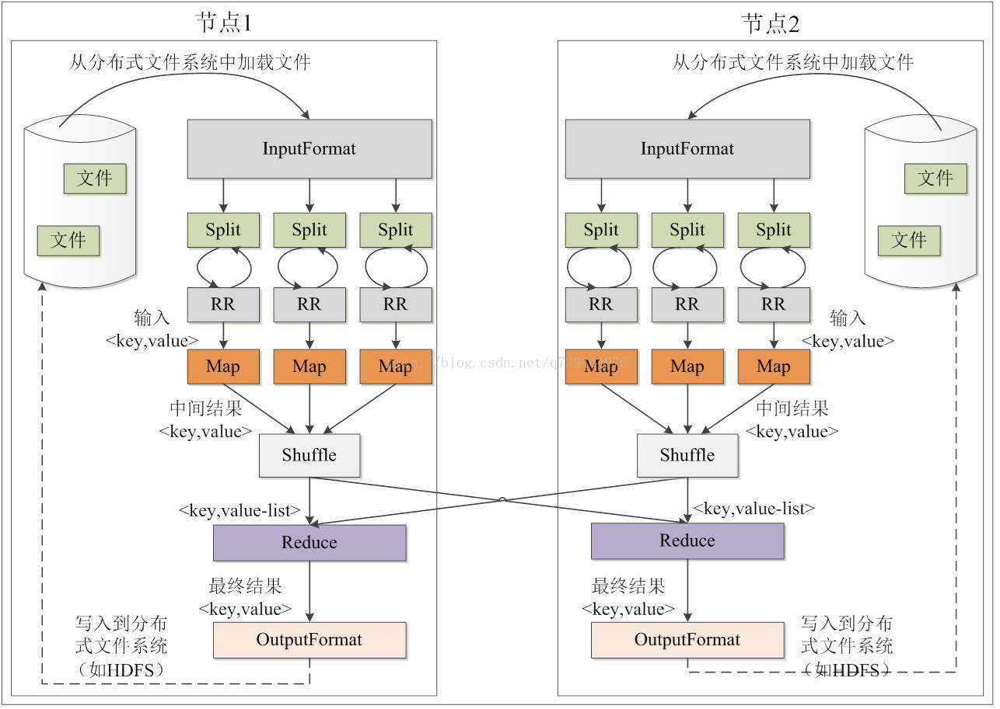
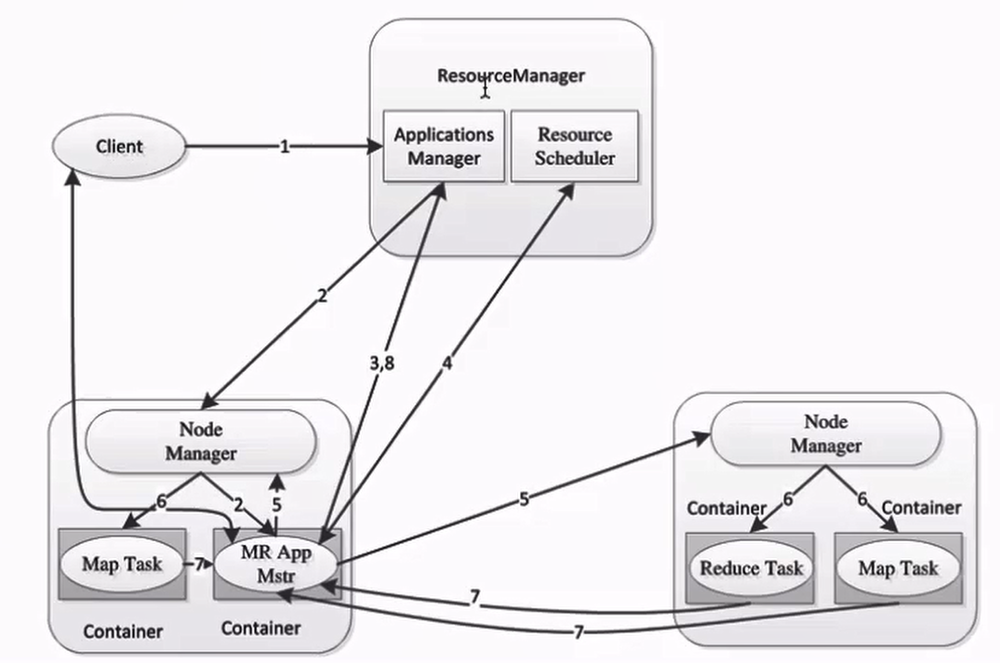

# 分布式计算框架 MapReduce 介绍

在之前的 YARN 的笔记中我们已经看到了，MapReduce 是一个运行在 YARN 上的分布式计算框架。

MapReduce 的核心思想就是把一个任务切分成多个子任务分别进行处理（这个就是 Map 过程），然后将每个子任务的输出进行合并，得出最后的结果（这个是 Reduce 过程）。Map 和 Reduce 之间还会有一个 Shuffle 的过程，将 Map 的输出整理为 Reduce 的输入。

## 1. MapReduce 的编程模型

MapReduce 的执行是建立在**键值对**之上的，一个 MapReduce 任务的数据流是这样的：

    (input) &lt;k1, v1> -> map -> &lt;k2, v2> -> combine -> &lt;k2, v2> -> reduce -> &lt;k3, v3> (output)

这个键值对也是有要求的，其中**键**和**值**都应该是**可序列化**的，需要实现承 `org.apache.hadoop.io.Writable` 这个接口。并且**键**需要实现 `org.apache.hadoop.io.WritableComparable<T>` 接口，因为 MapReduce 框架会自动对键进行排序。

下图是一个 MapReduce 任务执行的过程（也可以看做是 MapReduce 的编程模型）：

图中的每一个方框在 MapReduce 框架中都有相应的 Java 类与之对应。其中 `InputFormat` 用于将 HDFS 中的文件划分为多个 `Split`，之后 `ResourceReader` 对 `Split` 进行读取，并传递给 `Map` 进行子任务的执行。子任务执行完之后经过 `Shuffle` 和 `Reduce` 就可以得到结果，`OutputFormat` 会将得到的结果格式化后储存到 HDFS 当中。

> `Split` 是 MapReduce 中最小的计算单元，在默认情况下它与 HDFS 中最小的存储单元 `Block` 相对应，但是这个是可以人为修改的。

## 2. MapReduce 2.x 的架构模型

MapReduce 2.x 与 MapReduce 1.x 的架构相比发生了很大的变化，2.x 中的 ResourceManager 的 MR ApplicationMaster 取代了 1.x 中的 JobTracker，NodeManager 取代了 TaskTracker 等等。由于现在 2.x 的使用已经非常广泛了，所以就不在对 1.x 的模型进行描述了。

2.x 的架构模型如下图所示，基本上是沿用了 YARN 的架构模型：

运行的流程实际上与 YARN 差不多，是 YARN 运行流程的一种具体实现 *（先这么写，一些细节待进一步确认，比如 Reduce 任务去哪了2333）* ：

1. Client 向 ResourceManager 的 ApplicationsManager 提出任务请求；
2. ApplicationsManager 与一个 NodeManager 协商，在这个节点上启动一个 Container 用于运行 ApplicationManager 用于对本次 Client 提交的任务的执行进行监控，并提供失败重启的服务；
3. ApplicationManager 启动之后，通知 ApplicationsManager，让 ResourceManager 知道任务管理节点在哪里；
4. ApplicationManager 向 RM 的 Scheduler 询问资源分配计划；
5. ApplicationManager 根据 Scheduler 的分配计划联系多个 NM 请求分配资源启动 Container 执行子任务；
6. 收到 AM 请求的 NM 在本节点上开启 Container 执行 Map Task；
7. 各个 Container 执行完各自的 Map Task 之后将通知 AM；
8. AM 最后通知 ApplicationsManager 任务完成。

## 3. Hadoop 中的序列化

在第一部分中，我们看到了

# 参考资料

[1] [Apache Hadoop 官网](http://hadoop.apache.org/docs/r2.8.4/hadoop-mapreduce-client/hadoop-mapreduce-client-core/MapReduceTutorial.html)

[2] [MapReduce 详解](https://blog.csdn.net/q739404976/article/details/73188645)
