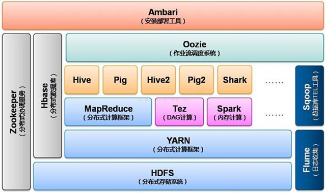

# YARN 相关知识

YARN 是 Yet Another Resource Negotiator 的缩写，是 Hadoop 使用的集群资源管理系统。YARN 在 Hadoop 0.23 的时候本引入，引入它的目的是改善 MapReduce 的实现，但是它所做到的不止于此，它同样可以支持其他的分布式计算框架比如 Spark， Tez 等。

YARN 在 Hadoop 中的位置如下图所示：

YARN 为上层程序提供了请求和使用集群资源的 API，一般我们应用程序员是用不到这些 API 的，因为运行在 YARN 上的框架已经为我们封装了这些操作。

## 1. YARN 中的几个角色

YARN 的基本思想是将**资源管理**和**任务调度**分配给不同的**守护进程**(Deamons)来管理。而这两个守护进程所对应的就是 YARN 中的两个重要角色—— **Resource Manager**（后简写为 RM ） 以及 **Application Master**（后简写为 AM ）。

其中 RM 是全局资源的管理者，所以对于局部资源（每台机器的资源），也需要有一个管理者来管理本地资源并配合 RM 的工作。这就是 YARN 中的第三个角色 **Node Manager**（后简写为 NM ）所负责的工作。

RM 和 NM 两者组成了数据计算的框架。 RM 负责根据**应用（ Application ）**进行资源的分配，而 NM 对于每台机器来说就是一个 Agent 的角色。它负责对**容器（ Container ）**的资源使用情况进行监控，并将其上报给 RM 或 **Scheduler** 。

> Application 对于 YARN 来说可以是一个 MapReduce 任务，也可以是一个 DAG （有向无环图）任务（比如 Spark？）。对于每一个 Application 来说，都会有一个 AM 对这个 Application 进行管理。

> Container 用于执行特定 Application 的一部分任务，每个 Container 都有资源的限制（比如 CPU 和内存等），它可以是一个 Unix 进程，也可以是一个 Linux cgroup。

> 对于 RM 还有一点要补充，RM 是由 ApplicationsManager（注意有个 s）和 Scheduler 两个部分组成的。 
> * Scheduler： 只负责对资源进行分配（是 pluggable 的，根据实现的不同有不同的分配策略，比如 CapacityScheduler ， FairScheduler 和 FIFOScheduler 等）。
> * ApplicationsManager： 负责接收客户端的任务请求，与第一个 Container 协商，在其上启动一个 AM 实例，并且提供 AM 的崩溃重启服务。而 AM 负责与 Scheduler 协商分配相应的 Container 并追踪他们的状态。

**运行流程：**

在 YARN 运作的过程中，首先启动一个 Application，这个时候会有一个相应的 AM 启动，AM 首先要和 RM 协商资源的分配情况，资源分配好之后 AM 就直接与 NM 进行协作，执行并对 Task 进行监控。流程如下图所示：

# 参考文献

[1] Hadoop 权威指南：大数据的存储与分析（第 4 版）

[2] [Apache Hadoop 官网](http://hadoop.apache.org/docs/r2.8.4/hadoop-yarn/hadoop-yarn-site/YARN.html)