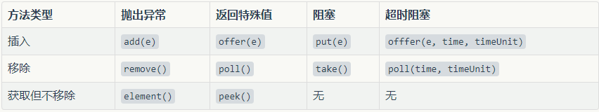

# 阻塞队列

## 1. 阻塞队列概述

阻塞队列通常用于实现生产者/消费者模式，在JUC包中提供了BlockingQueue接口并提供了几种阻塞队列的实现：
* ArrayBlockingQueue
* LinkedBlockingQueue
* PriorityBlockingQueue
* DelayQueue
* SynchronousQueue
* LinkedTransferQueue
* LinkedBlockingDeque

BlockingQueue接口中的一些基本方法在阻塞队列不可用时的行为（比如向一个满队列中插入或者从空队列中取出）如下图所示：

具体是这个意思：

**抛出异常**：当队列已满时调用add方法插入元素会抛出`IllegalStateException`异常，当队列为空时调用remove方法移出元素会抛出`NoSuchElementException`异常。

**返回特殊值**：调用offer方法插入元素如果成功返回true，队列已满时返回false；调用poll方法移出元素如果成功返回该元素，队列为空时返回`null`。

**阻塞**：当队列已满时调用put方法插入元素会一直阻塞到别的线程从队列中移出元素或者别的线程中断了阻塞线程，当队列为空时调用take方法移出元素会一直阻塞别的线程往队列中插入元素或者别的线程中断了阻塞线程。

**超时阻塞**：在指定时间内阻塞，超过指定时间返回。

