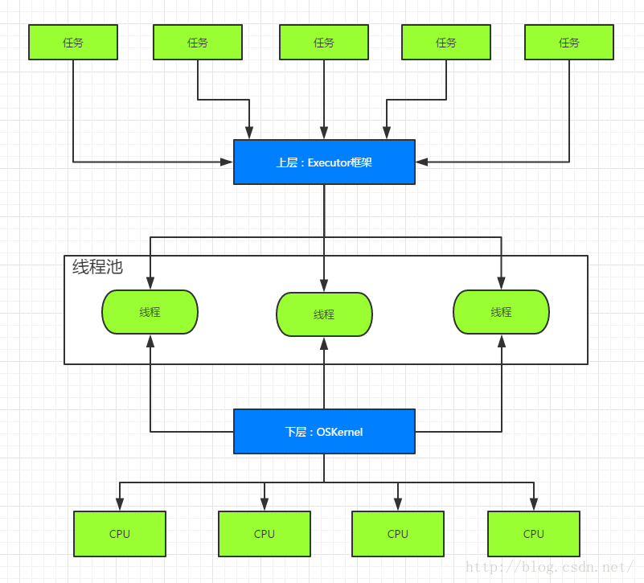
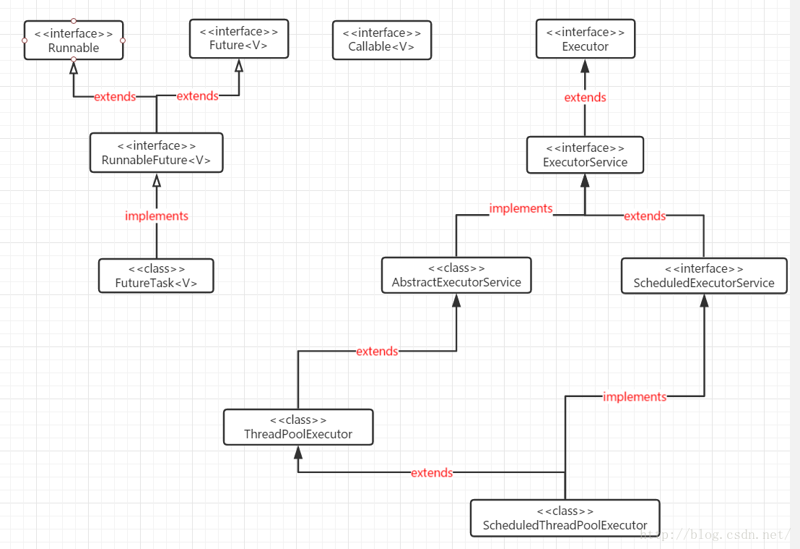
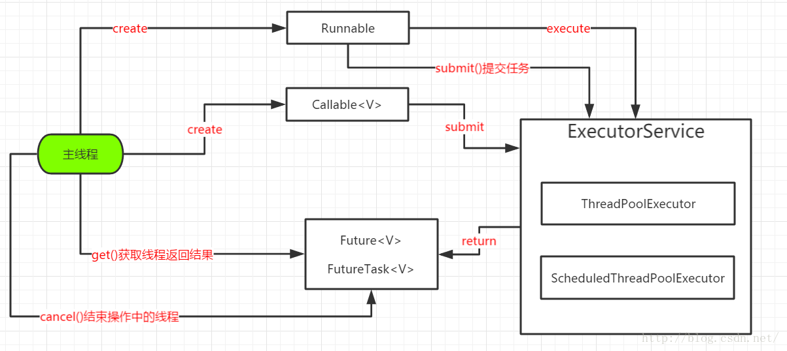
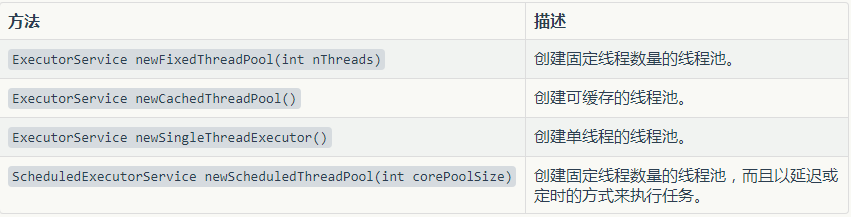
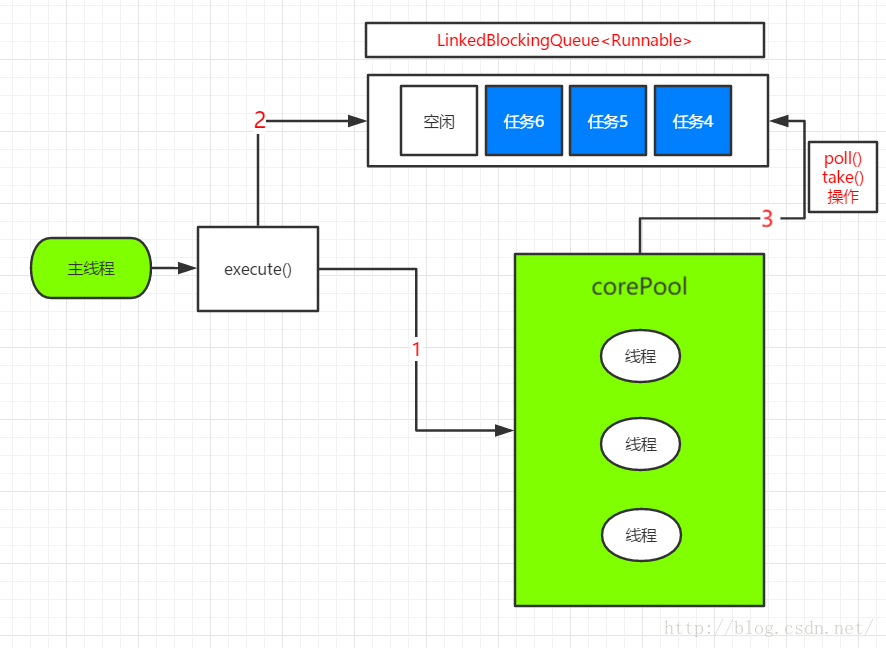
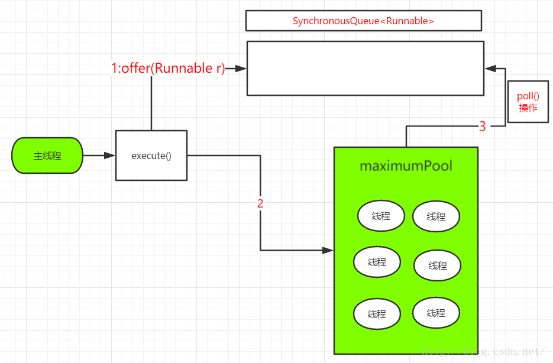
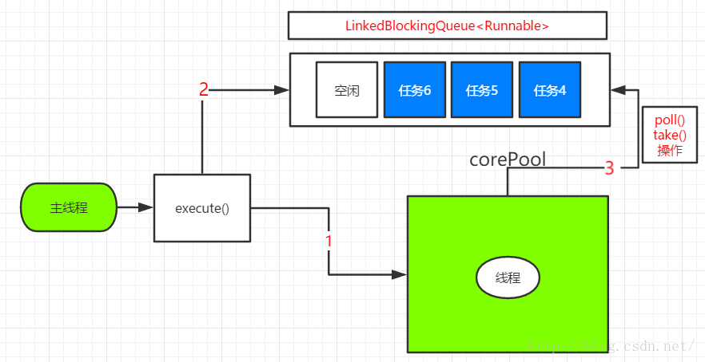
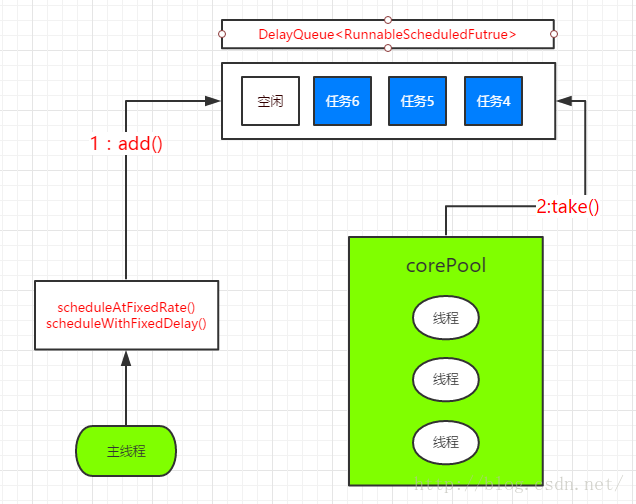
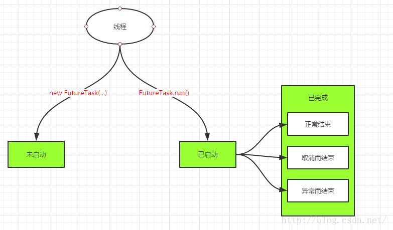

# Executor框架

## 1. Executor框架简介

我们一般开启线程的时候都是通过`Thread t1 = new Thread(new Runnable{...});`的形式去打开线程并执行`Runnable`接口中定义的任务。这样做在任务和线程数少的情况下非常方便，但是要知道，线程的开启和销毁都需要开销，如果线程数太多，就会导致系统的崩溃。

而线程池的出现很大程度上避免了这种情况的发生。通常，线程池中有一定数量的线程，我们向线程池中提交任务，如果线程池中有空闲的线程，由线程池中的一个线程来完成我们提交的这个任务，如果线程池中没有足够的空闲线程，根据不同的策略还有不同的解决方法，比如在线程池中新建线程，或者将新来的任务放入等待队列中等待空闲线程。这就避免了我们自己在写代码的时候还要考虑控制线程的数量等问题。而Executor框架就提供了线程池的功能。

### 1.1 Executor的线程映射结构

Executor的线程映射结构如下图所示：

### 1.2 Executor框架的结构

Executor框架的结构如下图所示：

其中主要包括这么几部分：

1. 任务：包括被执行任务需要实现的接口：Runnable接口或Callable接口；
2. 任务的执行主体：任务执行的核心接口就是Executor以及其子接口，它将任务的提交与执行分离开来；
3. 异步任务执行的接口：Future接口以及其实现，这是异步计算的结果。

而Executor框架的执行流程如下图所示：

可以看出，`Runnable`接口可以通过`execute()`方法提交给线程池，这种方法提交的任务是没有返回值的。而`Callable`接口可以通过`submit()`方法提交给线程池，并且立刻返回一个`Future`对象，调用线程可以像这个对象查询异步任务执行的状态以及结果。同时，也可以用`submit()`方法提交`Runnable`任务，同时得到一个`Future`，但是调用`Future`的`get()`方法的时候会返回null。

同时可以使用`Executor`的`callable()`方法把`Runnable`接口封装成`Callable`对象。

## 2. Executor中的线程池

Executors类里提供了创建适用于各种场景线程池的工具方法(静态方法)，其中常见的几种线程池创建方法如下图所示：

### 2.1 线程池的实现

以上几种创建线程池的底层实现都是由`ThreadPoolExecutor`类来实现的，这个类的一个构造函数如下：
	
	public ThreadPoolExecutor(int corePoolSize,  
                              int maximumPoolSize,  
                              long keepAliveTime,  
                              TimeUnit unit,  
                              BlockingQueue<Runnable> workQueue,  
                              ThreadFactory threadFactory) {  
        this(corePoolSize, maximumPoolSize, keepAliveTime, unit, workQueue,  
             threadFactory, defaultHandler);  
    }  

各个参数的含义如下：

* `carePoolSize`：线程池的核心线程数，默认情况下，核心线程数会一直在线程池中存活，即使它们处理闲置状态。
* `maximumPoolSize`：线程池所能容纳的最大线程数量，当活动线程数到达这个数值后，后续的新任务将会被阻塞。
* `keepAliveTime`：与后面的`unit`一起使用，用来设置非核心线程闲置时的超时时长，超过这个时长，这个线程就会被销毁。
* `workQueue`：线程池中的任务队列，通过线程池的execute方法提交Runnable对象会存储在这个队列中。

构造方法的具体实现中还有一个`defaultHandler`，这是一个`RejectExecutionHandler`，这个参数表示当ThreadPoolExecutor已经关闭或者ThreadPoolExecutor已经饱和时（达到了最大线程池大小而且工作队列已经满），execute方法将会调用Handler的rejectExecution方法来通知调用者，默认情况 下是抛出一个RejectExecutionException异常。

### 2.2 线程池执行任务时的大致步骤

ThreadPoolExecutor执行任务时的大致规则：

1. 如果线程池的数量还未达到核心线程的数量，那么会直接启动一个核心线程来执行任务
2. 如果线程池中的线程数量已经达到或者超出核心线程的数量，那么任务会被插入到任务队列中排队等待执行。
3. 如果在步骤（2）中无法将任务插入到任务队列中，这往往是由于任务队列已满，这个时候如果线程数量未达到线程池规定的最大值，那么会立刻启动一个非核心线程来执行任务。
4. 如果在步骤（3）中线程数量已经达到线程池规定的最大值，那么就会拒绝执行此任务，ThreadPoolExecutor会调用RejectExecutionHandler的rejectExecution方法来通知调用者。

> 注意，2、3步的顺序不要搞反。在提交任务后如果核心线程都忙，首先把任务放入任务队列，然后才创建非核心线程从任务队列中取任务并执行。

### 2.3 几类线程池

**FixedThreadPool**：

FixedThreadPool模式会使用一个优先固定数目的线程来处理若干数目的任务。刚开始的时候，线程池中线程的数量为0，每提交一个任务，线程池就会新加一个线程，直到到达规定的线程数。

一旦有线程处理完了任务就会被用来处理新的任务，或者从任务队列中取任务并执行(如果有的话)。`FixedThreadPool`模式下最多的线程数目是一定的。

`FixedThreadPool`的创建方式是：

`ExecutorService fixedThreadPool=Executors.newFixedThreadPool(5);`

而这种创建方法的底层实现如下：
	
	public static ExecutorService newFixedThreadPool(int nThreads) {  
        return new ThreadPoolExecutor(nThreads, nThreads,  
                                      0L, TimeUnit.MILLISECONDS,  
                                      new LinkedBlockingQueue<Runnable>());  
    }

`FixedThreadPool`使用的是任务队列是一个无界队列，因此这个线程池不会拒绝任务。这个线程池执行任务的顺序如下：

**CachedThreadPool**：

`CachedThreadPool`创建一个可缓存的线程池，最开始该线程池中的线程数为0，之后每提交一个任务就会创建一个线程，来完成该任务，除非当前线程池中有空闲线程可供使用。

`CachedThreadPool`的创建方法是：

	ExecutorService cachedThreadPool=Executors.newCachedThreadPool();

这种方式的底层实现如下：
	
	public static ExecutorService newCachedThreadPool() {  
        return new ThreadPoolExecutor(0, Integer.MAX_VALUE,  
                                      60L, TimeUnit.SECONDS,  
                                      new SynchronousQueue<Runnable>());  
    }

可以看到，核心线程池大小是0，非核心线程池的超时时间是60秒，使用的任务队列是没有容量的SynchronousQueue。在这种方式下，如果提交任务的速度快于任务处理的速度，仍会导致CPU和内存资源耗尽。

在这种方式下的执行顺序如下：

1. 主线程提交任务后，先将任务放入任务队列，如果此时有空闲线程正在执行`SynchronousQueue.poll()`的话，这个空闲线程就会获得任务，并执行这个任务。
2. 如果此时线程池中没有空闲任务的话1就会失败，这个时候就会新建一个线程，来执行任务。
3. 如果线程池中的线程执行完了任务，则会调用`SynchronousQueue.poll(keepAliveTime,TimeUnit.NANOSECONDS)`，让该线程在这个任务队列上最多阻塞60秒，如果这期间没有任务被提交，则线程被销毁。

**SingleThreadExecutor**：

`SingleThreadExecutor`是一个单线程的线程池，线程池中最多只有一个线程，可以保证任务串行在线程池中执行，因此可以处理共同资源而不需要考虑同步的问题。

`SingleThreadExecutor`的创建方法如下：

	ExecutorService singleThreadExecutor=Executors.newSingleThreadExecutor();

其底层实现如下：
	
	public static ExecutorService newSingleThreadExecutor() {  
        return new FinalizableDelegatedExecutorService  
            (new ThreadPoolExecutor(1, 1,  
                                    0L, TimeUnit.MILLISECONDS,  
                                    new LinkedBlockingQueue<Runnable>()));  
    }  

可以看到，这个线程池最多只有1个线程，并且这个线程池使用的是无界队列，其运行流程如下图所示：

**ScheduledThreadPoolExecutor**：

`ScheduledThreadPoolExecutor`是一个`ThreadPoolExecutor`的子类，同时实现了`ScheduledExecutorService`。这个`Executor`可以实现任务的**延时执行**调用以及任务的**周期性执行**，两个方法分别定义如下：

	//周期执行
	public ScheduledFuture<?> scheduleWithFixedDelay(Runnable command,
										long initialDelay,
										long delay,
										TimeUnit unit)  
	public ScheduledFuture<?> scheduleAtFixedRate(Runnable command,
                                       long initialDelay,
                                       long period,
                                       TimeUnit unit)

	//延迟执行
	public ScheduledFuture<?> schedule(Callable<V> callable, long delay, TimeUnit unit)
	public ScheduledFuture<?> schedule(Runnable command, long delay, TimeUnit unit)

这种线程池也可以通过`Executors`的静态工厂方法进行生成：

	public static ScheduledExecutorService newScheduledThreadPool(int corePoolSize)  
	public static ScheduledExecutorService newScheduledThreadPool(int corePoolSize, ThreadFactory threadFactory)  

执行流程大致如下图所示：

**小结**：

几种线程池的使用情景：

* FixedThreadPool：适用于负载较重的系统；
* CachedThreadPool：适用于负载较轻的系统；
* SingleThreadPool：适用于任务串行执行的系统；
* ScheduledThreadPoolExecutor：适用于定期执行任务的系统。

## 3. Future和Callable

我们平时经常使用的是`Runnable`接口来代表一个任务，并将其提交给线程或者线程池去执行。在这种方式下，任务提交了之后，任务的执行就与主线程或者调用线程无关了，我们无法去了解任务线程执行到了什么阶段。

为了解决这个问题，在设计Executor框架的时候就设计出了带返回值的任务`Callable`以及与之配合使用的`Future`。

### 3.1 Callable接口

`Callable`是一个接口，它代表一个任务，与`Runnable`不同的是，这个任务是有返回值的：

	public interface Callable<V> {
	    V call() throws Exception;
	}

这种带返回值的Callable任务不能像Runnable一样直接通过Thread的构造方法传入，在Executor的子接口ExecutorService中规定了Callable任务的提交方式：
	
	public interface ExecutorService extends Executor {
	    // 任务提交操作
	    <T> Future<T> submit(Callable<T> task);
    	Future<?> submit(Runnable task);
    	<T> Future<T> submit(Runnable task, T result);
    	// 生命周期管理
    	void shutdown();
    	List<Runnable> shutdownNow();
    	boolean isShutdown();
    	boolean isTerminated();
    	boolean awaitTermination(long timeout, TimeUnit unit) 
			throws InterruptedException;
    	// ... 省略了各种方便提交任务的方法
	}

### 3.2 Future接口

如果我们通过线程池的`submit`方法提交了任务，那我们可以得到一个`Future`对象，它表示一个任务的实时执行状态，并提供了判断是否已经完成或取消的方法，也提供了取消任务和获取任务的运行结果的方法。线程池的`submit`方法的返回类型`Future`，其实是一个接口：

	public interface Future<V> { 
	    V get() throws InterruptedException, ExecutionException;
	    V get(long timeout, TimeUnit unit) 
			throws InterruptedException, ExecutionException, TimeoutException;
	    boolean isDone();
	    boolean cancel(boolean mayInterruptIfRunning);
	    boolean isCancelled();
	}

在之前我们也看到，`submit`方法也可以接受`Runnable`类型的任务，由于`Runnable`的`run`方法并没有返回值，也就是说任务是没有返回值的，所以在该任务完成之后，对应的`Future`对象的`get`方法的返回值就是`null`。虽然不能获得返回值，但是我们还是可以调用`Future`的其他方法，比如`isDone`表示任务是否已经完成，`isCancelled`表示任务是否已经被取消，`cancel`表示尝试取消一个任务。

### 3.3 FutureTask类

由于`Future`只是一个接口，我们无法使用其对象，所以就引出了`FutureTask`类。`FutureTask`类实现了`RunnableTask`接口，而`RunnableTask`接口扩展了`Future`接口和`Runnable`接口。因此`FutureTask`类的对象是可以直接提交给线程执行的，同时也可以作为`Future`来获得`Callable`的返回值。

`FutureTask`的构造需要一个实现了`Callable`接口的类。

任务提交之后，任务有几种状态（状态的改变与run方法的执行有关？）：
1. 未启动：`FutureTask.run()`方法还没有被执行之前，`FutureTask`处于未启动状态，当创建一个`FutureTask`，而且没有执行`FutureTask.run()`方法前，这个`FutureTask`也处于未启动状态。
2. 已启动：`FutureTask.run()`被执行的过程中，`FutureTask`处于已启动状态。
3. 已完成：`FutureTask.run()`方法执行完正常结束，或者被取消或者抛出异常而结束，`FutureTask`都处于完成状态。同时要注意，**FutureTask执行完当前任务后会将内部的callable成员置空**。

几种状态的示意图如下所示：

所以有两种方式可以获得任务线程的返回值及状态：

* 一种是将实现了`Callable`的对象提交给线程池进行处理，并且立刻获得一个`Future`对象，使用者可以通过`Future`获得当前任务的执行状态和执行结果；
* 另一种方式是将实现了`Callable`接口的对象包装成`FutureTask`对象，然后将`FutureTask`提交给线程池执行，可以通过`FutureTask`获得当前任务的执行状态与执行结果。
* 同时，也可以直接调用`FutureTask`的`run`方法，这个时候也可以获得`FutureTask`的运行状态以及返回值。

## 参考资料

[1] [Java多线程编程：Callable、Future和FutureTask浅析（多线程编程之四）](https://blog.csdn.net/javazejian/article/details/50896505)

[2] [并发](https://www.zybuluo.com/xiaohaizi/note/983458)

[3] [FutureTask的用法及两种常用的使用场景](https://blog.csdn.net/linchunquan/article/details/22382487)