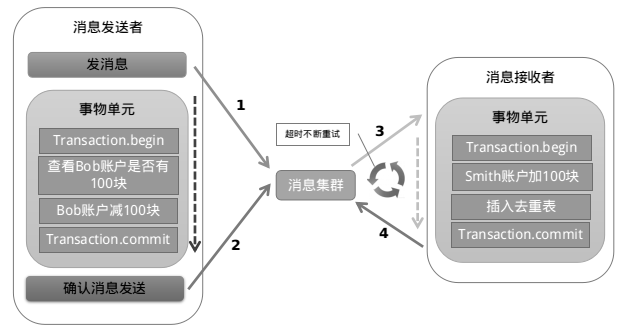

# 数据访问层

## 1. 数据库从单机到分布式

### 1.1 数据库单机优化

随着网站业务的上升，最简单的解决方案是更换更好的硬件，如果不考虑更换硬件，能够想到的处理方案就是**给数据库减压**。减压的思路有以下几种：
1. 应用优化，看看有没有给数据库增加不必要的压力；
2. 看看有没有其他办法可以降低数据库的压力，比如引入*缓存*以及*搜索引擎*；
3. 把数据库的访问分到多台服务器上。

数据拆分有两种方式**垂直拆分**和**水平拆分**。垂直拆分就是把一个数据库中不同业务单元的数据分到不同的数据库中，而水平拆分是把同一业务单元的数据分到不同的数据库中。

垂直拆分带来的影响：
1. 会破坏事务的ACID，我们必须修改实现或者引入分布式事务；
2. 有些使用到JOIN的操作会受到影响，需要应用以其他的方式解决；
3. 靠外键进行约束的场景会受到影响。

水平拆分带来的影响；
1. 垂直拆分会带来的问题同样也会引入到水平拆分中；
2. 通过自增实现的ID会受到影响；
3. 对单表的查询可能会分布到不同的数据库中。

#### 1.2 分布式事务

##### 分布式事务模型与规范：

X/Open组织定义了分布式事务的规范XA，在此之前先看看分布式事务处理模型——x/open DTP。它规定了三个组件，Application Program，Resource Manager和Tansaction Manager：

* AP：即应用程序，可以理解为DTP模型的程序。它定义了事务的边界，并定义了构成该事物的应用程序的特定操作；
* RM：资源管理器，可以理解为一个DBMS。应用程序通过资源管理器对资源进行管理，资源必须实现XA接口，资源管理器提供了存储资源共享的支持。
* TM：事务管理器，负责协调和管理事务，向AP提供编程接口，并对资源管理器进行管理。事务管理器向事务指定标识，并对其进行监视，处理事务的完成和失败。事务分支标识（XID）由TM指定，以标识一个RM中的全局事务和特定分支。它是TM和RM日志之间的相关标记，两端提交或者回滚需要XID。总的来说，TM是额外引入的保证多台机器达到一致性状态。

三者之间的关系如下图所示：

在DTP中还定义了下面几个概念：

* 事务：一个事务是一个完整的执行单元，由多个独立的任务组成，这几个任务在逻辑上是原子的。
* 全局事务：一次性操作多个RM的事务就是全局事务。
* 分支事务：在全局事务中，每个RM都有自己独立的任务，这些任务的集合就是分支任务。
* 控制线程：用来表示一个工作线程，主要是关联AP、RM和TM三者，也就是事务上下文环境。简单来说就是标识全局事务和分支事务关系的线程。

上图中，AP可以通过Native API和RM进行数据交互，这部分的交互不在分布式事务的管辖范围中。当AP和RM之间需要进行分布式事务的时候，AP就需要通过TM获得RM的连接，并使用XA Native API进行数据交互。

AP和TM之间的通信使用的是TX接口，它用于对事务进行控制，包括启动事务、提交事务和回滚事务。

TM和RM之间的交互是通过XA接口来进行的，TM管理着到RM的连接，并实现了两段提交。

##### 两段提交

我们在单机的事务中，提交或者回滚过程进行一次就可以了，但是在分布式事务中，我们需要在提交前添加一个准备阶段。下面是两次提交的过程：

如果准备阶段有一个资源失败，那么第二个阶段就会回滚所有资源。

以上两种都是在理想情况下的状况。使用两段式提交是增加分布式事务开销的一个原因。因此在必要的情况下才使用。其完整图如下所示：

##### 大型网站一致性的理论基础——CAP/BASE

##### CAP理论：

CAP的涵义如下：

* Consistency：所有节点在同一时间读到的是同样的数据，写入成功后所有节点都会同时看到这个数据；
* Availabiliy：无论请求成功或失败，每个请求都能得到一个反馈。
* Partition-Tolerance：系统中有部分问题或消息丢失，系统仍能正常运行。

但是三者不能同时满足，我们只能牺牲其中的一种而提高其他两种。

* 选择CA：放弃分区容忍性，加强一致性和可用性，这其实就是传统的单机数据库；
* 选择AP：放弃一致性，加强可用性和分区容忍性，这是很多分布式系统的选择，例如很多NoSQL就是如此；放弃强一致性而选择**最终一致性**是分布式系统的常用选择；
* 选择CP：放弃可用性，增强一致性和分区容忍性，这种选择下如果网络出现问题会让整个系统不可用。刚刚提到的2段提交(2PC)就是如此，为了一致性牺牲了可用性。

##### BASE理论：

通过CAP理论，我们已经知道了，一致性、加强可用性和分区容忍性是不可能兼得的，而BASE理论给我们指了一条道路：

* Basically Available：基本可用，也就是说如果系统有节点故障的时候，整个系统绝对不会瘫痪，但是可能造成性能上或功能上的一些损失。比如响应时间延长或者是收到服务降级的页面。
* Soft State：软状态，就是允许数据有中间状态，这就允许了节点之间传输数据允许存在延时。
* Eventually Consistence：最终一致性，在经过一段时间的同步之后，系统可以达到一个一致的状态。

其核心思想就是：虽然无法做到强一致性，但是可以结合自身的业务特点，做到最终一致性。

最终一致性有以下几种表现形式：

1. 因果一致性：如果进程A在更新完数据之后会通知进程B，那么对B的访问最终都能得到和A相同的最新结果。如果B要对数据进行更新，那务必要在A的最新数据的基础上进行更新。但是对没有A之间这种因果关系的C来说，就没有这个限制。
2. 读已写：对于进程A来说，它更新了一个数据之后，它总能够访问到它刚更新的数据，而不会访问到原来的数据。
3. 会话一致性：对于一个会话来说可以实现“读已写”的一致性。
3. 单调读一致性：如果一个进程读到了一个数据，那么系统应该保证该进程之后读到的数据版本不会早于之前那次读到的数据的版本。
4. 单调写一致性：来自同一进程的写操作要顺序进行。

##### 比两段提交更轻量级的Paxos协议

在分布式系统中，有两种数据交换的方式：一种是共享内存公用同一份数据，另一种是通过消息投递来进行信息的交换。而通过消息投递的方式进行信息的交换的时候通常会遇到各种问题，比如网络拥塞、进程挂掉、服务器挂掉等，这就会造成重复的消息或者一段时间内不可达的现象。

Paxos就是一个保证系统一致性的协议。

本部分篇幅较长，详见[这里](https://www.zhihu.com/question/19787937)。

##### 补偿事务(TCC-Try Confirm Cancel)

这种分布式事务实现方式的核心思想是：针对每个操作，都要注册一个与其相应的确认和补偿（撤销）操作。它分为三个阶段：

1. Try阶段：主要是对业务系统进行检测并预留资源；
2. Confirm阶段：对业务系统做确认提交，在Try阶段成功之后，默认Confirm阶段也一定会成功；
3. Cancel阶段：在业务执行错误需要回滚的情况下执行业务取消，释放预留资源。

TCC实际上是2PC的应用层实现（一般2PC是在数据库中实现的）。实际上这种方法还是分两步提交：首先是Try完成对业务条件的检查，如果Try成功的话就说明Confirm是可以进行的，如果Confirm出现问题的话就会重复执行Confirm，知道成功该为止；Cancel也是一样，如果Try的时候检查到无法满足业务的条件，就会执行Cancel，如果Cancel释放资源失败的话，就会重复执行，知道成功。所以Confirm和Cancel两个步骤都需要有幂等性质。

这种方法的优点是其流程相比2PC相对简单了一些，而缺点则是其一致性较2PC更弱，而且在2/3步的时候都有可能失败，有的时候需要程序员实现很多的补偿代码。

##### 本地消息表（异步确保）

这种方式的核心思想是将分布式事务拆分成本地事务进行处理。其流程如下图所示：

其基本思路如下：

1. 消息产生方：额外建立一个消息表，并记录发送消息的状态，消息表和业务数据要在同一事务中提交。然后消息会经过MQ发送到消息消费方，如果消息发送失败，会再次发送消息；
2. 消息消费方：需要处理接收到的消息，并完成自己的业务逻辑，此时，如果本地事务成功，则表明已经处理成功，通知消息产生方，消息产生方会删掉相应的消息表，表示已经完成该操作。如果处理失败，会重试执行。如果是业务上的失败，会给消息生产方发送一个补偿消息，通知消息生产方进行回滚；
3. 生产方和消费方都会定时扫描本地消息表，把还没处理的消息以及发送失败的消息进行相应的法处理。

**优点**：一种非常经典的实现，避免了分布式事务，实现了最终一致性。在 .NET中 有现成的解决方案。

**缺点**：消息表会耦合到业务系统中，如果没有封装好的解决方案，会有很多杂活需要处理。

##### MQ事务消息

以阿里的 RocketMQ 中间件为例，其思路大致为：

第一阶段Prepared消息，会拿到消息的地址。
第二阶段执行本地事务，第三阶段通过第一阶段拿到的地址去访问消息，并修改状态。

也就是说在业务方法内要想消息队列提交两次请求，一次发送消息和一次确认消息。如果确认消息发送失败了RocketMQ会定期扫描消息集群中的事务消息，这时候发现了Prepared消息，它会向消息发送者确认，所以生产方需要实现一个check接口，RocketMQ会根据发送端设置的策略来决定是回滚还是继续发送确认消息。这样就保证了消息发送与本地事务同时成功或同时失败。

MQ事务消息实际上就是本地消息表方法的改进，在这种方法中，消息生产者还是需要在本地存储一个消息表，但是对于消息表的轮询工作交给了消息队列去完成。

##### Saga事务

这种分布式事务实现方式的核心思想是将一个长事务分解成多个短事务，分步提交，如果有一个事务提交不成功就按照提交的相反顺序进行回滚。详见[2]。

## 1.3 多机的Sequence问题

当数据库水平拆分的时候，原来的自增ID就成为了一个问题。要保证它的**连续性**和**唯一性**。

解决方案有一下几种：
1. 如果我们只考虑唯一性的话，可以使用UUID的方式为每一条记录都生成一个独立的ID。
2. 如果要考虑连续性的话就需要独立出一个模块单独进行ID的生成，在底层使用一个独立的ID生成器来进行存储每一个ID序列当前的最大值，如下图所示：

3. 另外一种方式是把生成ID的逻辑放在应用中去完成，这样就可以舍弃ID生成器。

## 1.4 多级数据查询

### 1.4.1 跨库Join

在同一个数据库中可以使用Join操作来对两个表中的数据进行联合查询，但是如果这两个表分布在两个不同的数据库中，Join操作就无法执行了，这个时候有如下几种解决的思路：

1. 在应用层将Join操作分解成多次数据库的操作，取得数据后再在应用层将结果合并；
2. 数据冗余，对于常用的数据进行冗余存储，将原来需要Join的数据变成单表查询；
3. 借助外部系统（如搜索引擎）解决这一问题。

### 1.4.2 外键约束问题

由于分库后，要求每个单库都是内聚的，因此外键约束的工作只能放在应用层来进行判断和容错了。

# 参考资料
[1] 大型网站系统与Java中间件实践
[2] [聊聊分布式事务，再说说解决方案](https://www.cnblogs.com/savorboard/p/distributed-system-transaction-consistency.html)
[3] [消息中间件mq处理分布式事务](http://www.cnblogs.com/taiyonghai/p/6094350.html)
