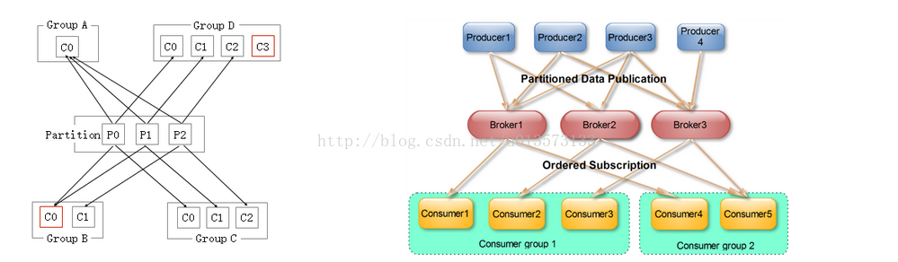
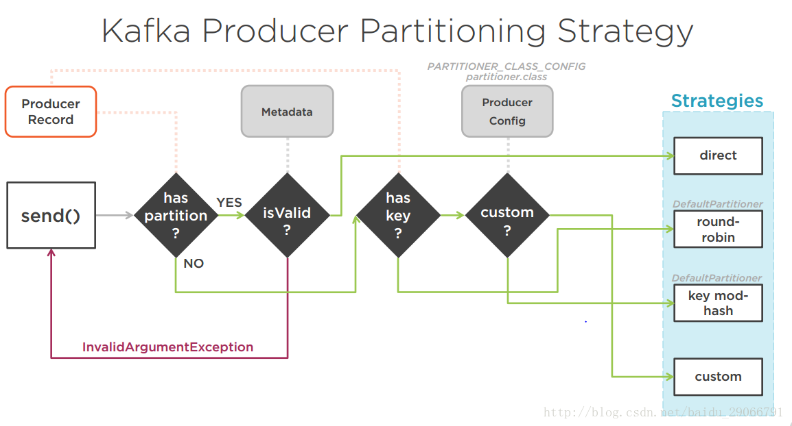

# Kafka 基础知识笔记

## 1. Kafka 的核心概念

### 1.1 Kafka 集群中的概念

**Broker**： Kafka 是由多个 Kafka 服务器组成的一个集群，每个 Kafka 服务叫做 Kafka Broker。集群共同完成消息中间件的工作。

**Topic**：Kafka 作为一个消息中间件，提供了订阅/发布的服务，一个 Topic 就可以看作是传统消息队列的一个 queue，不过 Topic 中的消息是可以共多个订阅者消费的。

**Partion**：Kafka 的发布者常常是日志的生产系统这样的生产消息非常快的系统，而其订阅者往往是一些比较慢速的系统，比如 HDFS/HBASE 等。这个时候如果订阅者直接从 Kafka 中接受消息的话，消息消费的速度往往会赶不上消息生产的速度，由此会导致消息的堆积。为了应对这种情况，就产生了分区（ Partion ）的需求。一个 Topic 在建立的时候就可以选择分区的数量，分区具体的使用可以参见后面的 Consumer。

**Producer**：Kafka 的客户端有两种，其中的一种就是 Producer，是发布者，它负责向 Kafka 集群中的 Topic 中 push 消息，push 消息的时候还会进行消息的序列化以及负载均衡（消息分区）。

**Consumer**：Kafka 客户端的另外一种，是订阅者，它他会定时轮询地从 Topic 中 pull 最新的消息。多个订阅了同一个 Topic 的消费者可以指定同一个 Consumer Group （消费者群组），同一个 Group 中的 Consumer 共同消费同一个 Topic 下的消息，所以一个消费者群组也是一个 **消费者集群**。但是要注意，同一个 Consumer Group 中的 Consumer 不会共同消费同一个 Partion 下的消息，所以需要保证 Consumer Group 中的 Consumer 的数量不大于 Partion 的数量。具体如下图所示：

**Broker Controller**：Broker 中的协调器，这个协调器是通过 Zookeeper 选举产生的，这个协调器。

**Partion Leader/Follower**：在一个 Topic 下的每一个 Partion ，根据设置的不同会有多个副本，而这个分区会有一个 Leader 来对所有副本进行管理，所有对于这个分区的读写都是由 Leader 来完成。在向 Follower 进行备份的时候， Follower 会向 Consumer 一样，取 Leader 上拉数据，完成主从数据的同步。

> 一个 Consumer Group 可以看作为一个消费一个 Topic 下消息的集群，如果你有多个不同的集群（服务）想要对同一个 Topic 下的消息做不同的处理，那么你就需要分别为每个集群（服务）指定不同的 Group。比如，你有一个生产日志的 Producer，将生产出来的日志放到了 Kafka 的 *Log* 主题下，你有两个服务： HDFS 和 Strom 都订阅了这个 Topic，他们分别要把日志存储到 HDFS 和使用 Strom 集群进行实时分析，那么你就需要分别为两个集群分配两个 Group。

**Offset**：Consumer 在消费的时候需要知道自己在相应 Topic 的相应的 Partion 上已经消费到的位置，这个信息通常由消费者自己保存，定期持久化（所以导致有的时候会有消息重复消费的情况出现，因为没有被持久化的 Offset 被丢掉了）。同时也有可能存放在 Broker 端，但是这样就会给 Broker 引入状态，不算事一个优雅的解决方案，所以还有单独将 Offset 设成一个 Topic 来让 Consumer 自行读取的方案。

### 1.2 一些问题

#### 1.2.1 Broker 数量的确定

首先看需要存储多少数据，如果要存储 10T 数据，每个 Broker 能够存储 2T ，那么至少需要 5 个 Broker ，另外，如果设置了副本数量，那么就需要更多的 Broker 。

其次就还需要考虑集群的处理能力，尤其是网络吞吐的能力。如果一个 Broker 在吞吐峰值时期的网络接口会达到 80% 的使用量，那它在高峰时期就无法支持两个 Consumer 共同消费。另外还要考虑设置了集群副本的时候，要把这个额外的网络负载也算进去。

#### 1.2.2 Partion 的数量

对于主题进行分区的一个重要作用就是负载均衡。

确定分区数量首先要看 Consumer 从分区读取数据的吞吐量，要保持每一个 Partion 对应写入的吞吐量不要大与 Consumer 消费消息的吞吐量，这个时候的 Partion 的数量才是比较合理的。

## 2. Kafka 的工作过程

### 2.1 Topic 的建立

### 2.2 Producer 消息生产

生产者要发出的消息叫做 `ProducerRecord` ，它主要有四个部分组成：`Topic` 、`Partion` 、`Key` 、 `Value`。其中 Key 是可选的。

1. 当 producer 获取到 metadata 信息之后，producer 将会和 Topic下所有partition leader保持 socket 连接。
2. 对 Value 和 Key 进行序列化。
2. 消息由producer直接通过socket发送broker，中间不会经过任何路由成，事实上，消息被路由到哪个partition上有producer客户端决定，比如可以采用 ‘random’,’key-hash’,’轮询’ 等，如果一个Topic中有多个partitions，那么在producer实现消息负载分发是必要的。
3. 在producer端的配置文件中，开发者可以指定 partition 的路由方式。
4. producer消息发送的应答机制，设置发送数据是否需要服务器的反馈，有三个值0，1，-1 :
  * 0：producer不等待broker发送ack
  * 1：当leader接收的消息之后发送ack
  * all：当所有的follower都同步消息成功发送ack

下面是 Kafka Producer 分配 Partion 的几种策略：

### 2.3 Consumer 消息消费

## 3. Zookeeper 的职责

* 负责 Broker Controller 的选举；
*

## 4. 其他知识

### 4.1 Kafka 为什么那么快

**生产者方面**：

Kafka 生产者写入是顺序写入，减少了随机寻址，对于机械硬盘的机器来说，顺序 IO 是可以大幅加快读写速度的。

另外，Kafka 写入数据的时候是写入到内存映射文件中的，内存映射文件的读写效率都要高于普通文件的读写。

> 内存映射文件（ mmap 函数调用）：
> 其原理是将 *逻辑内存* 中的一部分与磁盘上的文件进行映射，读的时候通过缺页中断直接从磁盘上将文件读入内存。
> 一般文件的写需要经过先读写用户态空间，之后进入内核态空间再进行一次复制，而内存映射文件就进行一次写就可以了。
> 因此内存映射文件的读写是很快的。

**消费者方面**：

Kafka 向消费者发送数据的时候使用了 Zero Copy 的技术，也是不经用户态，直接通过内核态将 socket 数据发送出去，获得了很快的速度。

同时，通过设置 Kafka 的最小文件发送块可以等待待发送的文件积攒到一定大小之后再一并发送出去，减小了多次发送的网络开销。

## 参考博客

[1] [Kafka史上最详细原理总结](https://blog.csdn.net/ychenfeng/article/details/74980531)（不过感觉这个帖子错误还挺多的...选择性参考）
