# 服务框架

本章从解决应用服务化问题的服务框架说起。

## 1. 网站功能持续丰富后的困境与应对

下图是一个简单结构的网站示意图，图中的网站的业务功能集中在几大应用上，而这些应用都直接访问底层的服务，如数据库、缓存、搜索引擎和分布式文件系统等。

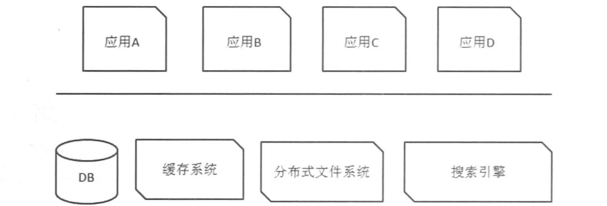

这样会产生大量的重复代码，会让应用变得复杂和臃肿，不易于维护和小需求的快速开发。虽然可以使用共享库来解决重复代码的问题，但是应用起来还是很不方便。

同时可以通过拆分大应用为几个小应用的方法，但是这种方法的问题是不能缓解底层数据库的压力。

另一个方案就是**服务化**的方案，如下图所示。所谓的服务化方案，就是在应用层和底层的数据库、缓存等系统之间加了一个服务层，且这个服务层可能有多层，服务之间也可以相互访问，

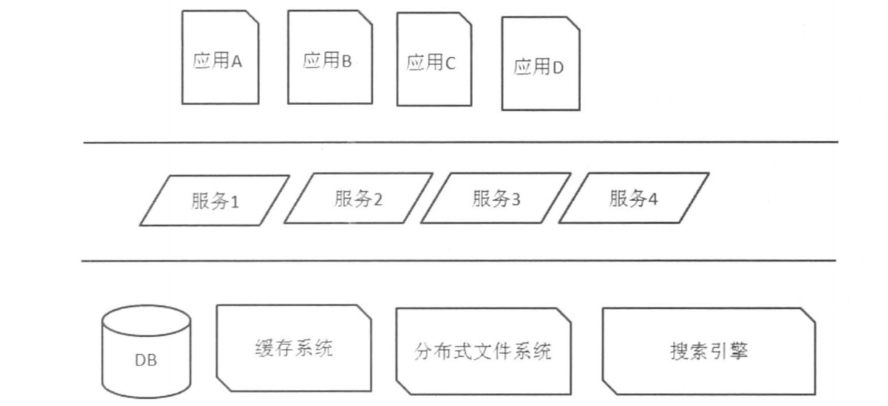

服务化的解决方案的**优点**：1.系统架构更加清晰立体；2.将原本散落在应用中的代码抽离出来变成服务，交给专门的团队维护，提高了代码的质量；3.底层的系统可以统一由服务层管理，结构更加清晰，可以提高底层系统效率。

## 2. 服务框架的设计与实现

### 2.1 应用从集中式走向分布式

在将单层应用改为多层、带有服务层的应用的时候，将原先的本地调用改为了远程调用，远程调用的过程如图所示：

在单机的单进程调用中，我们只需要把程序计数器指向方法的入口地址就可以了。但是在远程调用的过程中还会涉及到信息的编码->传送->解码->调用的过程。而寻址路由是让调用方确定调用哪个实例。寻址路由的实现在之前已经提到过，就是使用DNS、规则服务器或者负载均衡设备三种方式。

寻址玩了之后就是通信，我们需要构造请求数据包，将其序列化，通过Socket将数据发送出去。等到远程服务器处理完毕之后把结果发回，把收到的结果进行反序列化就可以得到最终的结果。

### 2.2 服务调用端的实现

在上一节中已经看到了远程调用的大致流程，本节我们重点关注调用方的一些实现方法。

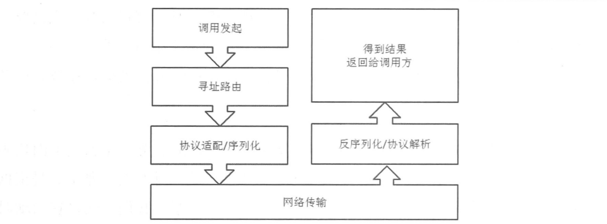

在调用的方式上，要尽量做到统一，使用相同的通信方式、协议以及实现，这样可以降低整个系统维护的成本。

#### 2.2.1 从代码的角度看服务框架的使用

一般我们的系统都会使用Spring来作为组件的容器，而作为服务框架，在**请求发起端**会配置一个通用的bean。

我们一一个计算器的服务作为例子来讲解。首先在服务端我们有一个计算器的服务，假设其明湖层为org.vanadies.CalculatorImpl，我们在服务端的配置文件就可以简单的写成这样：

而在调用端（在服务端也有，两者分别随客户端即调用端和服务端一起编译），我们配置一个通用的bean：

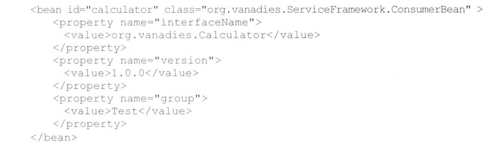

这个bean中配置了三个十分通用的属性：interface、version以及group。这三个属性共同描述了一个服务。

首先是Interface，它描述了接口（也包括对象）的名字，来确定被调用的是哪一个接口，并且使用**动态代理**生成对这个接口的代理类，完成本地的调用。

其次是version，这个字段更多是为了提高服务框架的可扩展性。如果开发者想要升级一项服务，比如增加参数或者修改返回值，这就需要客户端与服务端共同修改代码，比如在接口中增加新的方法，这会在过渡期增加系统的臃肿。而version字段提供了版本隔离的方式来平滑地应对。

最后是group，由于服务端可能由非常多的机器组成，可以把调用的服务端归组，调用者选择不同的分组来调用，这样就可以对调用同一服务的不同调用者进行隔离了。

#### 2.2.2 运行期服务框架和容器的对应关系

服务框架和应用容器的部署关系：
1. 把服务框架作为**应用的一个依赖包**与应用一起打包。这种方式不便于服务框架的升级，且无法接管classloader；
2. 把服务框架作为**应用容器的一部分**（通常为Web容器如Tomcat、Jetty、JBoss等）；
3. 将服务框架本身作为一个容器来提供远程调用和远程服务的功能。

这三种方式分别如下图所示：

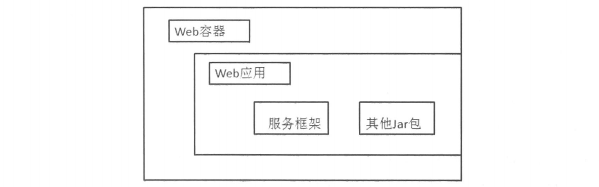

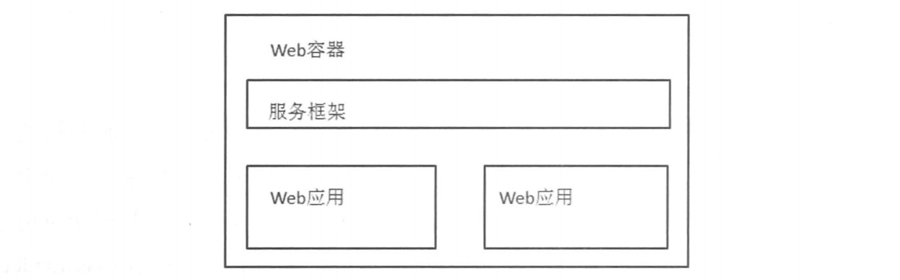

#### 2.2.3 Jar包冲突问题

Java应用中通常包含多个Jar包，而这些Jar包又依赖于其他的Jar包，当那些依赖的Jar包版本不同的时候就会产生Jar包的冲突。我们使用ClassLoader来解决Jar包冲突的问题，将服务框架用得到的类与应用用到的类控制在User-Defined classloader级别，就实现了jar包的相互隔离。

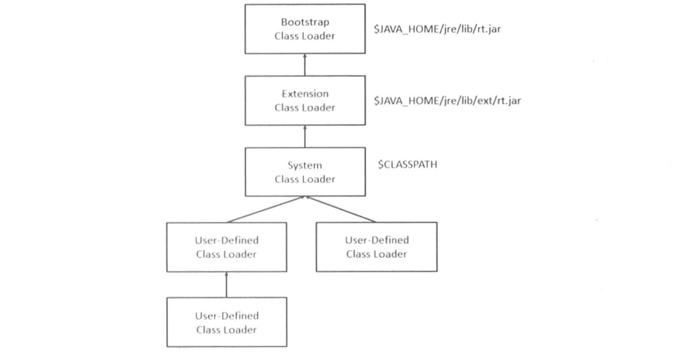

#### 2.2.4 服务调用者和服务提供者的通信

我们使用服务框架就是为了把本地对象之间的调用变成远程过程调用(RPC, Remote Procedure Call)。这就涉及到了远程通信的问题。

在使用远程调用的时候我们首先遇到的问题就是服务路由的问题。解决这个问题的第一种方法就是使用**中间代理**来解决，这是一种透明代理将服务调用方与被调用方进行进行连接的方法。

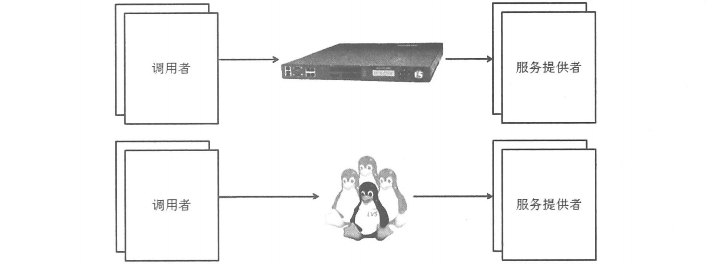

第二种方式就是**控制器结构**，服务注册查找中心向服务调用者提供一个可用的服务提供者的列表，调用者并不用每次调用都向其进行查询，可以先查询自己的缓存，当有变化的时候，服务注册中心会主动发起通知，告诉调用者可用服务的变化。其结构如图所示：

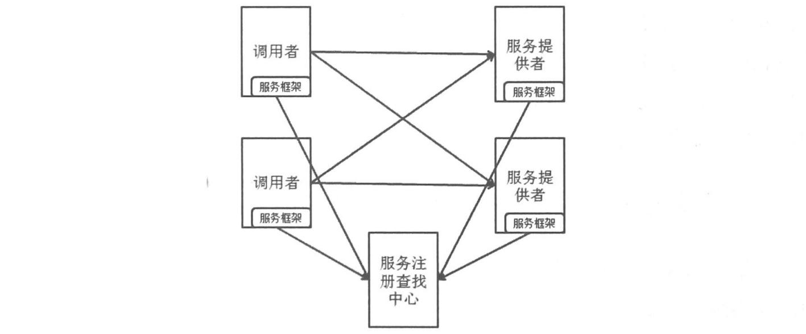

调用者获得服务提供者的列表之后就要确定本次调用的选择，也就是进行路由。这里首先就要考虑负载均衡，其常见的实现方式有随机、轮询和动态加权，前两者用于服务提供者处理能力相同的时候。

#### 2.2.5 引入基于接口、方法、参数的路由

先通过下图了解一下这种路由的结构。

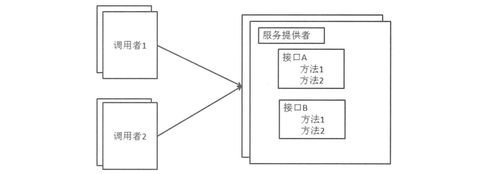

服务集群中部署了接口A和B，集群中的每台机器都提供借口AB的服务，这就会造成一个问题：如果其中一个方法执行的速度很慢，由于线程数量限制，就会导致同一台机器上的其他请求排队，使得本可以快速被处理完成的请求需要等待处理速度较慢的请求执行完才能执行，降低了系统的效率。

这个时候就可以将资源进行隔离，使得快慢不同、重要级别不同的方法之间可以不相互影响。这个时候虽然集群中的每台机器还是提供相同的服务，但是可以通过路由，将对一种服务的请求都都分配到同一台机器。

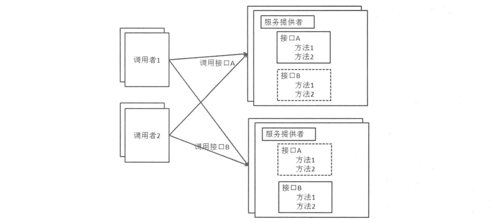

同样，如果想根据方法在进行更细粒度的划分的话，还可以在路由中加入方法、参数。道理同上。

#### 2.2.6 流量控制

可以设置当每秒请求超过一定数量的时候就拒绝远程的请求，也可以进行排队。而另一种方式是0-1开关，就是放开限制或者对其关闭。

可以通过一下两个维度进行控制：

* 根据服务端自身的接口和方法，为不同的接口和方法设置不同的阈值，这样可以使得不同的服务和方法之间不会相互影响。

* 根据来源做控制，根据请求来源的不同级别做控制。

#### 2.2.7 序列化与反序列化

在将本地的调用转化为远程过程调用的时候，我们需要把请求信息序列化为二进制，传输到服务端，服务端将请求反序列化之后得到调用的参数并进行方法的调用。

关于序列化有几个方面需要注意：

1. 跨语言支持
2. 性能开销
3. 序列化后的长度

在协议的方面，主要是由两个部分组成，一个是双方使用的**通信协议**，另外一个就是通信双方建立在通信协议之上的**远程过程调用本身使用的协议**。具体来说，我们可以使用HTTP作为通信协议，而远程调用使用的序列化与反序列化协议可以使用XML或者JSON来定义请求和响应的格式。

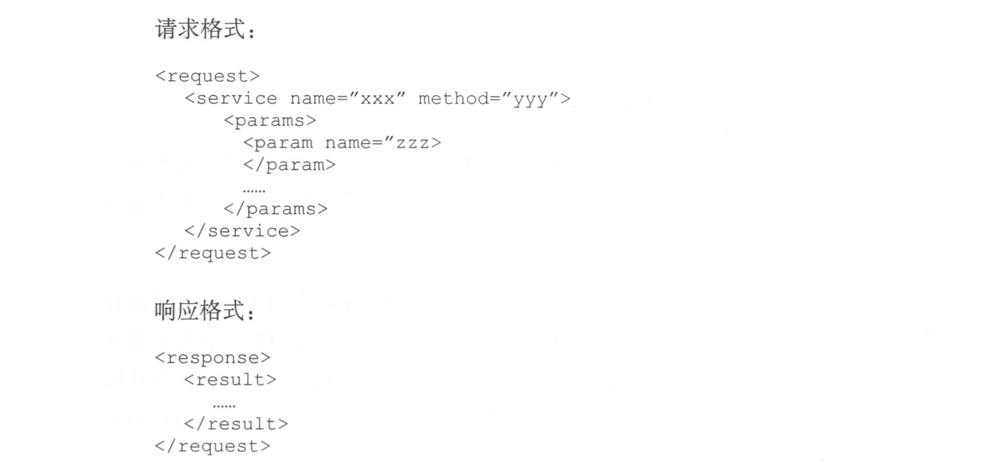

#### 2.2.8 网络通信方式

BIO和NIO（待补充）

#### 2.2.9 异步服务调用方式

第一种方式**OneWay方式**，这种方式下，调用者不关心服务的返回结果，因此调用的过程就会简单很多：

另一种方式是**CallBack方式**，这种方式下请求放会发送一个请求，之后继续执行自己的操作，等待对方有响应的时候进行一个回调：

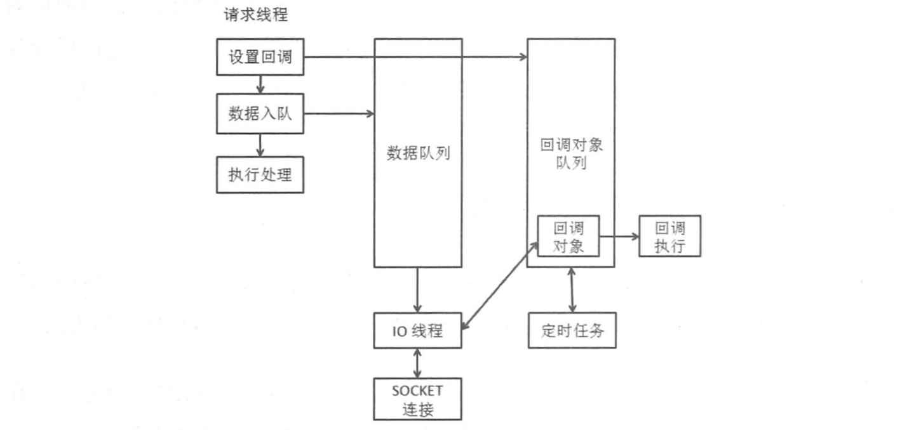

这种方式下，请求线程首先设置回调对象，然后将请求数据放入数据队列之后就继续其他的处理。IO线程将数据队列中的内容发到Socket，在IO线程收到服务方的回应之后会通知回调对象，这时定时任务进行回调函数的执行。定时任务一般运行于另外一个线程，不在IO线程中执行，因为如果回调任务执行时间较长的话会影响Io的进度。

第三种方式是**Future模式**，这种方式下，首先由请求线程将Future对象放入队列，之后将请求数据放入数据队列，之后请求线程回去执行其他操作，最后获取Future对象得到结果并直接控制超时。其流程如下图所示：

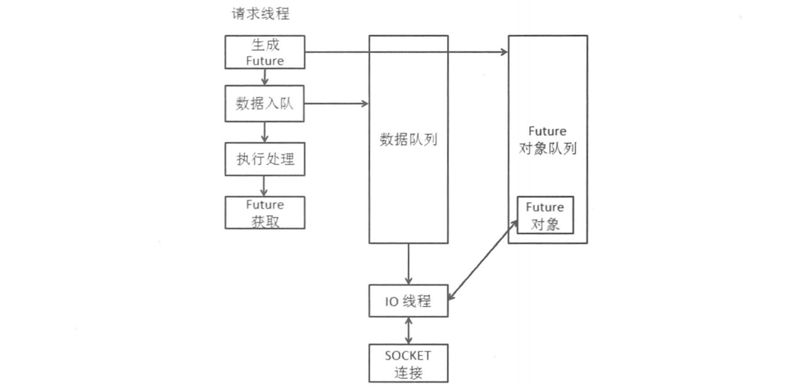

> 至此我们了解了三种模式，Oneway模式是一个单项的通知；CallBack是回调，CallBack的执行不是在原来的请求线程中；Future模式是一种可以主动控制超时、获取结果的方式，并且其执行还是在原来的请求线程中。

第四种方式是**可靠异步**，可靠异步一般靠消息中间件来完成，它可以保证异步请求可以在远端被执行。

## 2.3 服务提供端的设计与实现

服务端的执行流程大致如图所示：

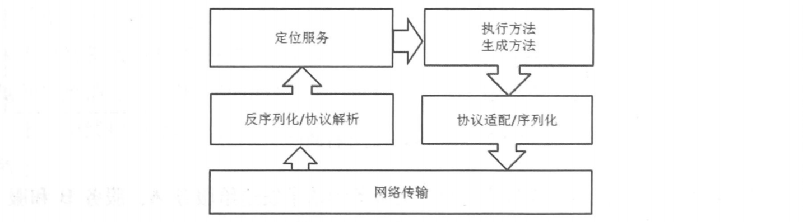

服务端大致有两项工作，第一个是**对本地服务的注册与管理**，另一个是**根据接收到的请求定位本地服务并执行**。

### 2.3.1 如何暴露服务

与服务调用端相应的，服务提供端也需要配置一个通用的ProviderBean（与CustomerBean相对应），配置方式如下图所示：

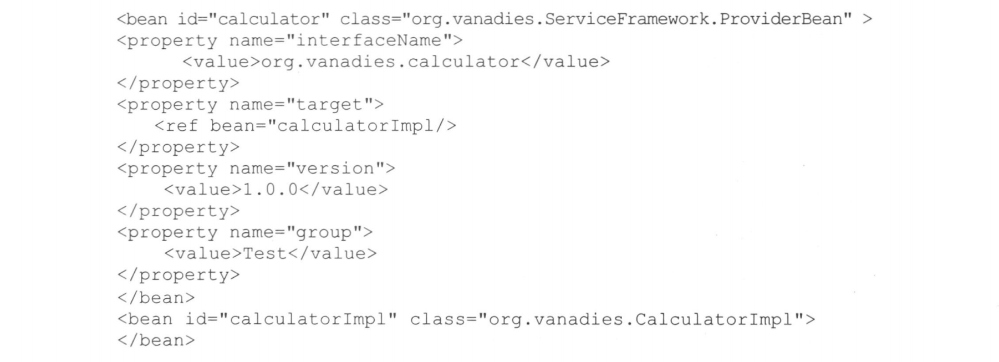

与CustomerBean不同的地方是ProviderBean中配置了一个target属性，用来标记真正执行服务的是哪个bean。ProvidereBean用来将自己所代表的服务注册到服务注册中心。

### 2.3.2 服务端对请求的处理过程

我们已经了解到了在请求到达服务端前的过程：首先请求端生成请求对象->发起调用->路由寻址->进行请求对象的序列化->使用相应通信协议到达服务端，而到达服务端之后的步骤如下所示：

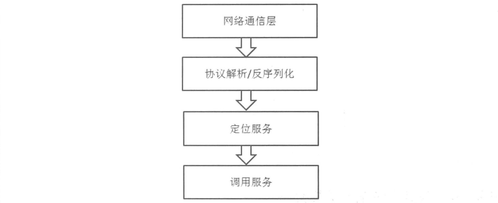

**两种线程：IO线程和工作线程**

在服务端，一般有多个**IO线程**进行服务器收到请求的IO处理，并再**IO线程**中接收到完整的数据包，并进行协议的解析，得到序列化后的数据。

而收到请求之后调用服务则是在**工作线程**中进行的（也就是非IO线程），根据具体实现的不同，请求对象的反序列化可能在IO线程中执行，也有可能在工作线程中执行。

### 2.3.3 执行不通服务的线程池隔离

服务端提供的工作线程是一个线程池，路由到服务端的请求会被放入这个线程池中执行。而工作线程池也不是唯一的，在服务端还可以根据接口、方法和参数定位到不同的线程池，实现线程池的隔离：

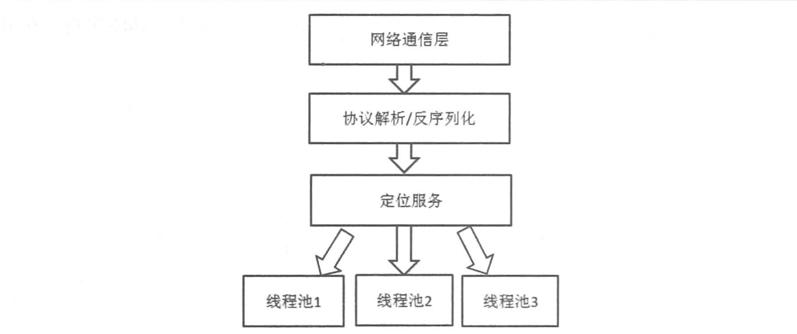

#### 2.3.4 服务提供端的流量控制

在服务提供端也需要0-1开关和QPS限制的方式进行流量的控制，而且针对不同的服务调用者进行分级，优先为高优先级的调用者提供服务。

整个服务框架按功能可以分为服务的调用者和服务的提供者，此外还有一些公共功能比如通信、序列化和反序列化等。在具体实现上，是将这些功能放在一起形成一个统一的框架，而不是把服务调用者和服务提供者分开形成两个框架，因为调用者和提供者是相对的，因为一个服务调用者可能是另一个服务的服务提供者。

服务器框架必须做到模块化且可配置，且模块可以被替换，有良好的可扩展性。

### 2.4 服务升级

使用服务框架之后就面临这服务升级的问题，服务升级可能分为两种，一种是**接口不变，只是接口内代码实现的改变**另一种是**接口需要改变，可能需要增加新的方法、改变参数列表等**。

对于前者来说，只需要在服务端进行升级，升级后进行灰度发布，然后全部发布即可。

而后者又分为两种，一种是**增加接口中的方法**，另一种是**改变接口方法的参数列表**。

前者需要在服务端增加方法，并且在调用端也增加相应的方法，原来的方法继续使用就可以了。而后者相对比较复杂，可用的解决办法：**在设计的时候考虑参数的可扩展性，如使用Map进行参数的传递**，另一种常用的方法是 **使用版本号，新版本的调用方即使用新版本的方法，旧版本的调用方还是用原来的调用方法**。

# 3. 实战中的优化

#### 服务部署的位置与服务化框架的平衡

以一个读写服务器为实例，结构如下：

在本例中使用了缓存来缓解数据库读写的压力，服务提供方对外提供了数据库的读写服务，同时还有这业务逻辑，但是在服务调用方**读取**数据频率很高的情境下，把缓存放在服务调用者一端就会更加实用。

