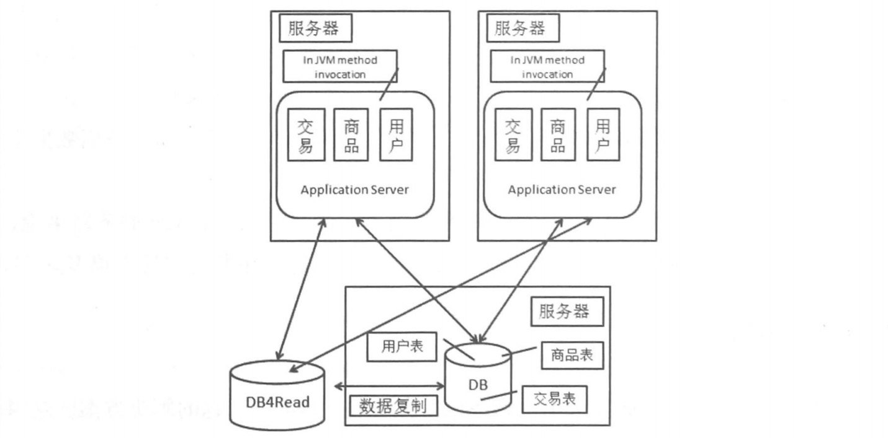

# 大型网站架构的演进

本文希望通过一个商品交易网站的例子来展示一个大型网站的演进过程，但是要记住，本文知识一个演进的例子，具体网站的演进过程会根据网站提供的服务的不同而有所不同。

## 1. 单机构成的网站

一个单机构成的网站一般使用一个开源的**Server作为容器**，直接使用**JSP/Servlet**等技术或者开源框架来构建，选择一个**数据库系统**来存储数据，通过**JDBC**进行数据库的连接操作。网站的架构如下图所示：

上图中，Application Server完成业务逻辑负责**计算**，DB负责数据的**存储**。一个大型网站的演进可以说都是围绕这两个点来进行的。而对于一个交易网站，这个架构应当如下图所示：

可以看到，在Application Server中，各个模块是通过JVM内部的方法调用来进行交互的。而应用和数据库之间是通过JDBC来进行交互的。

## 2. 单机负载警告，数据库与应用分离

将数据库与应用进行分离，但是应用和数据库之间还是通过JDBC进行交互，具体情况如下图所示：

## 3. 应用服务器负载警告，应用服务器走向集群

应用服务器压力变大的时候，可以增加应用服务器的数量，但是出现了一下的问题需要我们来解决：
* 用户访问应用的时候到底访问哪一台应用服务器。这种时候可以通过DNS来解决，也可以通过负载均衡设备（包括硬件负载均衡和LVS负载均衡）两种方式来解决；
* Session问题。

#### 3.1 引入负载均衡装置

引入负载均衡装置之后的系统如下图所示：

#### 3.2 Session问题

Session问题主要是指同一用户先后两次发起的请求可能会交由不同的应用服务器去处理，造成了第二次访问的时候无法取到第一次访问应用服务器的时候Session，产生Session问题。Session问题的解决方法有一下几种思路：

 **Session Sticky：**

 这种方式需要负载均衡设备的支持，使得相同用户的每一次请求都落在同一个应用服务器上。

 但是这种方式有一下几种缺点：
 1. 如果一台服务器宕机，其存储的Session信息就会丢失；
 2. 回话标识是应用层的信息，如果要对应用层信息进行解析，这种操作的开销就要比单纯的信息交换的开销大
 3. 负载均衡器编程了一个有状态的节点，要将回话保存到具体应用服务器的映射中，和无状态的节点相比，其内存消耗更大，容灾方面更麻烦。

**Session Replication:**

这种方式不再要求负载均衡器将同一个回话的请求发往同一个服务器，但是要求Web服务器之间增加Session的同步机制。

使用Session Replication对负载均衡设备的要求会下降，但是仍然存在问题：

* Session数据的同步需要占用更多的带宽，只要Session有变化就需要进行同步，集群中机器数量越多，占用的带宽就越大；

* 使用了Session同步就意味着每台Web服务器都要保存所有的Session，占用了更多Web服务器的存储空间。

因此这种方案不适合在大型集群中使用。

**Session数据集中存储：**

这种方式是将所有Session集中存放起来，然后各个Web服务器都从同样的地方来进行Session的存取。相比于Session Replication方案来说，它解决了内存的问题，而且对于网络带宽来说，也是这种方案较好。这种方式的问题：
* Session数据不在本机中，就会引入时延和不稳定性，不过在内网的环境下，这种情况问题不大；
* 如果存储Session的机器或者集群有问题，就会影响应用。

**Cookie Based:**

这种方式是将Session数据通过Cookie进行传递，这种方式的问题如下：
* Cookie的长度有限制，限制了Session可以存放的数据的量；
* 由于通过Cookie进行Session的传递，有泄露Session内容的风险；
* 由于Cookie携带了Session信息，网络传递的数据就会变多，相当于是把之前方案中的Web服务器内部的带宽消耗转化成了外部带宽的消耗；
* 由于每次请求都携带了Session信息，同样处理情况下输出的结果更少，影响并发性。

#### 3.3 数据读写分离

##### 3.3.1 使用数据库作为读库

这种方式是将主库的数据复制到读库中，其架构如图所示：

数据复制要考虑的一个问题就是延迟的问题，这会导致数据短暂不一致。

增加了读库之后还有一个影响，就是对于读写数据源选择的问题，在事务中的读和写都需要在主库中进行，

不同的数据库对此有不同的实现，Mysql支持master+slave复制。
