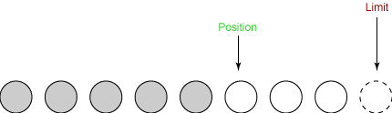
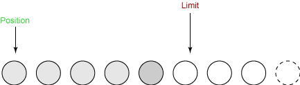

# Java NIO

NIO（Non-blocking I/O，在Java领域，也称为New I/O），是一种**同步非阻塞**的I/O模型，也**是I/O多路复用**的基础，已经被越来越多地应用到大型应用服务器，成为解决高并发与大量连接、I/O处理问题的有效方式。

在最传统的BIO编程中，使用的是面向流的IO，而在NIO中，使用的是面向块的IO。

传统IO的各种流是阻塞的。这意味着，当一个线程调用`read()` 或` write()`时，该线程被阻塞，直到有一些数据被读取，或数据完全写入。**该线程在此期间不能再干任何事情了**。 当使用BIO的`read()`或`write()`的时候，系统是阻塞的，如果是单线程的话必然就挂死在那里；但CPU是被释放出来的，开启多线程，就可以让CPU去处理更多的事情。**这样做的好处是可以让每个连接都专注于自己的IO并且编程模型简单，但是这种方式过分依赖线程。**

> 线程是很"贵"的资源，主要表现在：
> 1. 线程的创建和销毁成本很高，在Linux这样的操作系统中，线程本质上就是一个进程。创建和销毁都是重量级的系统函数。
> 2. 线程本身占用较大内存，像Java的线程栈，一般至少分配512K～1M的空间。
> 3. 线程的切换成本是很高的。操作系统发生线程切换的时候，需要保留线程的上下文，然后执行系统调用。如果线程数过高，可能执行线程切换的时间甚至会大于线程执行的时间，这时候带来的表现往往是系统load偏高、CPU sy使用率特别高（超过20%以上)，导致系统几乎陷入不可用的状态。
> 4. 容易造成锯齿状的系统负载。因为系统负载是用活动线程数或CPU核心数，一旦线程数量高但外部网络环境不是很稳定，就很容易造成大量请求的结果同时返回，激活大量阻塞线程从而使系统负载压力过大。

Java NIO的非阻塞模式，使一个线程从某通道发送请求读取数据，但是它仅能得到目前可用的数据，如果目前没有数据可用时，就什么都不会获取。而**不是保持线程阻塞**，所以直至数据变的可以读取之前，该线程可以继续做其他的事情。

对于底层的系统IO来说，大致都分为两个阶段：**等待就绪**和**数据操作**。等待就绪的时候是不消耗CPU的，而真正读取数据的操作还是需要CPU参与的，个过程非常快，属于memory copy，带宽通常在1GB/s级别以上。

下图是几种常见的IO编程模型：

可见，使用阻塞IO的时候，有很长一段的CPU时间都是在空等。用一句形象的话解释一下几种IO编程模型就是：**BIO里用户最关心“我要读”，NIO里用户最关心"我可以读了"，在AIO模型里用户更需要关注的是“读完了”**。

## 1. NIO的基础——通道和缓冲区

`Channel`和`Buffer`是NIO的核心对象，几乎所有的NIO操作都要用到这两个对象。通道是对原 I/O 包中的流的模拟。到任何目的地(或来自任何地方)的所有数据都必须通过一个 `Channel` 对象。一个 `Buffer` 实质上是一个容器对象。发送给一个通道的所有对象都必须首先放到缓冲区中；同样地，从通道中读取的任何数据都要读到缓冲区中。

### 1.1 缓冲区的概念

这里的缓冲区指的是`Buffer`对象，其中放置的是**要写入**或**刚读出**的数据。这里就体现出了一项NIO与传统IO的不同之处，我们在使用传统IO的时候都是直接从流中读取数据或者向流中写入数据。

**缓冲区实质上是一个数组**。通常它是一个字节数组，但是也可以使用其他种类的数组。但是一个缓冲区不仅仅是一个数组。缓冲区提供了对数据的结构化访问，而且还可以跟踪系统的读/写进程。

### 1.2 缓冲区的种类

于每一种基本 Java 类型都有一种缓冲区类型。每一个`Buffer`类都是`Buffer`接口的一个实例。 除了`ByteBuffer`，每一个`Buffer`类都有完全一样的操作，只是它们所处理的数据类型不一样。因为大多数标准 I/O 操作都使用`ByteBuffer`，所以它具有所有共享的缓冲区操作以及一些特有的操作。

### 1.3 通道的概念

`Channel`是一个对象，可以通过它读取和写入数据。拿 NIO 与原来的 I/O 做个比较，通道就像是流。

正如前面提到的，所有数据都通过`Buffer`对象来处理。用户永远不会将字节直接写入`Channel`中，相反，而是将数据写入包含一个或者多个字节的缓冲区。读数据也是同理。

### 1.4 通道的类型

通道与流的不同之处在于通道是双向的。而流只是在一个方向上移动(一个流必须是`InputStream`或者`OutputStream`的子类)， 而`Channel`可以用于读、写或者同时用于读写。

下图表示了一个网络NIO下的通道和缓冲区的关系图：

## 2. 缓冲区内部细节

前面我们提到了，缓冲区实际上是一个包装好的字节数组。这个包装好的数组中封装了的**访问数组内部元素的方法**，并且维护了与数组访问情况有关的**状态变量**。

### 2.1 状态变量

在`Buffer`的内部维护了三个状态变量：

* position：这个变量维护着**下一个**要访问的数组元素的位置；
* limit：这个变量维护着数组中还有多少数据是未访问，`position`总是**小于或等于**这个变量；
* capacity：这个变量维护着数组的容量，这个变量在用户访问缓冲区的时候是不变的。

下面通过一个例子说明这三个变量的关系：

* 1. 假设我们现在**读**一个容量为8的Buffer，初始状态下是这样的：

* 2. 第一次读取3个字节的数据，position向后移动3个字节，指向第4个字节：

* 3. 第二次读2个字节的数据，position向后移动2个字节，指向第6个字节：

* 4. 现在我们要将数据写到输出通道中。在这之前，我们必须调用 flip() 方法。这个方法做两件非常重要的事：**将limit置为position**并**将position置为0**，之后我们才能够往缓冲区中写数据，`clear()`和`flip()`可以让`Buffer`在读和写之间切换：

* 5. 下面可以进行第一次写数据，写4个字节：

* 6. 在这之后我们就只剩1个字节可以写了，再向其中写入数据就只能写一个字节了：

* 7. 最后我们需要调用`clear()`函数来让几个状态变量回复原来的状态，之后就可以进行下一轮操作了：

### 2.2 访问方法

为了访问或者想缓冲区中放入数据，我们还需要访问缓冲区的方法，下面以`ByteBuffer`为例，`ByteBuffer`有如下几种`get()`方法：

	byte get();
	ByteBuffer get( byte dst[] );
	ByteBuffer get( byte dst[], int offset, int length );
	byte get( int index );

其中前三种方法都是使用`position`和`limit`进行读取，而第四种方法直接绕过了`position`和`limit`，直接对内部数组进行读取且不会影响`position`和`limit`变量。

而`put()`方法与`get()`方法类似，第一个方法 写入（put）单个字节。第二和第三个方法写入来自一个数组的一组字节。第四个方法将数据从一个给定的源 `ByteBuffer` 写入这个 `ByteBuffer`。第五个方法将字节写入缓冲区中特定的 位置 。那些返回 `ByteBuffer` 的方法只是返回调用它们的缓冲区的 `this` 值。

	ByteBuffer put( byte b );
	ByteBuffer put( byte src[] );
	ByteBuffer put( byte src[], int offset, int length );
	ByteBuffer put( ByteBuffer src );
	ByteBuffer put( int index, byte b );

同样，第五个方法是绕过`position`和`limit`变量直接对`Buffer`内数组进行操作的。

其他基本类型的缓冲区与`ByteBuffer`类型的缓冲区一样，都有等价的`get()`和`put()`方法。但是`ByteBuffer`还有其他类型化的读写方法：

	getByte()
	getChar()
	getShort()
	getInt()
	getLong()
	getFloat()
	getDouble()
	putByte()
	putChar()
	putShort()
	putInt()
	putLong()
	putFloat()
	putDouble()

## 3. 缓冲区的更多内容

### 3.1 缓冲区的分配

我们可以通过`ByteBuffer`的静态方法`allocate()`来获取，同时也可以使用现有的数组包装成一个`ByteBuffer`:

	ByteBuffer buffer = ByteBuffer.allocate(1024);

	byte[] array = new byte[1024];
	ByteBuffer buffer2 = ByteBuffer.wrap(array);

我们还可以对缓冲区使用`slice()`方法进行分片，比如我们使用上面的`buffer`缓冲区：

	buffer.position(0);
	buffer.limit(512);
	ByteBuffer subBuffer = buffer.slice();	// 以原缓冲区的0~511字节做了一个子缓冲区

这样就取出了`buffer`的一部分作为子缓冲区，子缓冲区使用的底层数组是缓冲区数组相应的部分。

### 3.2 只读缓冲区

我们可以调用缓冲区的`asReadOnlyBuffer()`方法返回一个缓冲区的只读对象，但是我们无法将一个只读缓冲区转换成可写的缓冲区。

### 3.3 直接缓冲区

我们可以调用ByteBuffer的allocateDirect()方法来分配直接缓冲区。直接缓冲区的存取速度较一般缓冲区更快，因为JVM每次调用系统IO的时候尽量避免建立中间缓冲区，减少了二次拷贝的性能损耗。

## 4. 异步IO

对于我们平时的网络编程，如果使用BIO的话就会有本篇开章时谈到的缺点：过度依赖线程。因此基于NIO的异步编程就成了并发量较高的服务器的一个选择。使用NIO的时候不需要开启新线程就可以监听任何数量通道上的事件。这部分的代码在[这里](images/nio/nio-src/nio/MultiPortEcho.java)。

### 4.1 Selector

异步I/O中的核心对象名为`Selector`。`Selector`就是我们注册对各种 I/O 事件的地方，而且当那些事件发生时，就是这个对象告诉我们所发生的事件。

#### 创建Selector

创建Selector的方法很简单，如下所示。

	Selector selector = Selector.open();

有了`Selector`之后我们就可以在`Selector`上注册`Channel`以及我们感兴趣的事件。`Channel`对象的`register()`方法的第一个参数总是我们的这个`selector`对象。

#### 创建ServerSocketChannel

类似于我们传统网络编程，在服务端需要一个`ServerSocket`一样，我们在使用NIO进行网络编程的时候需要一个`ServerSocketChannel`监听连接，`ServerSocketChannel`的建立方式如下：

	ServerSocketChannel ssc = ServerSocketChannel.open();
	//将Channel设为非阻塞的，必须为每个套接字通道调用这个方法，否则异步IO无法工作
	ssc.configureBlocking( false );

	ServerSocket ss = ssc.socket();
	InetSocketAddress address = new InetSocketAddress( ports[i] );
	ss.bind( address );	//绑定端口

#### 选择键

将新打开的`Channel`注册到`selector`上，把我们要注册的事件也注册到`selector`上，之后会返回一个`SelectorKey`，当我们注册的事件发生的时候，`selector`会通过这个对象通知我们。

	SelectionKey key = ssc.register( selector, SelectionKey.OP_ACCEPT );

#### 内部循环

将通道和事件注册在`selector`上之后，就可以等待连接了，在NIO中，我们使用`selector.select()`这一阻塞方法来等待在`selector`上注册的事件发生。

之后我们就可以通过`selector.selectedKeys()`方法来获得所有已经触发事件的`SelectionKey`对象的**集合**，我们遍历这个返回的**集合**再根据`SelectionKey`对象所触发的事件进行相应操作。

	int num = selector.select();

	Set selectedKeys = selector.selectedKeys();
	Iterator it = selectedKeys.iterator();

	while (it.hasNext()) {
	     SelectionKey key = (SelectionKey)it.next();
	     // ... deal with I/O event ...
	}

#### 监听新连接

至此，我们只注册了一个`OP_ACCEPT`也就是连接到来的事件，当`select()`阻塞完后说明已经有链接到来，就可以接受新的连接了，这个时候`accept()`方法不会阻塞，因为新的连接已经到了。

得到新的`SocketChannel`之后也需要注册在`selector`上，监听其数据到来的事件。

	while (it.hasNext()) {
        SelectionKey key = (SelectionKey)it.next();

        if ((key.readyOps() & SelectionKey.OP_ACCEPT)
          == SelectionKey.OP_ACCEPT) {
          // 接受新连接
          ServerSocketChannel ssc = (ServerSocketChannel)key.channel();
          SocketChannel sc = ssc.accept();
          sc.configureBlocking( false );

          // 将新连接的通道注册到selector上
          SelectionKey newKey = sc.register( selector, SelectionKey.OP_READ );
          it.remove();

          System.out.println( "Got connection from "+sc );
        }

到后面新连接的`OP_READY`事件到来后使用其他方法进行处理。

至此，对`Selector`的用法的介绍就结束了。

## 5. 补充：IO多路复用

IO多路复用的意思是在单个线程通过记录跟踪每一个Sock(I/O流)的状态来同时管理多个I/O流。 发明它的原因，是尽量多的提高服务器的吞吐能力。

**三个系统函数select、poll、epoll**：

这三个函数共同存在的原因是三个函数实现的时间不同，后一个都对前一个做出了一些改进。

关于select：

* select 会修改传入的参数数组，这个对于一个需要调用很多次的函数，是非常不友好的。
* select 如果任何一个sock(I/O stream)出现了数据，select 仅仅会返回，但是并不会告诉你是那个sock上有数据，于是你只能自己一个一个的找。
* select 只能监视1024个链接， 这个跟草榴没啥关系哦，linux 定义在头文件中的，参见FD_SETSIZE。
* select 不是线程安全的，如果你把一个sock加入到select, 然后突然另外一个线程发现，尼玛，这个sock不用，要收回，这个select不支持的。

关于poll：

* poll 去掉了1024个链接的限制。
* poll 从设计上来说，不再修改传入数组，不过这个要看你的平台了。
* poll仍然是线程不安全的。

关于epoll：

* epoll 现在是线程安全的。
* epoll 现在不仅告诉你sock组里面数据，还会告诉你具体哪个sock有数据

## 参考资料

[1] [NIO入门](https://www.ibm.com/developerworks/cn/education/java/j-nio/j-nio.html#ma)

[2] [攻破JAVA NIO技术壁垒](https://blog.csdn.net/u013256816/article/details/51457215)

[3] [Java NIO浅析](https://tech.meituan.com/nio.html)
