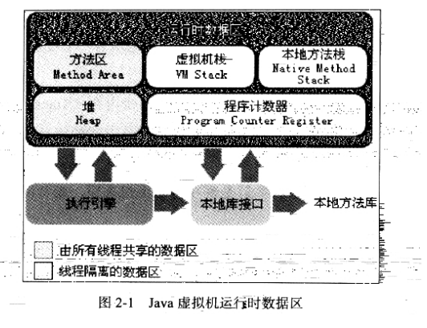
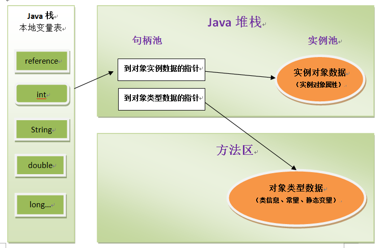
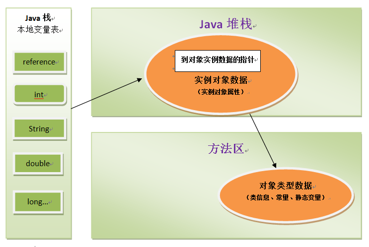
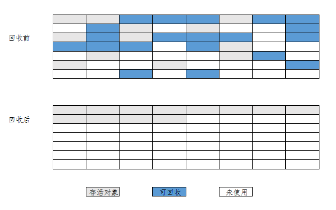
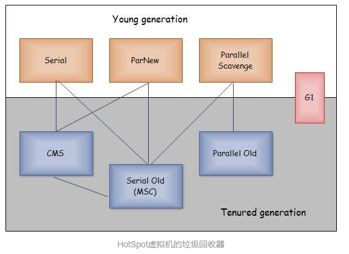
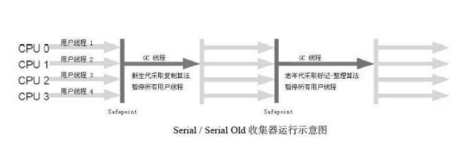
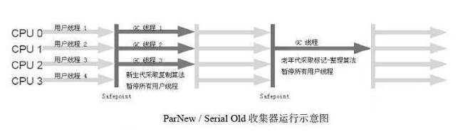
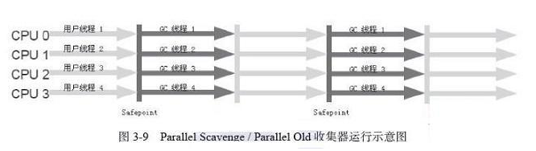
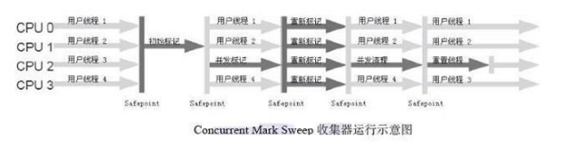
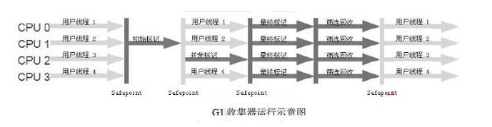

# Java内存管理与垃圾回收机制

标签： JVM

---

## 1. 运行时数据区域
JVM中的运行时数据区如下图所示：

>
一般程序员们喜欢把虚拟机的运行时数据区分成**堆和栈**，然而这只是运行时数据区的一部分，只是人们比较关注这两个区域。其中的堆用于分配对象，而这里的栈主要指的是虚拟机栈中的局部变量表部分。

下面将分别对这些数据区域进行解析。
#### 1.1 程序计数器

程序计数器是内存中一片很小的数据区，他可以看作为当前线程的字节码执行的行号，字节码解释器通过改变程序计数器的值，来选取下一条要执行的字节码指令，推进程序的执行。

每一个线程都要有一个独立的程序计数器。如果当前执行的是一个Java方法，这个计数器记录的就是正在执行的字节码指令的地址。如果执行的是一个Native方法，则其内容为Null。

#### 1.2 Java虚拟机栈

Java虚拟机栈也是一个线程私有的数据区。

Java虚拟机栈描述了**Java方法执行**的内存模型，每当一个方法被调用的时候，都会有一个相应的**栈帧**进栈，这个栈帧用于存储:
>
* 局部变量表
* 操作数栈
* 动态链接
* 方法出口信息
* el at.

一个方法从入栈到出栈的过程就对应着这个方法从开始执行到返回的过程。其中一个比较重要的区域是局部变量表。

**局部变量表**存放了`编译期`可知的各种基本类型(byte, boolean, char, short, int, long, float, double)、对象引用和returnAddress类型（指向一条字节码指令地址）。
其中long和double会占用2个局部变量空间(Slot)，其余的类型只占用一个。局部变量表的分配在`编译期间`分配，当进入一个方法的时候，局部变量表的大小是完全确定的。在方法的运行期间不会对局部变量表的空间进行改变。

在该区域有两种异常：`StackOverflowError`和`OutOfMemoryError`。前者在线程请求的栈深度大于虚拟机所允许的深度的时候抛出，而虚拟机也支持动态扩展，如果在动态扩展的时候无法申请到足够的内存，则会抛出OutOfMemoryError。

#### 1.3 本地方法栈

本地方法栈起到的作用域虚拟机栈的作用相仿，不过这个栈是在执行Native方法的时候使用的。这个区域也有虚拟机栈会抛出的两种异常。

#### 1.4 Java堆

Java对是所有线程共享的一块空间，堆的唯一目的就是存放对象的实例。虽然JVM规范中规定的是“所有的对象以及数组都要在堆中分配”，但是现在也不是那么绝对了。

Java堆也是垃圾收集和管理的主要区域。Java堆在空间上可以不连续，只要逻辑上是连续的即可。当前主流的Java虚拟机的堆都是可扩展的，（可以通过`-Xmx`和`-Xms`）来控制。关于Java对象的创建和回收我们将在后面详细探讨。

#### 1.5 方法区(Method Area)

方法区是一块线程共享的区域，方法区类似于传统编程语言的存储编译后的代码的存储空间，或者是操作系统的“text”段。习惯于HotSpot的程序员可能喜欢将方法区成为永久代，这是因为HotSpot将GC分代收集扩展至了方法区，因此将方法区实现为永久代。

它存储了每个类的结构，比如运行时常量池、静态域、方法数据以及方法和构造器的代码。

> ***运行时常量池***
> 
> 运行时常量池是每个类或每个接口的class文件中的constant_pool表的表示，其中的常量包括了方法中*编译期可知*的**数值型字面量**(numeric literals)和*在运行期必须解析*的域的引用(field reference)。当然，运行时常量池中的内容是可以在程序运行时动态添加的，可以算是class文件常量池的扩展（如翻译出来的直接引用、String.intern()生成的字符串等）。

>运行时常量池的作用类似于传统编程语言的符号表，但是运行时常量池中包含的数据的范围比传统符号表更广一些。

>异常：在创建类和接口的时候，如果运行时常量池需要的空间比JVM分配给方法区的空间还要大的话，JVM会抛出OutOfMemoryError
>
>来源:[JVMS-2.5.4](https://docs.oracle.com/javase/specs/jvms/se7/html/jvms-2.html#jvms-2.5.4)

扩展：[字符串与常量池](https://blog.csdn.net/sugar_rainbow/article/details/68150249)

对这个帖子的内容进行一下精简：

>* 在方法和域中的*字符串常量*都是在编译的过程中放入运行时常量池的；
>* 对于类似`str="GC"+"reclaim"`的字符串拼接，在常量池中只有直接生成的GCreclaim。但是如果是`str1="GC";str2="reclaim";str3=str1+str2;`的话，运行时常量池中只有GC和reclaim，而没有拼接后的字符串
>* 如果用了`str1="GC";
>str2=new String("GC");
>str3=new String("abc");
>str1==str3;// false`
>这种情况下运行时运行时常量池中会有GC和abc两个字符串，这是编译期放进到Class文件的常量池中的，运行期才会生成new的对象，而这个对象会生成在堆中，因而返回false；
>* JDK1.7中JVM把String常量区从方法区中移除了；JDK1.8中JVM把String常量池移入了堆中，同时取消了“永久代”，改用元空间代替（Metaspace）。在HotSpot虚拟机的实现中，1.7及以前的的永久代在逻辑上是堆的一部分，其垃圾回收是与老年代绑定的。元空间被移出了JVM，是一块本地内存。

#### 1.6 直接内存
直接内存并不是虚拟机的一部分，但是这部分也有可能被频繁的使用，而且有可能抛出OutOfMemoryError。在使用NIO的时候，引入了基于Channel与Buffer的IO机制，它使用Native函数在堆外直接分配内存。如果对这部分内存缺乏管理而使得这部分的使用量超过了物理限制，则会抛出OutOfMemoryError。

## 2. Java虚拟机对象
#### 2.1 对象的创建
*注：这部分只针对一般的Java对象，而不包括数组、class对象等。*

1. 首先，在虚拟机的执行过程中遇到关键词`new`的时候，先去检查运行时常量池，看是否能在其中找到对应类的符号引用，并检查其对应的类是否被加载、解析和初始化过。若没有，限制性加载过程。
2. 为对象分配内存：类在被加载之后，其实例所需要的空间大小就确定了，需要在堆中把一个相应大小的区域划分出来。分配的方法有**指针碰撞**和**空闲列表**等方法，使用哪种方法取决于Java堆中的空间是否规整。同时，为了解决并发情况下的分配问题，有对分配操作进行同步处理的方式(大多使用CAS)和为每个线程分配本地线程缓冲的方式(在分配新TLAB时才需要同步)。
3. **实例字段**初始化零值（不包括对象头）。如果使用了TLAB，则这个过程可提前到TLAB分配时进行。
4. 设置对象的对象头(Object head)：其中的信息包括这个对象是哪个类的实例、如何找到类的元数据、对象的哈希码、对象的分代年龄等信息。后续会讲到锁与对象头的关系。(留个坑)
5. 执行<init\>方法,按照程序员的意愿对类进行初始化。
> 关于类准备和实例初始化：创建对象时的初始化与类加载时的准备不同，类加载时的初始化先为**类变量**赋初始值（一般为0，而不是我们写的值），如果有static final的变量，则将其值初始化为我们写的值。真正为类变量赋值的过程在类加载的初始化阶段。

#### 2.2 对象的内存布局

在HotSpot虚拟机中，对象有三个区域：对象头、实例数据和填充。

- 对象头：对象头包括`Mark Word`和`类型指针`。
- 实例数据：在程序代码中定义的各种类型的字段内容。
- 填充：HotSpot规定对象大小必须为8字节的整数倍。

#### 2.3 对象访问定位

有指针访问方式和句柄访问方式两种。

- 如果使用句柄方式的话，Java堆需要分出一片区域作为句柄池，而栈中的reference存储的是句柄地址。句柄中包括了对象实例数据的地址以及对象类型数据的地址。如下图所示：

- 而如果使用直接指针法，则堆中的对象就必须考虑如何访问类型数据。如下图所示：

两种方式各有所长，句柄方式在垃圾回收对象移动后只改变句柄中的实例地址，而reference不需要改变。而直接指针则有着访问速度快的优势。

## 3. 垃圾回收器

程序计数器、虚拟机栈和本地方法栈3个区域都是随着线程的创建而创建，随着线程的结束而销毁。栈中的栈帧随着方法的进入和退出有条不紊的执行者入栈和出栈操作，每一个栈帧中分配多少内存基本上都是在类结构确定的时候*（编译期）*定下来的。但是Java堆以及方法区却不是这样，接口的不同实现类的大小有所不同，一个方法中的分支需要的内存也不一定，这些都是在*运行期*才确定的。

#### 3.1 判断对象存活状态

##### 3.1.1 引用计数法

给对象添加一个引用计数器，每当一个引用指向它，其值加1，引用失效时，其值减1。当其值为0的时候就说明对象已经没有引用指向它，可以被回收了。

这种方法实现简单，判断效率高，但是它没办法解决对象间循环引用的问题。

##### 3.1.2 可达性分析算法

以“GC root”为起点，从这些节点开始向下搜索，搜索过的路径被称为引用链，没有在引用链上的对象就是不可用的对象，可以被GC。以下是几种可以作为GC root的对象：

* 虚拟机栈中（栈帧中的本地变量表）中引用的对象；
* 方法区中静态变量引用的对象；
* 方法区中常量引用的对象；
* 本地方法栈中JNI（即Native方法）中引用的对象；
* 被Bootstrap类加载器加载的对象。

##### 3.1.3 Java中的四种引用

1. 强引用：就是类似于`a=new Object();`的引用，只要有强引用存在，对象就不会被GC；
2. 软引用：在系统发生内存溢出异常之前，只有软引用的对象会被回收；
3. 弱引用：如果对象只有软引用指向它，它就可以被GC；
4. 虚引用：不能通过虚引用获得对象，只有虚引用指向的对象可以被GC，其作用只在于该对象被回收的时候可以得到一个系统通知。

##### 3.1.4 标记回收对象

该过程包含两次标记：

1. 当可达性分析发现对象不在引用链上的时候，它将会被第一次标记，并筛选出有必要执行finalize方法的对象（即重写了finalize方法且没有执行过的对象）；
2. 对于需要执行finalize方法的对象会被放置在F-Queue中，并在虚拟机建立的低优先级的Finalizer线程中执行，但不保证被执行完，防止finalize耗时过长导致内存回收崩溃。如果在这一过程中对象自救，他就会被第二次标记并被移出“即将回收”的集合，否则对象就被真正回收。

> 注意：finalize方法只会被执行一次！

##### 3.1.5 回收方法区

方法区（在1.8以前是永久代，1.8以后的待查）的垃圾回收主要分为两部分：回收**废弃的常量**和卸载**无用的类**。

表示类无用的三个条件:

* Java堆中不存在该类的实例；
* 加载该类的ClassLoader已经被回收；
* 该类对应的java.lang.Class对象没有在任何地方被引用，无法通过反射获得该类的对象。

#### 3.2 垃圾收集算法

##### 3.2.1 标记-清除法

该方法首先标记出所有需要回收的对象，标记完成后对被标记的对象进行统一的回收。

其**缺点**在于标记与清除两个过程的效率都不高，且清除后会产生大量内存碎片，可能在为大对象分配空间的时候触发另一次回收。

##### 3.2.2 复制算法

这种算法将内存分成等大小的两块，每次使用一块，每次垃圾回收的时候将一边的存活对象复制到另外一边，然后将已经使用过的内存一次清理掉。

这种方式的**缺点**是空间利用率低，但是由于大部分对象朝生夕死，没必要把所有的空间平均分配，下面将对商业虚拟机的实现进行介绍，这种方法有效减少了空间的浪费。同时，如果对象的存活率较高，这种方法就需要经常进行复制，效率低下，不使用与老年代的垃圾收集。

现代的商用虚拟机中都是用这种方式进行**新生代**的垃圾回收的。将新生代分成1个Eden和2个Survivor（大小为8:1:1），分配对象的时候首先在Eden分配，在进行垃圾回收的时候将Eden中和1个Survivor中的存活对象复制到另1个Survivor中,然后清理掉Eden和刚才用过的Survivor。过程如下图所示：

但是当Survivor的空间不够其他两个部分中存活的对象的话就需要老年代进行担保分配，将这些对象直接放入老年代。

##### 3.2.3 标记-整理算法

这种算法是将所有存活对象进行标记，然后将所有对象往一端移动，然后清除边界以外的内存。

这种方法避免了复制算法的低空间利用率的缺点，也避免了标记-清除算法产生大量内存碎片的难题。这种算法如下图所示：

##### 3.2.4 分代收集算法

根绝对象存活周期的不同，将内存分为几个不同的部分，一般分为年轻代和老年代，个年代根据自己的情况使用不同的算法。

#### 3.3 垃圾收集器

下图所示是HotSpot虚拟机所使用的垃圾收集器。

##### 3.3.1 Serial收集器

在使用Serial收集器的时候，表明其它线程需要等待垃圾收集完成之后才能继续执行。使用了**复制算法**进行垃圾回收。

应用场景： Serial收集器是虚拟机运行在Client模式下的默认新生代收集器。

优势： 简单而高效（与其他收集器的单线程比），对于限定单个CPU的环境来说，Serial收集器由于没有线程交互的开销，专心做垃圾收集自然可以获得最高的单线程收集效率。

##### 3.3.2 ParNew收集器

ParNew收集器其实就是Serial收集器的多线程版本，其所有控制参数、收集算法、Stop the World、对象分配规则、回收策略都和Serial策略完全一样。

应用场景： ParNew收集器是许多运行在Server模式下的虚拟机中首选的新生代收集器。

Serial收集器 VS ParNew收集器：

> 1. ParNew收集器在单CPU的环境中绝对不会有比Serial收集器更好的效果，甚至由于存在线程交互的开销，该收集器在通过超线程技术实现的两个CPU的环境中都不能百分之百地保证可以超越Serial收集器。
> 2. 然而，随着可以使用的CPU的数量的增加，它对于GC时系统资源的有效利用还是很有好处的。

##### 3.3.3 Parallel Scanvage收集器

特性：Parallel Scavenge收集器是一个新生代收集器，它也是使用**复制算法**的收集器，又是并行的多线程收集器。其目标尽可能提高吞吐量，而CMS等收集器的目标是尽可能降低GC和用户线程的停顿时间。

>吞吐量=用户代码运行时间 / 运行总时间。
>
>停顿时间越短越适合用户交互，而吞吐量越大越适合后台计算。短停顿时间是以牺牲吞吐量为代价换来的。降低停顿时间通常以调小新生代，这样使得每回回收垃圾的时候只需要回收更小的一片区域，但是垃圾回收会更加频繁，降低了吞吐量。

应用场景： 停顿时间越短就越适合需要与用户交互的程序，良好的响应速度能提升用户体验，而高吞吐量则可以高效率地利用CPU时间（定义为：CPU用于运行用户代码的时间与CPU总消耗时间的比值），尽快完成程序的运算任务，主要适合在后台运算而不需要太多交互的任务。

对比分析：

1. Parallel Scavenge收集器 VS CMS等收集器：Parallel Scavenge收集器的特点是它的关注点与其他收集器不同，CMS等收集器的关注点是尽可能地缩短垃圾收集时用户线程的停顿时间，而Parallel Scavenge收集器的目标则是达到一个可控制的吞吐量（Throughput）。由于与吞吐量关系密切，Parallel Scavenge收集器也经常称为“吞吐量优先”收集器。
2. Parallel Scavenge收集器 VS ParNew收集器： Parallel Scavenge收集器与ParNew收集器的一个重要区别是它具有自适应调节策略。
3. GC自适应的调节策略：Parallel Scavenge收集器有一个参数-XX:+UseAdaptiveSizePolicy。当这个参数打开之后，就不需要手工指定新生代的大小、Eden与Survivor区的比例、晋升老年代对象年龄等细节参数了，虚拟机会根据当前系统的运行情况收集性能监控信息，动态调整这些参数以提供最合适的停顿时间或者最大的吞吐量，这种调节方式称为GC自适应的调节策略（GC Ergonomics）。

##### 3.3.4 Serial Old收集器

特性： Serial Old是Serial收集器的老年代版本，它同样是一个单线程收集器，使用**标记－整理**算法。

应用场景：

* Client模式： Serial Old收集器的主要意义也是在于给Client模式下的虚拟机使用。

* Server模式： 如果在Server模式下，那么它主要还有两大用途：一种用途是在JDK 1.5以及之前的版本中与Parallel Scavenge收集器搭配使用，另一种用途就是作为CMS收集器的后备预案，在并发收集发生Concurrent Mode Failure时使用。但是这种模式下Serial Old收集器并不是一个好选择，它会成为服务器性能上的“拖累”。

##### 3.3.5 Parallel Old收集器

特性： Parallel Old是Parallel Scavenge收集器的老年代版本，使用多线程和“标记－整理”算法。

应用场景： 在注重吞吐量以及CPU资源敏感的场合，都可以优先考虑Parallel Scavenge加Parallel Old收集器。它在Server模式下可以代替Serial Old与Parallel Scanvage配合。

##### 3.3.6 CMS(Concurrent Mark Sweep)收集器

CMS收集器是一种以获取最短回收时间为目标的收集器。使用了**标记-清理**法进行垃圾回收。其运作过程分为如下四步：

1. 初始标记(CMS initial mark)：标记GC root直接可以关联到的对象，速度很快
2. 并发标记(CMS concurrent mark)：并发标记阶段就是进行GC Roots Tracing的过程
3. 重新标记(CMS remark)：重新标记阶段是为了修正并发标记期间因用户程序继续运作而导致标记产生变动的那一部分对象的标记记录，这个阶段的停顿时间一般会比初始标记阶段稍长一些，但远比并发标记的时间短，仍然需要“Stop The World”
4. 并发清除(CMS concurrent sweep)：并发地清除无用对象

其中，**初始标记**和**重新标记**两个部分仍然存在"Stop the World"的情况。但是可以明显的看到，用户线程已经可以和垃圾回收过程并发的执行了，这一点减少了垃圾回收所需要的时间。

但是这种收集器也有其缺点：
1. CMS收集器对CPU资源非常敏感（并发收集本身对CPU资源比较敏感，而且其分配的线程数量为（CPU数量+3）/4，所以在CPU资源小于4时会严重影响用户代码的执行）
2. CMS收集器无法处理浮动垃圾，可能出现Concurrent Mode Faliure错误。（浮动垃圾定义为：由于并发清理阶段用户线程还在执行，所以必然会出现新的垃圾，这些垃圾出现在标记过程之后，无法在本次垃圾收集时回收，就称为浮动垃圾；所以CMS收集器没办法向其他收集器那样等到老年代几乎完全被填满了再进行收集，需要预留一部分空间提供并发收集时的程序运作使用，1.6中为92%，若发生预留的内存无法满足程序运行的需要，则会临时启用Serial Old收集器，停顿时间变长）
3. 由于CMS收集器使用了**标记-清除**法，那么在清除垃圾的时候势必会留下很多内存碎片，而内存整理过程是无法并发进行的。

##### 3.3.7 G1收集器

G1是一个面向服务器的垃圾收集器，其目标是替换掉JDK1.5中的发布的CMS收集器。

> 使用G1收集器的时候，Java堆的内存布局就会与其他情况下不同。G1不在针对新生代或者老年代，它将整个Java堆分成几个大小相等的独立的域(Region)，虽然还保留着新生代和老年代，但是他们不再是物理上独立的空间了，它们都是一部分Region的集合。

其特点如下：
1. 并行与并发： G1能充分利用多CPU、多核环境下的硬件优势，使用多个CPU来缩短Stop-The-World停顿的时间，部分其他收集器原本需要停顿Java线程执行的GC动作，G1收集器仍然可以通过并发的方式让Java程序继续执行。
2. 分代收集： 与其他收集器一样，分代概念在G1中依然得以保留。虽然G1可以不需要其他收集器配合就能独立管理整个GC堆，但它能够采用不同的方式去处理新创建的对象和已经存活了一段时间、熬过多次GC的旧对象，以获取更好的收集效果。
3. 空间整合：与CMS的“标记—清理”算法不同，G1从整体来看是基于“标记—整理”算法实现的收集器，从局部（两个Region之间）上来看是基于“复制”算法实现的，但无论如何，这两种算法都意味着G1运作期间不会产生内存空间碎片，收集后能提供规整的可用内存。这种特性有利于程序长时间运行，分配大对象时不会因为无法找到连续内存空间而提前触发下一次GC。
4. 可预测的停顿： 这是G1相对于CMS的另一大优势，降低停顿时间是G1和CMS共同的关注点，但G1除了追求低停顿外，还能建立可预测的停顿时间模型，能让使用者明确指定在一个长度为M毫秒的时间片段内，消耗在垃圾收集上的时间不得超过N毫秒。

>G1收集器之所以能建立可预测的停顿时间模型，是因为它可以有计划地避免在整个Java堆中进行全区域的垃圾收集。G1跟踪各个Region里面的垃圾堆积的价值大小（回收所获得的空间大小以及回收所需时间的经验值），在后台维护一个优先列表，每次根据允许的收集时间，优先回收价值最大的Region（这也就是Garbage-First名称的来由）。这种使用Region划分内存空间以及有优先级的区域回收方式，保证了G1收集器在有限的时间内可以获取尽可能高的收集效率。

至此，所有的垃圾收集器就介绍完毕了。

> 题外话：关于Minor GC、Major GC和Full GC见[这里](http://www.importnew.com/15820.html)。
