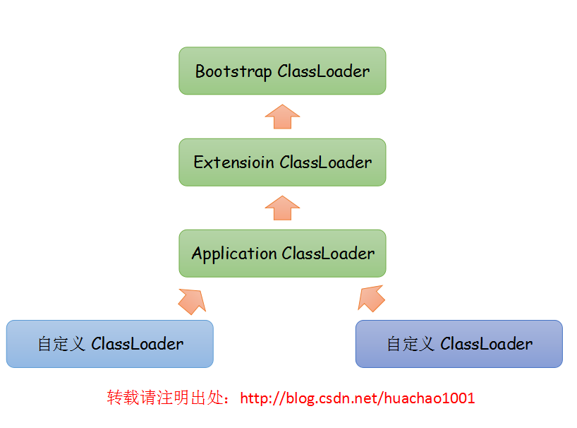

# 虚拟机类加载机制

## 1. 类加载的时机

Java中的类型实在运行时才进行加载的。其生命周期包括：**加载**(Loading)，**验证**(Verification)，**准备**(Preparation)，**解析**(Resolution)，**初始化**(Initialization)，**使用**(Using)和**卸载**(Unloading)。其中，验证、准备和解析三个阶段统称为**连接**。

虚拟机规范并没有限制类的*加载*时机，但是严格限制了类的*初始化*时机，而初始化之前，加载、验证、准备一定是已经开始的。而解析阶段有时候可能会发生在初始化之后。必须开始初始化的几个标志**有且只有一下5项**：

1. 遇到new, getstatic, putstatic或invokestatic这4条指令码的时候，如果类还未初始化需要先触发初始化。它们分别对应的场景是new一个对象的时候、读取或者设置一个类的静态域的时候（除了final修饰的、在编译期被放到了常量池中的静态域）以及类的静态方法被调用的时候。
2. 使用反射对类进行反射调用的时候，如果类没有进行过初始化，则需先进行初始化。
3. 当初始化一个类，但是其父类还没有初始化的时候，先触发其父类的初始化（如果是父接口的话在用到父接口的时候才会初始化父接口）。
4. 虚拟机启动的时候，会先初始化需要执行的主类（就是main方法所在的类）。
5. 在JDK1.7之后，支持了动态语言，如果有一个java.lang.invoke.MethodHandle实例最后解析结果的方法句柄所对应的类还未初始化，则先触发其初始化。

上上段强调了有且只有以上5中情况，除此之外所有类引用方式都不会触发类的初始化，这些方式被称为被动引用。比如：
* 使用子类调用父类中的静态域的时候，就不会触发子类的初始化，只会触发父类的初始化，但是可能会触发子类的加载和验证，这根据虚拟机实现的不同而不同；
* 通过数组来定义来引用类不会触发类的初始化，但是它会触发一个虚拟机自己生成的相应数组类的初始化，它直接继承自Object类，用户可以访问的只有length和clone()，其中还封装了数组的访问方式，而不是C/C++的指针移动访问方式，这是Java数组安全访问的原因；
* 调用的静态域是在编译期就被放到常量池中的域的话，也不会触发初始化过程。

## 2. 类加载的过程

类加载过程就是加载、检验、准备、解析和初始化5个阶段。

#### 2.1 加载

在加载过程中主要完成三个任务：

1. 通过一个**类全限定名**来获取定义此类的二进制字节流（可从压缩包、网络、反射、其他文件、数据库等源头中获取）；
2. 将这个字节流所代表的**静态存储结构**转化为方法区的**运行时数据结构**；
3. 在内存中生成代表这个类的java.lang.Class对象作为方法区中这个类的各种数据的访问入口，具体在内存哪个位置由虚拟机实现决定，HotSpot会将其放在方法区。

加载与其他连接阶段可能交叉进行，但是开始的时间会保持固定的顺序。

#### 2.2 验证

Java虚拟机在加载类的时候会对字节码进行检查，如果验证到输入字节流不符合Class文件格式的约束，虚拟机就应该跑出一个java.lang.VerifyError异常或者其子类异常。验证阶段大致上会完成下面4个阶段的动作：文件格式验证、元数据验证、字节码验证、符号引用验证。

虽然验证阶段是一个非常重要的阶段，但是它对于程序运行期没有影响，可以在实施阶段通过使用参数-Xverify:none来关闭大部分的验证措施，以缩短虚拟机类加载的时间。

#### 2.3 准备

准备阶段正式为**类变量**分配内存并设置类变量的**初始值**，这些变量所需要的内存都将在**方法区**内分配。

> 注意：这里所说的初始值一般情况下是类变量的0值，而不是程序员赋给变量的值。但是，如果类变量是一个常量(就是static final修饰的变量)的话，其会有ConstantValue属性，这时类变量会直接被赋予相应的值，而不是0值。

#### 2.4 解析

解析阶段是虚拟机将常量池中的符号引用替换为直接引用的过程。

* **符号引用**以一组符号来描述所引用的目标，符号可以是任意形式的字面量，只要使用时能够无歧义地定位到目标即可。
* **直接引用**可以是直接指向目标的指针、相对偏移量或者一个能够间接定位到目标的句柄。

虚拟机规范并没有规定何时对类进行解析，只要求在执行anewarray, checkcast, getfield, getstatic, instanceof, invokedynamic, invokeinterface, invokespecial, invokestatic, invokevirtual, ldc, ldc_w, multianewarray, new, putfield和putstatic这16个用于符号引用的字节码指令之前，先对他们的符号引用进行解析。

解析动作主要针对类或者接口、字段、类方法、接口方法、方法类型、方法句柄和调用点限定符7类符号进行。

#### 2.5 初始化

这是类加载的最后一步。在前面的类加载阶段用户应用程序可以通过自定义类加载器参与之外，其余动作完全由虚拟机主导。到了初始化阶段，才真正开始执行类中定义的Java代码。

初始化阶段会执行字节码中的`<clinit>`方法。这个方法是由编译器自动收集类中的所有**类变量的赋值动作**和**静态代码块**中的语句合并产生的。编译器收集的顺序与语句定义的顺序相同，定义在后面的语句块可以访问到定义在后面的变量，定义在前面的语句块可以为定义在后面的变量赋值，但是不能访问。

\<clinit>方法不需要显示调用父类构造器，但是由于父类先于子类被加载，所以父类的\<clinit>方法也会先于子类的执行。

\<clinit>方法不是必须的，如果一个类中没有静态代码块，也没有对静态变量的赋值操作，那么就可以不给这个类生成\<clinit>方法。

接口中不能定义静态代码块，但是可以有静态变量，所以接口中也可以有\<clinit>方法。与类中的不同，它不需要先调用父接口中的\<clinit>方法，只有用到父接口中的域的时候，父接口才会初始化。

虚拟机会保证一个类的\<clinit>方法在多个线程下可以被正确的加锁、同步，如果多个线程同时去初始化一个类，那么只会有一个线程去执行这个类的\<clinit>方法，，其他线程都需要阻塞等待，知道活动线程执行\<clinit>方法完毕。如果一个类的初始化方法需要耗费很长时间，就可能造成多个线程阻塞。

## 3. 类加载器

虚拟机设计团队将类加载的动作放到虚拟机之外去实现，以便让应用程序自己决定如何加载类。实现这个动作的代码模块被称为“类加载器”。

#### 3.1 类与类加载器

对于任意一个类，都需要有加载它的类加载器和这个类本身一同确立其在Java虚拟机中的唯一性。

#### 3.2 双亲委派模型

从Java虚拟机的角度来说，类加载器分为两大类：**启动类加载器(Bootstrap ClassLoader)**和**其他类型加载器**。其中，启动类加载器由C++实现，是虚拟机的一部分；而其他所有类型的加载器都是由Java实现，独立于虚拟机外部，继承自java.lang.ClassLoader。

而从开发人员的角度来说，类加载器可以分为：

* 启动类加载器(Bootstrap ClassLoader)：这个类加载器将存放在<JAVA_HOME>\lib中或者-Xbootclasspath所指定路径中的并且名称能够被虚拟机识别的类进行加载。**这个类无法被Java程序直接引用**。
* 扩展类加载器(Extension ClassLoader)：负责加载<JAVA_HOME>\lib\ext中的或者是被系统变量java.ext.dirs系统变量指定的路径中的所有类库。
* 应用程序类加载器(Application ClassLoader)：也被称为系统类加载器，这个类加载器是ClassLoader中的getSystemClassLoader()方法的返回值，它负责**加载用户类路径(ClassPath)**上所指定的类库。一般情况下这就是程序中默认的类加载器。

这些类加载器的关系如下图所示：

类加载器之间的这种层次关系被称为类加载器的**双亲委派模型**，双亲委派模型要求除了顶层的启动类加载器之外的所有类加载器都有自己的父类加载器。这种继承关系是通过**组合关系**来复用父类加载器的代码，而**不是**使用**继承关系**。

双亲委派模型的工作过程是：如果一个类加载器收到了类加载的请求，它本身不会先去加载这个类，而是把这个请求委派给父类加载器去完成。因此所有的类加载请求都应该被传到启动类加载器，只有当父类加载器反馈无法加载这个加载请求的时候，子类加载器才会尝试自己去加载。

其优点是使得Java类同类加载器一样具备了一种带有优先级关系的层次关系。例如Object类，存放在rt.jar中，无理论哪一个类加载器要加载这个类，都会被委托到启动类加载器去加载，因此Object在程序的各种类加载器环境中都是同一个类。

## 参考资料
[1] 深入理解Java虚拟机-JVM高级特性与最佳实践