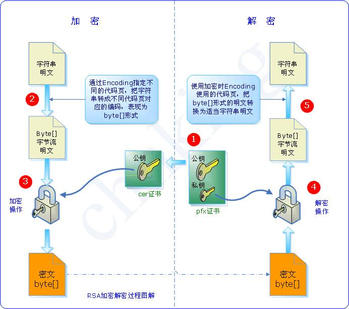
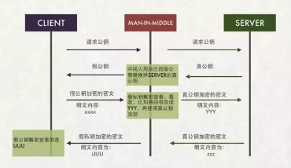
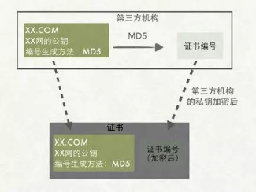
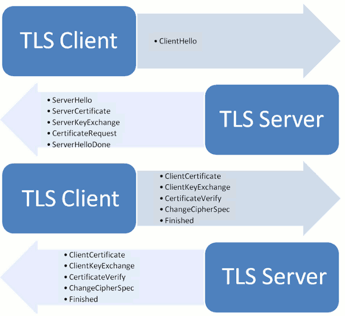

# 加密及协议总结

Start on 2018.4.2 by iNARI

## 1 密码学原理

### 1.1 加密方法分类

加密方法可以分为两大类。一类是单钥加密（private key cryptography），还有一类叫做双钥加密（public key cryptography）。前者的加密和解密过程都用同一套密码，后者的加密和解密过程用的是两套密码。

历史上，人类传统的加密方法都是前一种，比如二战期间德军用的Enigma电报密码。莫尔斯电码也可以看作是一种私钥加密方法。

### 1.2 两种加密方式的比较

在单钥加密的情况下，密钥只有一把，所以密钥的保存变得很重要。一旦密钥泄漏，密码也就被破解。

在双钥加密的情况下，密钥有两把，一把是公开的公钥，还有一把是不公开的私钥。

双钥加密的原理如下：

a) 公钥和私钥是一一对应的关系，有一把公钥就必然有一把与之对应的、独一无二的私钥，反之亦成立。

b) 所有的（公钥, 私钥）对都是不同的。

c) 用公钥可以解开私钥加密的信息，反之亦成立。 *(iNARI注:我感觉这一条的前提应说好是加密方案还是签名方案，对于加密方案来说，只能用公钥加密私钥解密，而对于签名方案来说只能使用私钥负责签名公钥负责验证，如果在同一算法中私钥公钥都可以用来加密解密的话信息的安全性根本无法保证，参考[知乎](https://www.zhihu.com/question/25912483))*

d) 同时生成公钥和私钥应该相对比较容易，但是从公钥推算出私钥，应该是很困难或者是不可能的。

因为任何人都可以生成自己的（公钥，私钥）对，所以为了防止有人散布伪造的公钥骗取信任，就需要一个可靠的第三方机构来生成经过认证的（公钥，私钥）对。目前，世界上最主要的数字服务认证商是位于美国加州的Verisign公司，它的主要业务就是分发RSA数字证书。

### 1.3 典型的非对称加密算法RSA算法

RSA公钥加密算法是1977年由Ron Rivest、Adi Shamirh和LenAdleman在（美国麻省理工学院）开发的。RSA取名来自开发他们三者的名字。RSA是目前最有影响力的公钥加密算法，它能够抵抗到目前为止已知的所有密码攻击，已被ISO推荐为公钥数据加密标准。RSA算法基于一个十分简单的数论事实：将两个大素数相乘十分容易，但那时想要对其乘积进行因式分解却极其困难，因此可以将乘积公开作为加密密钥。

## 2 SSL/TLS加密通信机制

SSL/TLS加密方法的基础是对称加密与分对称加密的结合，刚开始的握手阶段通过非对称加密传递“回话秘钥”，握手结束后双方使用生成的“会话秘钥”进行对称加密通信。在非对称加密的过程中，服务器需要将其公钥传递给客户端，为了防止公钥伪造，涉及到了一个CA证书的概念，因此我们先对CA做一个简要的介绍。然后会对HTTPS的过程做一个简要的介绍。

### 2.1 数字证书与CA

数字证书是一个经证书授权中心数字签名的包含公开密钥拥有者信息以及公开密钥的文件。最简单的证书包含一个公开密钥、名称以及证书授权中心的数字签名。其作用是保证服务器公钥的权威性，防止中间人对服务器公钥进行替换。下图是中间人拦截公钥的过程。

如果想要保证交到客户端手上的公钥是真正的服务器公钥，就需要有一个权威的机构对公钥内容进行证明，这个权威的机构就是CA(Certificate Authority,即证书授权中心)。一个数字证书的生成需要以下几个方面：
1. 首先服务器的拥有者将公钥和服务器的一些信息提(包括域名等服务器信息)供给CA；
2. CA对公钥和服务器信息进行一次HASH生成消息摘要，并标明使用的HASH算法；
3. CA对生成的HASH值使用自己的私钥进行加密，生成数字签名（也叫证书编号）；
4. CA将数字签名加入证书，并将`颁发者`、`证书用途`、`过期时间`等加入证书，将生成的证书传回。

而用户通过服务器获得了数字证书之后按照以下步骤操作：
1. 将服务器信息取出来，按照证书中给出的CA使用的HASH算法，将服务器信息按照该算法进行HASH，得到A；
2. 取出证书编号，使用CA的公钥将证书编号进行解密得到B，其中CA的公钥一般存储在操作系统中或者是浏览器中的；
3. 将A与B进行对比，如果一样证明证书有效，接下来就可以使用服务器的公钥了。

### 2.2 HTTPS简介

#### 2.2.1 HTTPS概述

HTTP是超文本传输协议，在传递的过程中是明文传输，而HTTPS协议是HTTP+SSL/TSL加密协议，是加密传输，安全性更高。

HTTPS的过程主要分两部分，第一部分协商阶段，B/S双方协商出一个对话所用的session key，一部分是**明文通信**，另一部分是**非对称加密通信**；而后一部分是信息传输阶段，双方使用协商好的session key进行**对称加密通信**。详细部分后面讲。

#### 2.2.2 SSL/TSL握手阶段

握手阶段使用了四次通信，这四次通信都是明文通信。
大致过程如下图所示：

* 首先由客户端发起一次通信加密的请求，传递的信息如下：

> 1. 客户端支持的协议版本，如TLS1.0
> 2. 一个客户端生成的随机数，用于后面生成session key
> 3. 客户端支持的加密算法，如RSA
> 4. 客户端支持的压缩算法

* 服务器收到请求后返回信息，如下：

> 1. 对客户端支持的协议版本进行确认，如果版本不符，则服务器关闭加密通信
> 2. 一个服务器生成的随机数，用于后面生成session key
> 3. 对客户端使用的加密算法进行确认
> 4. 服务器证书

* 客户端收到服务器回应以后，首先验证服务器证书。如果证书不是可信机构颁布、或者证书中的域名与实际域名不一致、或者证书已经过期，就会向访问者显示一个警告，由其选择是否还要继续通信。
如果证书没有问题，客户端就会从证书中取出服务器的公钥。然后，向服务器发送下面三项信息。

> 1. 客户端生成的随机数，并将该随机数用服务器的公钥进行加密传输*（保证session key安全生成的核心）*
> 2. 编码改变通知，表示双方之后要使用协商好的**加密算法**与**秘钥**进行通信
> 3. 客户端握手结束通知，表示客户端握手阶段结束，这一项同时也是前面发送的所有内容的hash值，用来供服务器校验

* 服务器通过三个随机数生成对话秘钥，进行的最后回应：

> 1. 编码改变通知，表示随后的信息都将用双方商定的加密方法和密钥发送
> 2. 服务器握手结束通知，表示服务器握手阶段结束，这一项同时也是前面发送的所有内容的hash值，用来供客户端校验

至此，SSL/TLS加密通信建立完毕，之后双方就通过双方各自生成的session key和加密算法进行对称加密通信，而对HTTPS而言就是加密传输HTTP请求。

---
### 参考资源
[1] [密码学笔记](http://www.ruanyifeng.com/blog/2006/12/notes_on_cryptography.html) - 阮一峰

[2] [公钥，私钥和数字签名这样最好理解，以及加解密实例](https://blog.csdn.net/ly0303521/article/details/53391741) - 博主转载

[3] [SSL/TLS协议运行机制的概述](http://www.ruanyifeng.com/blog/2014/02/ssl_tls.html) - 阮一峰