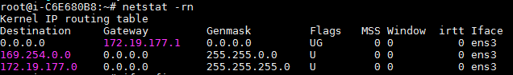

# 路由协议

## 1.路由表概述
**路由器** 是用于网络层进行IP数据包传递的设备，它需要根据IP包中的目的地址选择一条合适的路径将数据包传递到目的主机。因此需要每一个路由器都维护一张路由表，这张路由表记录了目的主机的主机地址或是网络地址。

#### 1.1 路由表内容
路由表通常包含`Destination`, `GateWay`, `Mask`, `Flag`, `Interface`等几项。
其中`Destination`和`Mask`或者`Flag`确定目的地址（一个主机地址或者是网络地址，根据`Mask`和`Flag`不同而不同）。

对于一个给定的路由器，可以打印出5种不同的`Flag`：

* U 该路由可以使用。
* G 该路由是一个 **网关（或者路由器）**。如果没有该标志，表示本路由器是与目标直接相连的。 *（可以区分直接路由与间接路由，而这个路由的目的地址可能为网络地址也可能为主机地址）*
* H 表示该路由是到一个 **主机** 的路由，`destination`是一个主机地址，如果没有该标志说明该路由是一条到网络地址的路由，`destination`是一个网络地址。
* D 该路由是由重定向报文创建的。
* M 该路由已经被重定向报文修改。

而`GateWay`给出的是下一站的地址，就是外出地址，这项通常与Interface两项共同确定跳到下一个路由器的链路,Interface和GateWay是同一网段的。当该项路由记录是发往一个直接路由的时候，GateWay和Interface应该是同一个地址

`Interface`是本地接口的名称，指明本条路由由本机的哪一个接口发出。

如果路由表中没有匹配的项（也没有缺省路由）的时候，就会向应用或者转发的主机发送一份 **ICMP主机不可达差错报文**。

#### 1.2 路由表的搜索顺序
如果一个路由器接受到一个IP报文，它会进行如下几部操作：

1. 搜索匹配的主机地址；
2. 搜索匹配的网络地址；
3. 搜索默认表项（默认路由一般被指定为一个网络表项，其网络号为0）

实际上，上面的顺序就是让网络号尽量匹配（最长匹配）。而对于主机的匹配始终发生在匹配而网络地址步骤之前。

下面来个实例，比如下图是我的服务器上的一个路由表，使用`netstat -rn`进行查看：

> 哈哈！都是保留地址！

第一条的`Destination`是`0.0.0.0`，也就是缺省路由，应该是最后匹配的项，`Flag`字段为`UG`代表这个路由表项是可用的，且是一个间接路由，不与目标网络或主机直接相连。

第二条和第三条的`Flag`都是`U`，没有`G`也没有`H`，而且从`Mask`来看，这两个表项连接的都是一个网络地址，所以这两项都是与目标网络直接相连的。而第三项的子网掩码位数比第二项长，所以接收到数据包后先匹配第三项，再匹配第二项，最后是第一项。

#### 1.3 ICMP重定向报文

ICMP重定向报文是当主机采用非最优路由发送数据报时，路由器会发回ICMP重定向报文来通知主机最优路由的存在。并且重定向报文**必须由路由器**生成，当主机作为路由器使用时，必须将其内核配置成可以发送重定向报文。重定向报文是为**主机**而不是路由器服务的。

假如一个主机所在的子网上有两个的路由器R1和R2，主机发送的数据包，由于主机的默认路由是R1，所以将该数据报发送给R1，但是R1发现这个数据报的下一站是R2，这时，R1会向主机发送一个ICMP重定向报文，告诉主机以后把数据报发送给R2，允许主机更新路由表，并且将主机数据包转发到R2。

重定向报文一般用来让具有很少选路信息的主机主键建立更加完善的路由表.重定向报文个数如下图所示：

更多关于ICMP重定向的内容[参见本文](http://blog.51cto.com/82880/68795)。

#### 1.4 ICMP路由发现报文

主机在引导之后要发送一份路由器请求报文，一台或多台路由器响应该报文，可以由此配置默认路由。但同时，路由器应该定时广播其路由器通告报文，允许每个监听的主机相应的更新他们的路由表。
路由器请求报文格式如下图所示：

路由器通告报文的格式如下图所示：

## 2 动态路由协议

每个路由器上都运行这一个路由守护进程，它运行路由协议，并与相邻的路由器进行信息的交换。路由守护进程根据相邻路由器的信息更新自己的路由表。如果发现多条路径都可以到达终点，那么它将根据路由策略选择一条最短的路径加到路由表中，如果有路径断开，它也可以删除或者另配一条线路。

在Internet中是以自治系统(Autonomous System)方式组织的，每个自治域由一个管理实体管理。在自治域内部可以使用内部网关协议IGP或域内选路协议常见的有RIP协议和OSPF协议；在域之间可以使用外部网关协议EGP还有意在取代EGP的边界网关协议BGP。

### 2.1 RIP：选路信息协议

**RIP报文包含在UDP数据包中**。