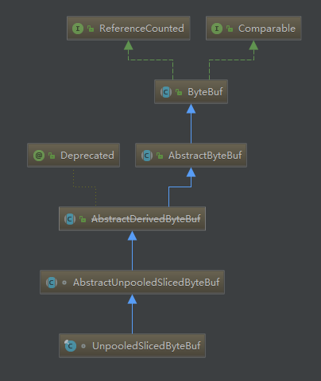
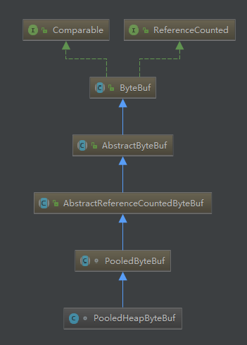

# ByteBuf 相关知识解析

我们知道，在 Java NIO 编程模型中，我们知道 Channel 就是一个抽象的通道，用于在两方之间传输数据，而 ByteBuffer 是 NIO 编程模型中存储数据的组件，而 Channel 正是在 2 个 ByteBuffer 之间传输数据的。可以把 ByteBuffer 想象成两个水桶，而 Channel 是一个水管，水桶中的水就是数据，在两个 ByteBuffer 之间传输数据就像是在两个水桶间输送水。

但是 Java 原生的 ByteBuffer 的设计十分复杂，用起来非常繁琐，需要频繁的在读和写的状态之间进行切换，一不小心就会写出 BUG 。因此 Netty 就将 ByteBuffer 进行了一次改进，也就是我们这篇要讲的主角—— ByteBuf 。

这篇文章使用的 Netty 版本是 `4.1.6 final`。

## ByteBuf 的 slice 和 duplicate 方法

有的时候我们需要在 ByteBuf 的基础上创建一个方便操作的视图，这个时候可能就会用到 ByteBuf 的 `slice()` 或者 `duplicate()`。

两个方法都会返回一个新的 ByteBuf 对象。

* slice() 方法从原始 ByteBuf 中截取一段，这段数据是从 readerIndex 到 writeIndex，同时，返回的新的 ByteBuf 的最大容量 maxCapacity 为原始 ByteBuf 的 readableBytes()；
* duplicate() 方法把整个 ByteBuf 都截取出来，包括所有的数据，指针信息；
* slice() 方法与 duplicate() 方法的相同点是：底层内存以及引用计数与原始的 ByteBuf 共享，也就是说经过 slice() 或者 duplicate() 返回的 ByteBuf 调用 write 系列方法都会影响到 原始的 ByteBuf，但是它们都维持着与原始 ByteBuf 相同的内存引用计数和不同的读写指针；
* slice() 方法与 duplicate() 不同点就是：slice() 只截取从 readerIndex 到 writerIndex 之间的数据，它返回的 ByteBuf 的最大容量被限制到 原始 ByteBuf 的 readableBytes(), 而 duplicate() 是把整个 ByteBuf 都与原始的 ByteBuf 共享。

知道了 `slice()` 和 `duplicate()` 的作用，我们就来看看他们的实现方法。

### slice 方法的具体实现

但是我们知道 ByteBuf 是一个接口，那么 `slice()` 是在哪个类中实现的呢？我们看一下下面这个图：

这个图是 ByteBuf 家族下的一个具体的实现类，ByteBuf 这个抽象类定义了所有 ByteBuf 中应该实现的公共方法。

slice() 方法的实现是在 `AbstractByteBuf` 这一级实现的。这一级还实现了读写 ByteBuf 的一些功能，但是真正底层的数组并没有在这里定义，真正的读写方法（`_getByte()` 等）都是抽象方法，需要子类去实现。在 `AbstractByteBuf` 中其实是创建了一个 `UnpooledSlicedByteBuf` ，如下所示：

	public ByteBuf slice(int index, int length) {
        return new UnpooledSlicedByteBuf(this, index, length);
    }

从名字上来看是新建了一个 **非池化** 的 ByteBuf ，这个 ByteBuf 包装了当前的 ByteBuf ，可以通过 `unwrap()` 方法来获得被包装的 ByteBuf 。在这个非池化的 ByteBuf 中底层的存储用的实际上就是 `unwrap()` 得到的被包装的 ByteBuf ，但是自己维护了一个变量来维护自己的 `readerIndex` 和 `writerIndex` ，这个变量就是 `AbstractUnpooledSlicedByteBuf` 中的 `adjustment` 。

在调用 `AbstractUnpooledSlicedByteBuf` 中的 `_getByte()` 等方法的时候实际上是这样的：

	protected byte _getByte(int index) {
        return unwrap().getByte(idx(index));
    }

而 `idx()` 是这样的：

	final int idx(int index) {
        return index + adjustment;
    }

这样就是通过 `adjustment` 控制了访问底层 ByteBuf 的范围。

## ByteBuf 的引用计数

由于 Netty 使用了堆外内存，而堆外内存是不被 jvm 直接管理的，也就是说申请到的内存无法被垃圾回收器直接回收，所以需要我们手动回收。有点类似于c语言里面，申请到的内存必须手工释放，否则会造成内存泄漏。

Netty 的 ByteBuf 是通过 **引用计数** 的方式管理的，如果一个 ByteBuf 没有地方被引用到，需要回收底层内存。默认情况下，当创建完一个 ByteBuf，它的引用为 1 ，然后每次调用 retain() 方法， 它的引用就加一， release() 方法原理是将引用计数减一，减完之后如果发现引用计数为 0 ，则直接回收 ByteBuf 底层的内存。

> 调用了 `slice()` 和 `duplicate()` 之后记得给原来的 ByteBuf 的 `retain()` 方法，在销毁的时候调用 `release()` 方法。

这部分功能的实现就是靠 ByteBuf 中的域 `refCnt` 以及对这个域进行控制的方法 `retain()` 和 `release()` 来实现的。`retain()` 方法可以将 `refCnt` 的值加 1 ，代表底层的 ByteBuf 多了一个引用，而 `release()` 相反，会减小 `refCnt` 的值，如果值为 0 ，则会释放掉底层的内存。

用上面那个图，最顶层的 `ReferenceCounted` 接口定义了引用计数相关的方法，而具体实现引用计数方法的就是这个 `AbstractReferenceCountedByteBuf` 。这里我们就可以看到设计者在设计 ByteBuf 的整套 API 的时候使用的分层设计的思想，不同层次的功能在不同层次中实现，使得整体框架更加易于维护。

### 具体实现

**线程安全问题**

由于有多线程调用的情况会发生，所以这部分在设计的时候考虑到了 **线程安全** 的问题，在对 `refCnt` 进行更新的时候使用了 `AtomicIntegerFieldUpdater` 采用了 CAS 机制进行更新。注意：这里的 `refCnt` 必须是 `voletile` 和 `int` 的，否则 `AtomicIntegerFieldUpdater` 的初始化会失败。

> 这里使用 `AtomicIntegerFieldUpdater` 而不是使用 `AtomicInteger` 我感觉可能是当初设计的时候没有考虑线程安全问题，而到后面想到这个问题的时候本着尽量不侵入原来源码的原则使用了 `AtomicIntegerFieldUpdater` 通过反射进行 CAS 操作。

下面是实际执行 `retain()` 的代码：

	private ByteBuf retain0(int increment) {
        int refCnt;
        int nextCnt;
        do {
            refCnt = this.refCnt;
            nextCnt = refCnt + increment;
            if (nextCnt <= increment) {
                throw new IllegalReferenceCountException(refCnt, increment);
            }
        } while(!refCntUpdater.compareAndSet(this, refCnt, nextCnt));

        return this;
    }

下面是实际执行 `release()` 的代码：

	private boolean release0(int decrement) {
        int refCnt;
        do {
            refCnt = this.refCnt;
            if (refCnt < decrement) {
                throw new IllegalReferenceCountException(refCnt, -decrement);
            }
        } while(!refCntUpdater.compareAndSet(this, refCnt, refCnt - decrement));

        if (refCnt == decrement) {
            this.deallocate();
            return true;
        } else {
            return false;
        }
    }

当一个 ByteBuf 被初始化的时候， `refCnt` 的值为 1 ，每回调用 `retain()` 的时候， `refCnt` 加 1 ，在将 `refCnt` 成功减到 0 的时候，会触发底层内存的释放机制。

那么在调用了 `slice()` 的时候创建的 ByteBuf 调用 `retain()` 和 `release()` 的时候改变的是谁的 `refCnt` 呢？

