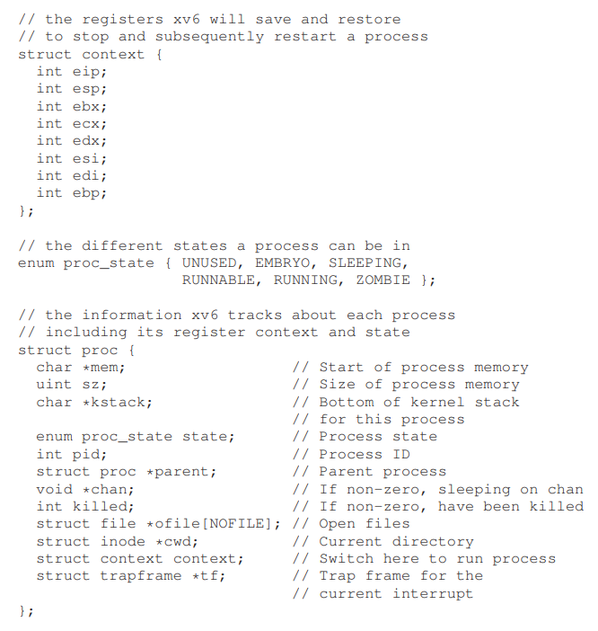

# 抽象：进程

**进程** (Process) 就是一个运行中的 **程序** (Program)。程序是一个没有生命周期的，存储在硬盘里的，等待执行的一堆指令（可能还有静态数据）。是操作系统获取这些指令，让他们运行起来的。

而在同时执行多个进程的时候，涉及到的一个概念就是 CPU 的虚拟化。 CPU 虚拟化的意思就是将一个物理的 CPU 虚拟化虚拟化成为多个 CPU ，使得正在运行中的多个程序都认为自己在独占一个物理 CPU ，但是实际上是多个进程共享同一个物理 CPU 。这个虚拟化就是通过操作系统实现的，它需要操作系统具有底层的 **机制** (Mechanism) 和顶层的 **策略** (Policy) 两者共同完成。

这其中的机制就包括比如说 **分时** (Time-sharing) ，它确定了一个模型，就是让多个进程在运行的过程中进行切换，对 CPU 进行时分复用，还有 **上下文切换** (Context switch) ，它使得一个进程在被切换的时候可以记录下当前进程的信息，保证之后可以正确的切换回来，等等。而这其中的策略主要就是操作系统对于线程切换的决策算法。

## 1. 抽象：一个进程

前面我们介绍了进程的概念，下面我们还要讲讲什么组成了进程。首先我们又要介绍一个概念 **机器状态** (Machine state)，机器状态是程序在运行过程中读取和修改的东西。 **内存** (Memory) 和 **寄存器** (Register) 都是机器状态的一部分。其中，内存中存储着进程所需要读和写的数据，同时，指令也是存储在内存中的。而寄存器也是指令在很多运行的时候直接读写的。

## 2. 进程 API

操作系统提供了一些操作进程的接口：

* 创建：就是创建一个进程，比如说你双击一个应用的图标或者在命令行输入一串命令的时候，都会创建一个新的进程。
* 销毁：进程在运行完成之后会自动退出，但是使用者也可以对其进行干预，在没有运行完的时候杀死这个进程。
* 等待：让一个进程暂停运行。
* 其他的操作：比如挂起和恢复一个线程；
* 状态：通过这个接口来获得进程的状态信息，比如这个进程运行了多久，或者这个进程处于什么状态。

## 3. 进程的创建：一些细节

一个进程在创建的时候首先会将指令和静态数据加载进内存中这个进程的地址空间。早期和简单的操作系统中，加载的过程是 eagerly 的，它会将所有要用到的指令和数据都加载到内存，而现代的操作系统通常都是 lazily 式的加载，它只加载在程序执行的时候需要的数据，想真正理解这部分，还要学习后面 **分页** (Paging) 和 **交换** (Switching) 的知识。

代码和静态数据加载到内存之后，操作系统还要做一些其他事情。比如分配 **栈** (Stack)，在 C 语言中栈用来存放本地变量、函数的参数和返回地址。

操作系统还会分配一些内存给程序的 **堆** (Heap) 。在 C 语言中，使用 `malloc()` 和 `free()` 动态分配和回收的空间就是在堆上的。

操作系统还会进行一些 IO 初始化的操作，比如对于 UNIX 系统来说，每个进程初始化的时候会默认打开三个 **文件描述符**，标准输入、标准输出和错误。

进行完一系列初始化的操作之后程序就可以运行了，从程序的 `main()` 函数开始执行新的进程，这个时候，操作系统就将 CPU 的控制权交给了这个新的进程，这个进程就开始了它的运行。

## 4. 进程的状态

简单的来看，一个进程有这么三个状态：

* 运行中 (Running) ：处理器正在执行这个进程。
* 就绪 (Ready) ：当前处理器没有在执行这个进程，但是 OS 随时可以选择执行这个进程。
* 阻塞 (Blocked) ：一个处于阻塞状态的进程会将 CPU 让出来给别的进程，在某些事件（比如 IO 完成事件）发生之前，这个进程不会进入就绪状态。

## 5. 数据结构

操作系统也是一个程序，和一般的程序一样，操作系统中也有一些重要的数据结构来追踪一些信息。为了追踪各个进程的信息，操作系统使用了 **进程列表** (Process list) 来追踪当前正在运行的进程的信息，同时操作系统还要追踪当前处于阻塞状态的进程，以保证它们在阻塞结束之后可以重新被调度。

下面是一个操作系统中常见的进程相关的数据结构（通常被称为 **进程控制块** Process Control Block，PCB，每个进程列表的 entry 就是一个 PCB）：

可以看到，除了之前我们说的三个状态之外，实际实现中的进程还有两个状态 EMBRYO 和 ZOMBIE 分别表示刚刚初始化的进程和已经运行完成的进程。 ZOMBIE 状态可以方便其他进程（通常是父进程）测试这个进程的返回值，看看这个进程是否是正常退出。