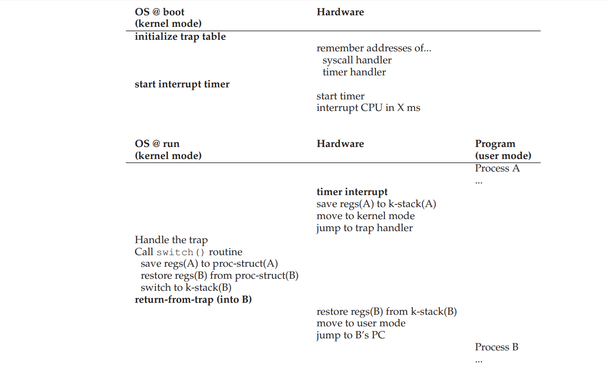

# 原理：受限制的直接执行

前面我们说过了 CPU 的虚拟化就是让各个进程分时使用 CPU 。以上只是简单的说法，在此之上，操作系统还有很多工作要做，比如如何做才能不引入过多的开销，如何在运行进程的同时保持着对 CPU 的控制，等等。如果没有对 CPU 的控制，一个进程可能就会一直占据着机器，或者访问它本没有权限访问的文件等等。

## 1. 基本技术：受限制的直接执行

说到受限制的直接执行 (Limited Direct Execution) ，我们要先说下什么是直接执行 (Direct Execution) 。直接执行就是在操作系统想要开启一个新进程的时候，就创建一个 PCB 并将其放入进程列表，为新进程分配空间，并将指令和静态数据加载进内存，设置好栈的参数 argc/argv ，清空寄存器，然后进入新进程的 main() 并执行。知道新的进程执行完之后返回。

这就有一个很直接的问题，在新的进程运行的时候我们的操作系统就失去了对 CPU 的控制，必须要等到新进程执行完之后才能重新取回控制权。这样我们甚至无法让操作系统切换进程实现多进程对于 CPU 的时分共享。这样的话，虽然程序执行的效率高，但是操作系统就仅仅变成了一个库 (Library) 。

## 2. 问题 #1：受限制的操作

在程序的运行过程中都会有一些受限制的操作，比如 IO 、请求 CPU 和内存资源等。这些操作不应该让每一个进程都可以任意执行。因此就引出了 **用户模式** (User Mode) 和 **内核模式** (Kernel Mode) 。在用户模式下不能进行受限制的操作，而运行在内核模式下可以进行任意操作，操作系统就运行在内核模式下。

那么运行在用户模式下如何进行比如 IO 、进程创建销毁和分配内存等这些受限制的操作呢？现代操作系统都提供了几百个 **系统调用** (System Call) 来进入内核模式并执行这些操作。用户代码中调用系统调用之后，首先会执行一个特殊的 **陷阱指令** (Trap Instruction) ，将跳入内核并将权限等级提升到内核模式，然后执行相应的调用。执行完成之后将从陷阱指令返回，并将特权等级调整回用户模式。

在执行陷阱指令的时候，还需要将当前的一些上下文信息（ PC 、标志位以及一些寄存器）压入进程的内核栈。调用返回的时候将这些信息弹出，复原上下文信息，继续执行。

> 陷阱表 (Trap Table) 这块还要在看一下。

在受限的直接执行协议中有两个过程：第一个是在系统启动的时候，系统内核初始化一个陷阱表， CPU 会记住它的位置留以后用，这是通过一个特权指令实现的。

第二个就是内核进行了相应的操作（比如新建进程列表中的节点、分配内存等）后，执行陷阱返回指令 (return-from-trap) 启动新的进程之前，这个时候 CPU 会切换到用户模式，并开始执行用户进程。

## 3. 问题 #2：进程间切换

上一节中我们也提到了，如果进程直接执行在硬件上，我们无法控制何时切换进程以完成进程切换。按理说操作系统应该可以决定何时切换进程，但是如果一个进程正运行在 CPU 上，也就是说这个时候操作系统是没有在运行的，就更别提判断何时切换进程了。

### 一种合作的方法：等待系统调用

这是一种在过去曾经被使用过的方法（比如早期版本的 Macintosh 和旧的 Xerox Alto 系统）。大部分程序都会在进行系统调用的时候把控制权交给 CPU ，比如读取硬盘数据、发送数据到其他计算机等的时候，有的系统还会有 `yield` 这种明确的系统调用让进程把控制权交给操作系统。

另外，进程进行一些非法操作（比如除 0 、访问不应被访问的内存等）的时候也会产生一个到操作系统的陷阱，这个时候操作系统就会再次得到 CPU 的控制权。

所以这种方法就是被动的等待进程进行系统调用或者进行了非法操作的时候，操作系统才能重新获得 CPU 的控制权。这种方法的缺陷就是如果进程陷入一个没有系统调用的死循环（无论是有意为之的还是无意的）那么操作系统将再也无法获得 CPU 的控制。

### 一种非合作的方法：系统索取控制权

一种不需要进程配合交出控制权的方法就是使用 **定时器中断** (Timer Interrupt) 。这个时候操作系统取回 CPU 控制权的过程就是这样的：在其他进程运行的时候，预先设定好的定时器产生一个中断，这个时候正在运行的程序被中断，预先设定好的操作系统的 **中断处理程序** 开始运行。这之后，操作系统就可以做切换相关的工作了。

这也就是说，操作系统必须在启动的时候就设置好中断处理程序，并且在启动的时候打开定时器。

### 保存和恢复上下文

在如果在一个进程执行的时候，操作系统通过系统调用或定时器中断的方式获得控制权后决定切换到另外一个进程进行执行的时候就涉及到了 **上下文切换** (Context Switch) 。这个时候操作系统需要将一些寄存器的状态保存起来（比如当前进程的内核栈），然后将下面将要执行的进程的状态恢复到寄存器中。

要保存的信息有：通用寄存器、 PC 、内核栈指针等。

过程见下图：

刚开始，进程 A 在运行，这个时候产生了定时器中断，硬件将寄存器存入进程 A 的内核栈，并进入内核模式。在定时器中断处理程序中，操作系统决定将控制权交给进程 B 。这个时候，它将调用 `switch()` 将当前寄存器的值存入进程 A 的进程数据结构中，从进程 B 的进程数据结构中恢复进程 B 的寄存器的值，之后进行上写文切换，也就是将栈指针切换到进程 B 的内核栈。最后，从系统见镜中返回，进程 B 开始运行。

> 可以看到上面进行了两次寄存器值的保存。其中第一次是在定时中断发生的时候， *硬件* 隐式地将 *用户寄存器* 存入 *进程的内核栈*；第二次是操作系统 *软件* 显式地将 *内核寄存器* 保存到 *进程的数据结构* 中。这也是为了让之后的操作系统的行为从 *看起来像是从内核返回到进程 A* 变成 *看起来像是从内核返回到进程 B*

