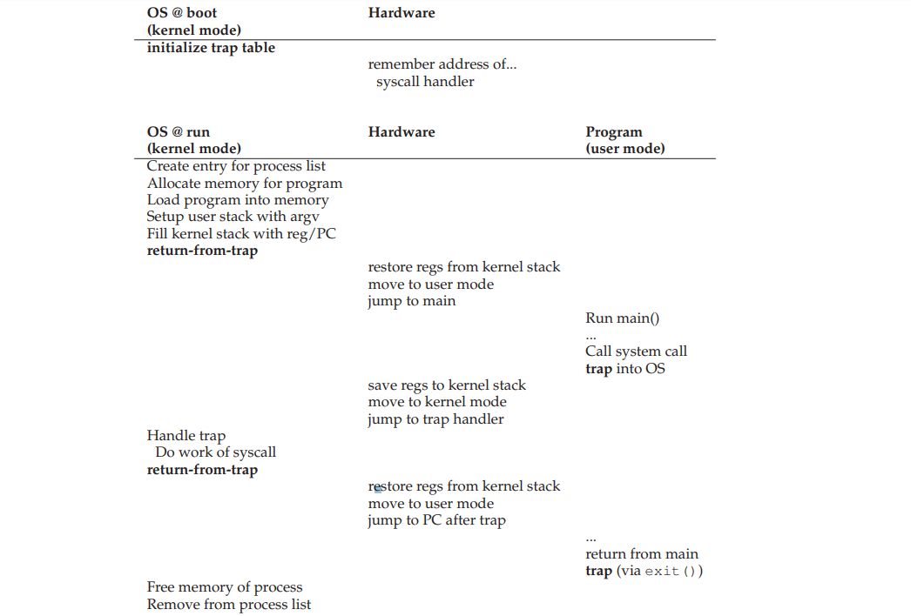

# 原理：受限制的直接执行

前面我们说过了 CPU 的虚拟化就是让各个进程分时使用 CPU 。以上只是简单的说法，在此之上，操作系统还有很多工作要做，比如如何做才能不引入过多的开销，如何在运行进程的同时保持着对 CPU 的控制，等等。如果没有对 CPU 的控制，一个进程可能就会一直占据着机器，或者访问它本没有权限访问的文件等等。

## 1. 基本技术：受限制的直接执行

说到受限制的直接执行 (Limited Direct Execution) ，我们要先说下什么是直接执行 (Direct Execution) 。直接执行就是在操作系统想要开启一个新进程的时候，就创建一个 PCB 并将其放入进程列表，为新进程分配空间，并将指令和静态数据加载进内存，设置好栈的参数 argc/argv ，清空寄存器，然后进入新进程的 main() 并执行。知道新的进程执行完之后返回。

这就有一个很直接的问题，在新的进程运行的时候我们的操作系统就失去了对 CPU 的控制，必须要等到新进程执行完之后才能重新取回控制权。这样我们甚至无法让操作系统切换进程实现多进程对于 CPU 的时分共享。这样的话，虽然程序执行的效率高，但是操作系统就仅仅变成了一个库 (Library) 。

## 2. 问题 #1：受限制的操作

在程序的运行过程中都会有一些受限制的操作，比如 IO 、请求 CPU 和内存资源等。这些操作不应该让每一个进程都可以任意执行。因此就引出了 **用户模式** (User Mode) 和 **内核模式** (Kernel Mode) 。在用户模式下不能进行受限制的操作，而运行在内核模式下可以进行任意操作，操作系统就运行在内核模式下。

那么运行在用户模式下如何进行比如 IO 、进程创建销毁和分配内存等这些受限制的操作呢？现代操作系统都提供了几百个 **系统调用** (System Call) 来进入内核模式并执行这些操作。用户代码中调用系统调用之后，首先会执行一个特殊的 **陷阱指令** (Trap Instruction) ，将跳入内核并将权限等级提升到内核模式，然后执行相应的调用。执行完成之后将从陷阱指令返回，并将特权等级调整回用户模式。

在执行陷阱指令的时候，还需要将当前的一些上下文信息（ PC 、标志位以及一些寄存器）压入进程的内核栈。调用返回的时候将这些信息弹出，复原上下文信息，继续执行。

> 陷阱表 (Trap Table) 这块还要在看一下。

在受限的直接执行协议中有两个过程：第一个是在系统启动的时候，系统内核初始化一个陷阱表， CPU 会记住它的位置留以后用，这是通过一个特权指令实现的。

第二个就是内核进行了相应的操作（比如新建进程列表中的节点、分配内存等）后，执行陷阱返回指令 (return-from-trap) 启动新的进程之前，这个时候 CPU 会切换到用户模式，并开始执行用户进程。