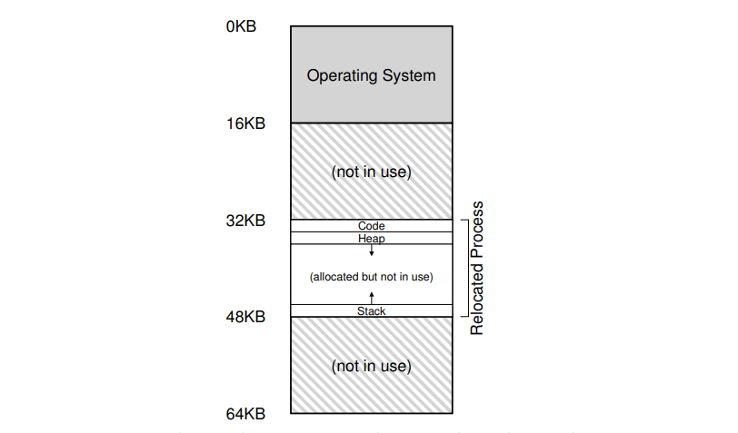
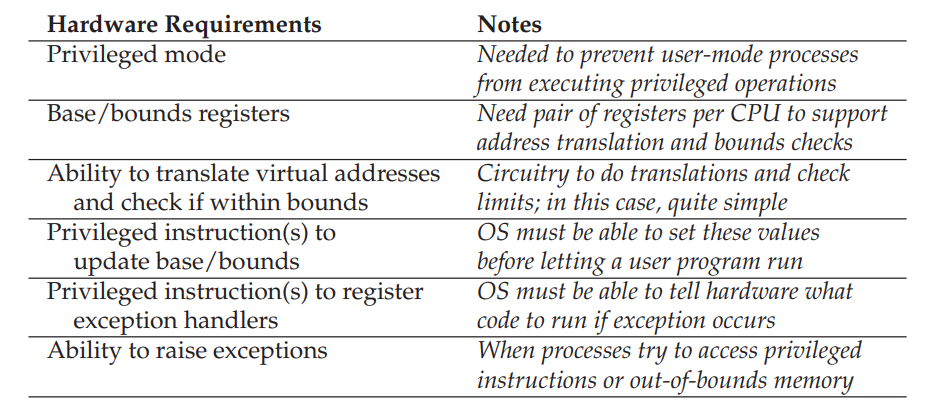
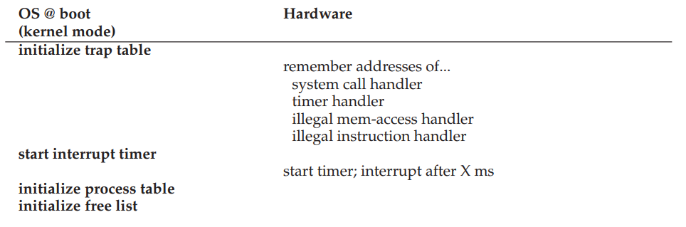
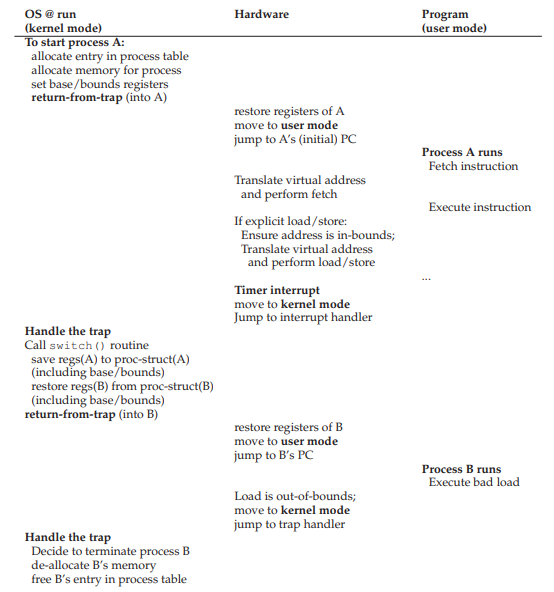
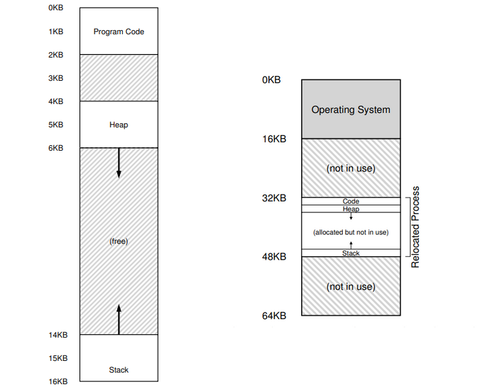
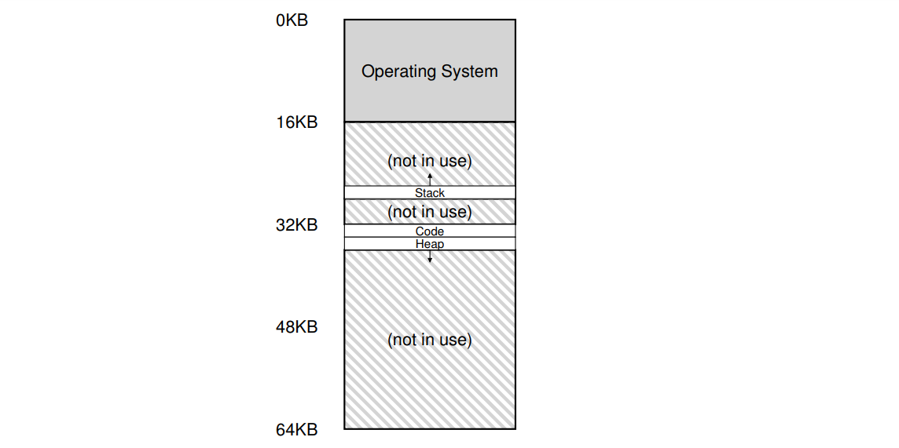

# 虚拟内存

## 1. 虚拟内存的目标

最原始的操作系统就是一个库，用户对于内存的操作也是直接在物理内存上进行操作。

但是后来由于 **多道程序设计** (Multiprogramming) 的出现，为了提高硬件资源的利用率，比如在一个进程进行 IO 操作的时候，调度其它进程进行运行。很快，分时使用 CPU 的方法出现了，一种分时的方法就是每个进程分别运行一小段时间，并且可以使用全部的内存，一段时间后将所有内存信息保存到硬盘，然后将 CPU 控制权交给下一个程序。但是这种方法有着大量的磁盘 IO ，十分耗费时间，后来人们发明了多个程序的数据在内存中共同存在的方式。这个时候内存的隔离就成了一个重要的问题，因为我们不希望一个程序可以读甚至修改另一个程序的内存。

之后就出现了地址空间的概念。它将物理地址抽象成了虚拟地址提供给程序使用。

那么虚拟内存设计的目标都有什么呢？

* 透明：虚拟内存的实现要对程序不可见，为此，操作系统和硬件需要做许多相应的工作；
* 高效：体现在两个方面，时间上，不能让程序的运行速度变得过慢；空间上，不能用过多的内存空间来支持内存的虚拟化。这也使得操作系统需要硬件的支持，比如 TLB；
* 安全：需要将进程与进程隔离开

## 2. 机制：地址转换

我们之前了解过 **有限制的直接执行** 是操作系统保持自己控制权的方式，地址转换就是有限制的直接执行的一种。下面的几节我们会介绍几种虚拟内存管理的方法，每种方法层层递进，功能和性能都会越来越完善。在本届中我们介绍的方法就是 **基址、范围寄存器** (Base and Bound Register)，也叫 **动态重分配** (Dynamic relocation)。

这种方式的实现需要操作系统与硬件配合来实现，确切的说，每一种虚拟内存转换的方式的实现都需要硬件的功能支持，以此达到更高的效率。

### 前提条件

这种方式的内存管理有以下几个条件：

1. 用户的 **地址空间** (Address space) 是连续的物理内存；
2. 用户的地址空间不会太大，不大于物理内存的大小；
3. 假设每个进程的地址空间都是一样大的。

当然，这些都是临时的假设，我们之后会逐步放宽这些条件。符合这样条件的物理内存看起来就是这样的：

### 实现

这种方式的实现需要两种寄存器：基址寄存器 (Base register) 以及范围寄存器 (Bound register)。前者保存着 **当前进程** 物理内存的开始的地址，后者保存着当前进程能够使用的空间的大小。

程序中使用的内存地址都是虚拟地址，都是从 0 开始的，当程序要访问某一个具体的内存地址的时候就可以通过如下公式计算出物理地址：

    物理地址 = 基址（保存在机制寄存器中） + 虚拟地址

这种方式将虚拟地址作为一个偏移量来使用，通过偏移量和基址得到最终的物理地址。**这个地址翻译的过程是发生在运行时的**，而且我们甚至可以在程序开始运行之后改变内存地址的位置，所以这种地址转换的方法也被称为动态重分配 (Dynamic Relocation)。

而范围寄存器的任务是判断当前要取的虚拟地址有没有超过分配的范围，如果超过范围或者地址为负数，就出触发一个异常，一般系统都会终止这个发生异常的任务。

这两个寄存器实际上是 CPU 上的内存管理单元 (MMU) 中的两个寄存器。地址翻译的工作都是有 MMU 电路来完成的。

> 到目前为止的硬件支持的小结：
> 1. 首先我们在前面 CPU 虚拟化的时候讲过的，CPU 要有两种运行模式：用户模式和内核模式，这个是可以通过一个 **处理器状态字** (Processor status word) 来表示的。
> 2. 我们刚才讲到的 MMU 以及其上的两个寄存器：Base register 和 Bounds Register，这两个寄存器的内容当然都需要在特权模式下才可以更改。
> 3. 最后，CPU 还需要可以产生异常信号（比如虚拟地址超出范围，或者是程序想在用户模式下调用特权操作的时候），同时调用 **异常处理程序** (Exception Handler)。这就要求 CPU 可以根据异常类型找到相应的异常处理程序的位置。

上面我们说了些硬件方面需要的支持，但是我们之前说地址翻译需要硬件和操作系统的配合才可以实现，那么在这个过程中操作系统做了哪些工作呢？

首先，在一个进程开始的时候，操作系统需要找到一片没有被分配的内存分配给这个新的进程。通常这个过程就是一个从 **空闲列表** (Free List) 的数据结构中找。

其次，在进程结束的时候，操作系统需要回收分配给这个进程的内存空间，这也就需要将刚刚从空闲列表中取出来的 Entry 添加回去。

另外，我们的系统是个多进程的系统的话，就要考虑在上下文切换的时候操作系统也需要将 Base/Bounds Register 的内容存入内存的相应进程的 **进程控制块** (Process Control Block, PCB) 中，并将将要执行的进程 Base/Bounds Register 恢复。

操作系统还要提供异常处理程序，这些都是操作系统通过特权操作在启动的时候装载好的。

下面我们加上这接刚学习到的内容，再结合上我们前面学到的进程和 CPU 虚拟化的知识，看看操作系统启动的时候都会做什么：

运行的时候会进行的操作：

我们本节介绍的方法是最简单的一种虚拟内存管理的方法，但是我们对他的假设太理想，下节我们将介绍一种更加复杂的方法。

## 3. 分段

我们上面介绍的方法使用的是两个寄存器：基址寄存器以及范围寄存器，每个进程分别在各自的 PCB 中保存这两个寄存器的值，在这个进程要运行的时候将这两个寄存器的值恢复到 MMU 之后，就可以自动完成虚拟地址到物理地址的转换了。

但是这种方法存在一些问题。首先就是内存的利用率很低，一个方面，因为我们每个进程使用的内存空间可能都不相同，多次进程内存分配之后就可能出现大量的 **内存碎片** ，使得虽然及其的物理内存虽然足够大，但是没有一个连续的区域能够容纳新分配的进程内存。

另一个方面，我们注意到上面的方法分配内存的时候是直接按照虚拟地址空间看起来的样子进行分配的，下图左边的是进程地址空间的示意图，而右边的是物理内存中内存分配的方式：

我们会发现，虚拟地址空间中间有一段内存并没有使用，但是在物理内存分配的时候给这段地址也分配了空间，试想一下，如果对于一个 32 位地址空间（ 4GB ）的进程来说，可能实际使用的内存只有几 MB 但是分配的物理空间却是 4GB ，这个浪费是我们难以接受的，因此 **分段** （ Segmentation ）就被提了出来。

分段的方法将对每一个进程的代码段、堆以及栈分别记录它们的基址以及范围，使用了这种方法的机器的物理内存看起来就是这个样的：

看到上面的图，虽然堆和栈是在生长的，但是由于有大小的限制，所以这两部分所占用的内存并不会无限增长，我们在上一节也提到了，在地址转换的时候会有地址范围检查的过程的，使用分段的方法同样也有这一过程，如果想访问的地址的范围超过了范围寄存器指示的范围，系统就会抛出 **段错误异常** 。

使用了分段还可以支持内存的共享，比如多个进程复用了同一段代码，就可以将这段代码段设置为共享，多个进程将地址空间中相应代码的内存映射到同一个物理地址上。为了支持内存共享，我们就需要 **保护位** (Protection bits)，通过将段的保护级别设置为只读，就可以将这个段共享给多个进程而不用担心隔离性的问题了。这样我们就可以看看一个进程需要记录那些与分段有关的信息：

### 分段的粒度问题

我们本节中讨论的这种分段方法算是一种比较原始的粗粒度的分段方法，而细粒度的分段方法可以将代码段、堆、栈再细分成多个段，使得内存的分配可以更加灵活，但是使用细粒度的分段方法就需要更多的硬件支持，需要有 **分段表** (Segmentation Table)。