# Redis基本概念

## 1. Redis简介

Redis是一个存取速度非常快的菲关系型数据库。它采用key-value的方式进行存储，可以进行`String`类型与`String`，`List`，`Set`，`Sorted Set`以及`Hash`的映射。而且与Memcached不同，Redis可以将数据持久化到硬盘中。因此Redis即可以作为辅助数据库也可以作为主数据库来使用。

Redis的五种数据如下图所示：

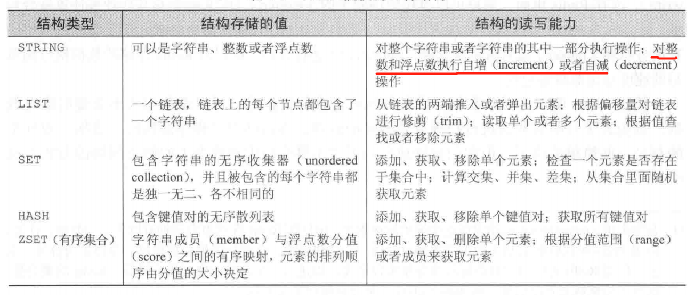

同时，Redis实现了**主从复制**的特性，执行复制的服务器会连接上主服务器，接受主服务器发送的数据库初始副本。之后在主服务器执行**写**命令的时候，也会发送到所有的从服务器上去执行，实现数据的同步。

Redis的数据存储在内存中，因此随机访问的性能很强.

## 2. Redis命令简介

### 2.1 String命令

Redis的字符串类型可以表示三种类型的数值：

* 字节串
* 整数（范围与long integer相同）
* 浮点数（精度与double相同）

String相关命令如图所示：

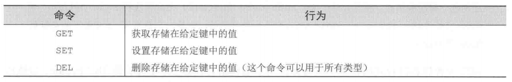

同时，对字符串还有自增和自减的操作。如下图所示

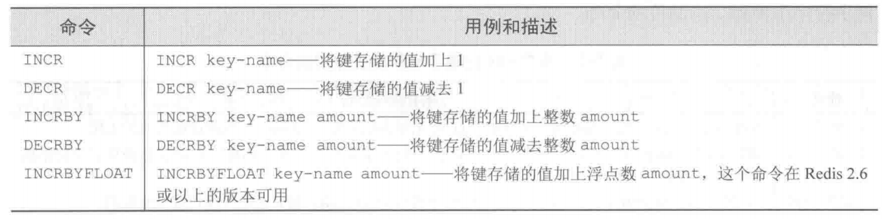

如果用户对不存在的键进行了自加或自减操作，默认值为0的自加或自减。如果待自加或自减的字符串不能被解释为一个整数或浮点数，Redis会向用户返回一个错误。

Redis对于字符串还有一些字符串操作和位操作的命令，如下图所示：

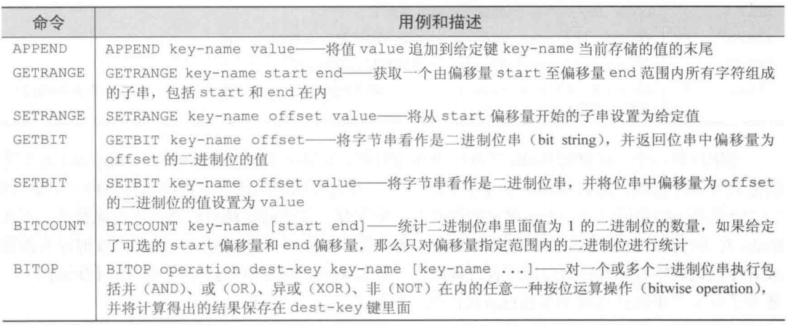

### 2.2 List相关命令

List相关的命令如图所示：

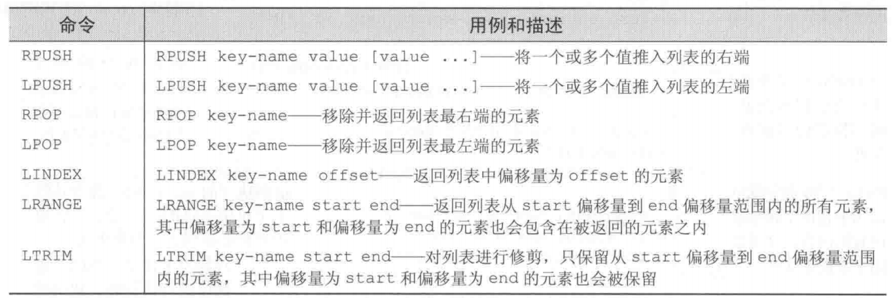

在Range命令中，如果第二个参数是-1的话就代表是范围结束（也就是最后一个）索引（事实上，可以将索引看成一个环，整数就是正着数的位置，负数就是反方向数的索引值）。

同时还有一些阻塞式的列表弹出命令和将元素从一个列表移动到另一个列表的命令，这些命令如下图所示：

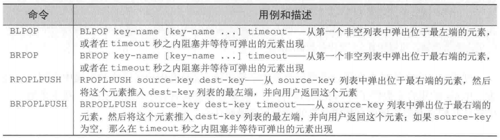

### 2.3 Set相关命令

List和Set都可放置多个成员，但是List中可以放置多个相同的成员，而Set使用了哈希表保证了存储的每个成员都是不同的（结构类似于Java中的HashSet，因此也是无序的）。Set相关的命令如下图所示：

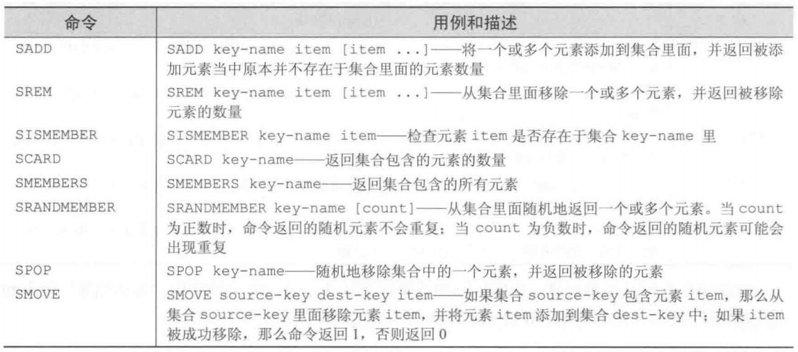

但是Set真正强大的地方在于其支持的**集合运算**，它可以组合和关联多个集合。集合运算操作指令如下图所示：

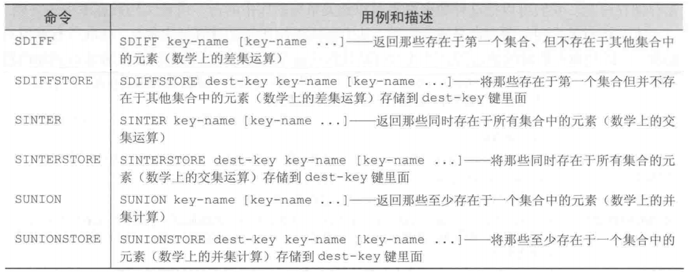

### 2.4 Hash相关命令

Hash可以看做是一个微缩版的Redis，其结构如下图所示：

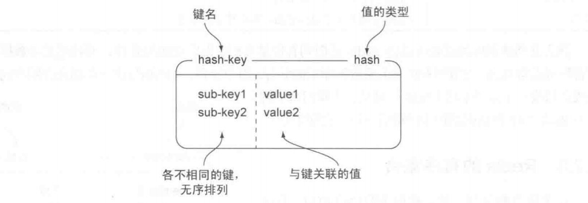

相关的指令如下图所示：

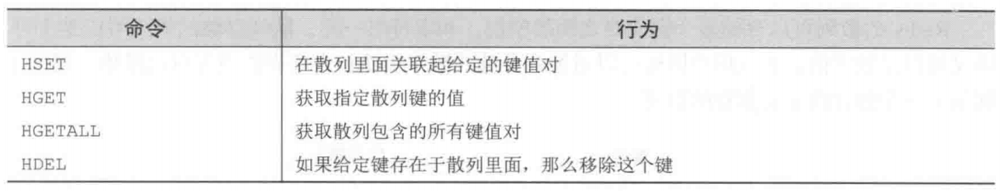

一次操作多个键值对的操作如下图所示：

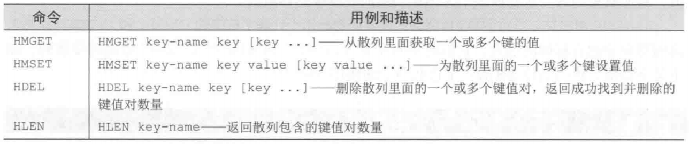

一些高级特性：

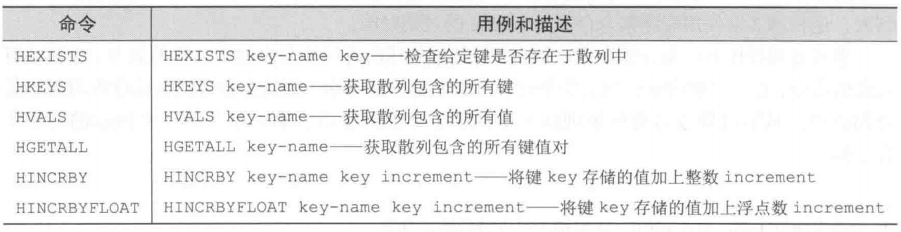

### 2.5 ZSet相关指令

有序集合和散列一样，都存储了一个键值对，有序集合的值是一个分值，是一个浮点数。有序集合可以根据键来访问元素，也可以根据分值的排列顺序来访问元素。使用指令如下图所示：

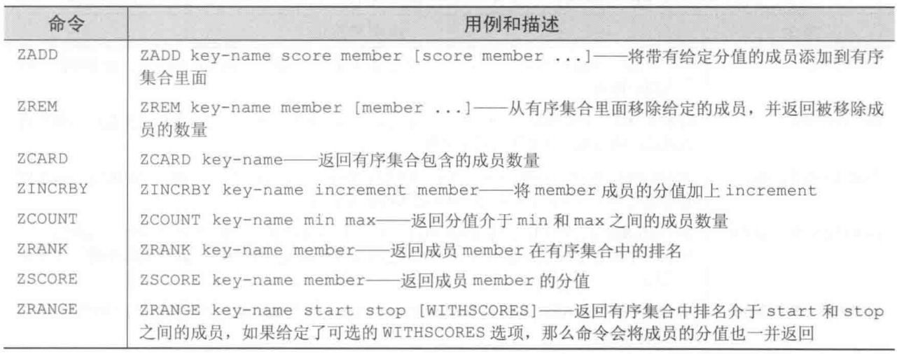

同时，ZSet也提供了一些范围操作以及集合运算操作的指令，如下图所示：

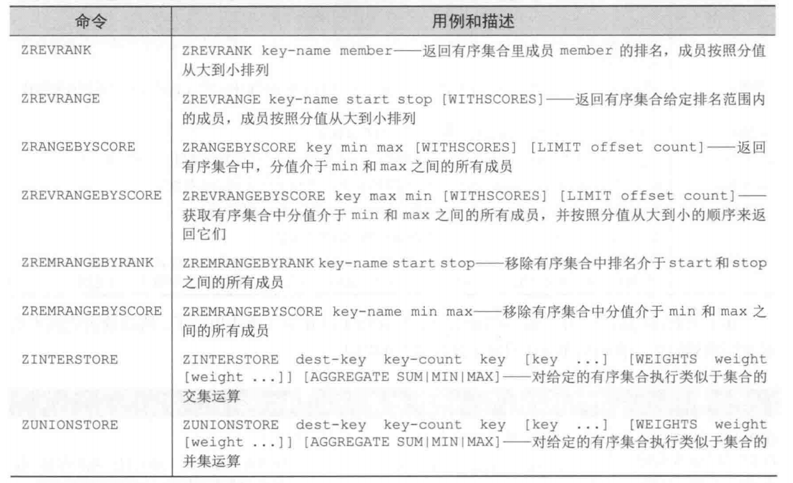

### 2.6 订阅和发布

订阅者(Listener)负责订阅频道(Channel)，发布者(Publisher)负责向频道发送二进制字符串消息，所有订阅此频道的订阅者都会受到这条消息。

与此相关的指令如下图所示：

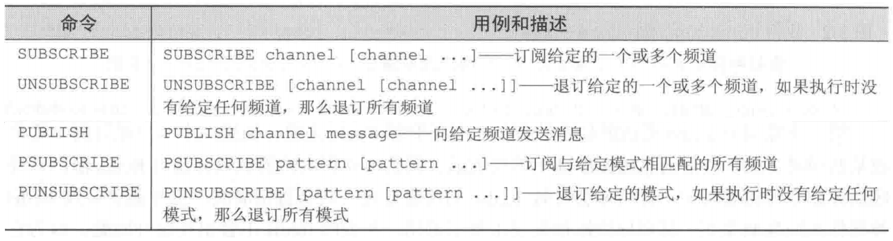

### 2.7 其他指令

#### 2.7.1 排序

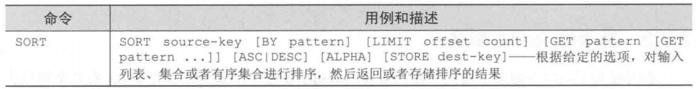

#### 2.7.2 基本的Redis事务

Redis的事务主要涉及到五个命令：`MULTI`,`EXEC`,`WATCH`,`UNWATCH`,`DISCARD`。

首先要执行`MULTI`指令，将我们想执行的多个指令放在这条指令后，Redis会把这些指令放在一个任务队列中，然后执行这些指令。

#### 2.7.3 键的过期命令

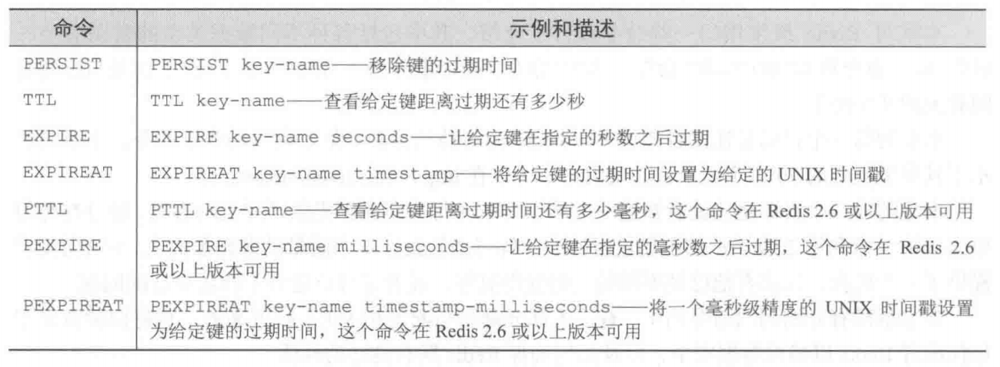

## 3. 数据安全与性能保证

### 3.1 持久化

Redis的持久化已经写过了，在[这里](../Sundry/Redis.md)。

### 3.2 复制

当从服务器连接到主服务器的时候，主服务器会执行`BGSAVE`命令，因此开启主从复制的时候要保证正确配置了`dir`和`dbfilename`选项。通过`slaveof host port`选项以及命令来指定主服务器，通过命令`slaveof no one`来停止主从复制。

Redis主从复制的过程如下图所示：

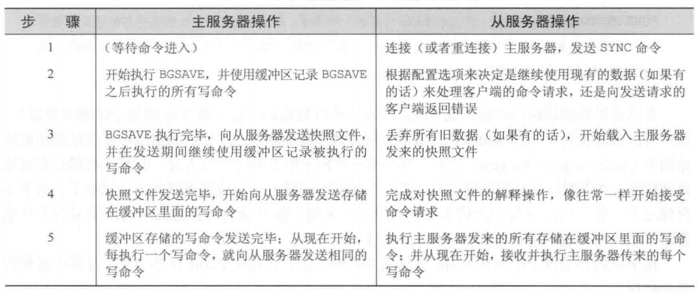

从上表中可以看出，在开始进行主从复制的时候，主服务器还是会尽力执行到来的请求，但是如果主服务器带宽不足或者没有足够的内存进行BGSAVE的话，就会影响Redis命令执行的效率。因此一般让Redis服务器只使用50-65%的内存，保证BGSAVE能够正常运行。

且要注意，从服务器会丢掉原来所有的数据，用主服务器的数据替换之前的数据。

同时，从服务器也可以有它的从服务器。从服务器到从服务器的同步与主服务器到从服务器唯一不同的地方是：从服务器在进行上表中第4步的时候回断开与从服务器的从服务器的连接，重新进行同步。

## 4. 处理系统故障

### 4.1 单机故障恢复

在服务器意外宕机之后，可以通过`redis-chack-aof`和`redis-check-dump`来使用aof文件后dump文件对数据库进行恢复。如下图所示：

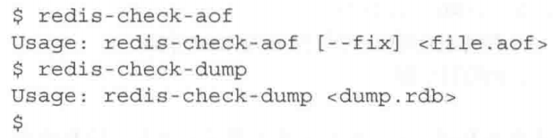

如果`redis-check-aof`使用了`--fix`选项，就会对aof文件进行修复，但修复仅仅是对有错误的部分开始到文件最后进行删除。现阶段没有能够修复快照文件丢失部分的功能，所以最好对快照文件进行备份。

### 4.2 更换故障服务器

假如有A、B两台服务器，A为主服务器，B为从服务器，此时A服务器故障，要更换C服务器作为主服务器，就需要在B上执行`SAVE`，然后将快照文件发到C服务器，然后将B设置为C的从服务器就完成了。

另一种方法是将从服务器升级为主服务器，将新的服务器设为从服务器。

## 5. Redis事务

类似于MySQL使用`BEGIN`开启一个事务，使用`ROLLBACK`和`COMMIT`来回滚或者提交事务，Redis使用`MULTI`开启一个事务，`EXEC`来执行一个事务。

在并发的场景下，我们可以使用`WATCH/UNWATCH`来对一些键进行监视，如果被监视的键在`EXEC`之前被**其它客户端**修改了，那么在用户执行`EXEC`的时候，事务会失败并且返回一个错误。其中`UNWATCH`是用在`MULTI`之前的，用于取消对键的监控，而`DISCARD`是用在`MULTI`之后，且会清除事务队列中的所有命令。

Redis 服务器会先将客户端传来的 `multi` 之后的指令放入一个队列中，遇到 `exec` 指令之后将队列中的指令一起执行，中间不会插入其他客户端的指令，因此 Redis 事务在一定程度上实现了 **隔离性** 。但是 redis 的事务无法保证原子性，如果一个事务中的指令无法执行，不会影响到事务中其他指令的执行，也就是说如果事务执行到一半发现有一条指令无法执行，那么这条指令就不会被执行，但是它前后的指令仍然会被执行，
