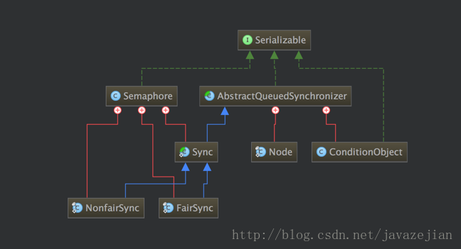

### 1. Semaphore信号量

信号量是一个共享锁，其核心方法是`aquire()`和`release()`两个方法，分别用于**获得一个许可**和**释放一个许可**。

信号量还有其他方法：

	//构造方法摘要
	//创建具有给定的许可数和非公平的公平设置的Semaphore。
	Semaphore(int permits) 

	//创建具有给定的许可数和给定的公平设置的Semaphore，true即为公平锁     
	Semaphore(int permits, boolean fair) 

	//从此信号量中获取许可，不可中断
	void acquireUninterruptibly() 

	//返回此信号量中当前可用的许可数。      
	int availablePermits() 

	//获取并返回立即可用的所有许可。    
	int drainPermits() 

	//返回一个 collection，包含可能等待获取的线程。       
	protected Collection<Thread> getQueuedThreads();

	//返回正在等待获取的线程的估计数目。
	int getQueueLength()

	//查询是否有线程正在等待获取。       
	boolean hasQueuedThreads() 

	//如果此信号量的公平设置为 true，则返回 true。          
	boolean isFair() 

	//仅在调用时此信号量存在一个可用许可，才从信号量获取许可。          
	boolean tryAcquire() 

	//如果在给定的等待时间内，此信号量有可用的许可并且当前线程未被中断，则从此信号量获取一个许可。        
	boolean tryAcquire(long timeout, TimeUnit unit) 

Semaphore的内部实现结构（同ReentrantLock是相同的）：

Semaphore需要在NonfairSync和FairSync中实现tryAquireShared()，而tryReleaseShared()直接使用父类Sync的实现。AQS只维护核心并发操作（维护同步队列、控制同步状态等），而加锁和解锁都交由子类去完成。

### 2. 多线程下的单例模式

单例模式可以掌握以下三种：双重检查锁的懒汉式、饿汉式以及静态内部类的延时加载式。分别如下：

* 双重检查锁：
	

	class InstanceA {
		private static volatile InstanceA instance = null;
		private InstanceA() {}

		public static InstanceA getInstance() {
			if(instance == null) {
				synchronized (InstanceA.class) {
					if(instance == null) {
						instance = new InstanceA();
					}
				}
			}
			return instance;
		}
	}

要注意加锁的位置，并且要**把instance变量设置为volatile**。

* 饿汉式：
	

	class InstanceB {
		private static InstanceB instance = new InstanceB();
		private InstanceB() {}
		
		public static InstanceB getInstance() {
			return instance;
		}
	}

饿汉式天生就是线程安全的，在`InstanceB.getInstance()`第一次被调用的时候，InstanceB被加载，在加载的过程中，虚拟机会保证只有一个线程对这个类进行加载，所以就保证了静态变量instance只有一份。

* **静态**内部类延时加载
	

	class InstanceC {

		private InstanceC() {}

    	private static class Inner {
        	public static final InstanceC INSTANCE = new InstanceC();
    	}

    	public static InstanceC getInstance() {
        	return Inner.INSTANCE;
    	}
	}

静态内部类不会持有外部类对象的引用，因为他是静态的，所以和一个外部类一样，但是它可以访问外部类的静态方法，在第一次使用到内部静态类的时候而不是第一次使用到外部类的时候进行加载，因此可以保证单例。