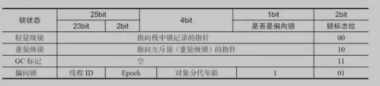
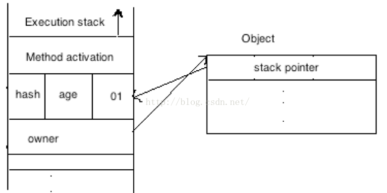

### 1. Semaphore信号量

信号量是一个共享锁，其核心方法是`aquire()`和`release()`两个方法，分别用于**获得一个许可**和**释放一个许可**。

信号量还有其他方法：

	//构造方法摘要
	//创建具有给定的许可数和非公平的公平设置的Semaphore。
	Semaphore(int permits) 

	//创建具有给定的许可数和给定的公平设置的Semaphore，true即为公平锁     
	Semaphore(int permits, boolean fair) 

	//从此信号量中获取许可，不可中断
	void acquireUninterruptibly() 

	//返回此信号量中当前可用的许可数。      
	int availablePermits() 

	//获取并返回立即可用的所有许可。    
	int drainPermits() 

	//返回一个 collection，包含可能等待获取的线程。       
	protected Collection<Thread> getQueuedThreads();

	//返回正在等待获取的线程的估计数目。
	int getQueueLength()

	//查询是否有线程正在等待获取。       
	boolean hasQueuedThreads() 

	//如果此信号量的公平设置为 true，则返回 true。          
	boolean isFair() 

	//仅在调用时此信号量存在一个可用许可，才从信号量获取许可。          
	boolean tryAcquire() 

	//如果在给定的等待时间内，此信号量有可用的许可并且当前线程未被中断，则从此信号量获取一个许可。        
	boolean tryAcquire(long timeout, TimeUnit unit) 

Semaphore的内部实现结构（同ReentrantLock是相同的）：

Semaphore需要在NonfairSync和FairSync中实现tryAquireShared()，而tryReleaseShared()直接使用父类Sync的实现。AQS只维护核心并发操作（维护同步队列、控制同步状态等），而加锁和解锁都交由子类去完成。

### 2. 多线程下的单例模式

单例模式可以掌握以下三种：双重检查锁的懒汉式、饿汉式以及静态内部类的延时加载式。分别如下：

* 双重检查锁：
	

	class InstanceA {
		private static volatile InstanceA instance = null;
		private InstanceA() {}

		public static InstanceA getInstance() {
			if(instance == null) {
				synchronized (InstanceA.class) {
					if(instance == null) {
						instance = new InstanceA();
					}
				}
			}
			return instance;
		}
	}

要注意加锁的位置，并且要**把instance变量设置为volatile**。

* 饿汉式：
	

	class InstanceB {
		private static InstanceB instance = new InstanceB();
		private InstanceB() {}
		
		public static InstanceB getInstance() {
			return instance;
		}
	}

饿汉式天生就是线程安全的，在`InstanceB.getInstance()`第一次被调用的时候，InstanceB被加载，在加载的过程中，虚拟机会保证只有一个线程对这个类进行加载，所以就保证了静态变量instance只有一份。

* **静态**内部类延时加载
	

	class InstanceC {

		private InstanceC() {}

    	private static class Inner {
        	public static final InstanceC INSTANCE = new InstanceC();
    	}

    	public static InstanceC getInstance() {
        	return Inner.INSTANCE;
    	}
	}

静态内部类不会持有外部类对象的引用，因为他是静态的，所以和一个外部类一样，但是它可以访问外部类的静态方法，在第一次使用到内部静态类的时候而不是第一次使用到外部类的时候进行加载，因此可以保证单例。

### 3. 内置锁的锁优化

主要参考了[这篇文章](http://www.importnew.com/21933.html)。

内置锁存放的位置是锁对象的对象头中的Mark Word。这个字段是实现**锁偏向**和**轻量级锁**的关键。对象头中主要有两部分的内容，一个是Mark Word，另一个是用于存储指向方法区对象类型数据的指针，如果是数组的话，还会有一个额外的部分用于存储数组长度。32位JVM中Mark Word的结构如下图所示：

Mark Word的状态变化如下图所示：

#### 3.1 锁偏向

如果一个线程获得了锁，那么这个锁会首先进入偏向模式，将Mark Word设为偏向状态，将本线程ID写入Mark Word。当这个线程再次请求锁的时候，只要对比Mark Word中的线程ID和自己是否相同，不需要在进行CAS操作。

**偏向锁的Mark Word会一直保持偏向锁的状态**。在其他线程尝试竞争偏向锁的时候，持有偏向锁的线程才会释放锁。偏向锁的撤销，需要等待全局安全点（在这个时间点上没有字节码正在执行），它会首先暂停拥有偏向锁的线程，然后检查持有偏向锁的线程是否活着，如果线程不处于活动状态，则将对象头设置成无锁状态，如果线程仍然活着，拥有偏向锁的栈会被执行，遍历偏向对象的锁记录，栈中的锁记录和对象头的Mark Word要么重新偏向于其他线程，要么恢复到无锁或者标记对象不适合作为偏向锁，最后唤醒暂停的线程。

这种模式适用于并发量非常小的情况。

#### 3.2 轻量级锁

如果偏向锁获取失败，虚拟机不会立刻挂起线程，而是启用轻量级锁。首先在线程栈中生成一个Mark Word的复制，称为Lock Record，然后将对象原来的Mark Word通过CAS操作进行修改，改为指向这个Lock Record的指针，并将2bit的所标志为置位00，来代表这个线程持有轻量级锁。

如果这个更新操作失败了，虚拟机首先会检查对象的Mark Word是否指向当前线程的栈帧，如果是，说明当前线程已经拥有了这个对象的锁，那就可以直接进入同步块继续执行，否则说明这个锁对象已经被其它线程抢占了。如果有两条以上的线程征用同一个锁，那轻量级锁就不再有效，要膨胀为重量级锁，锁标记的状态值变为“10”，Mark Word中存储的就是指向重量级锁（互斥量）的指针，后面等待锁的线程也要进入阻塞状态。

它的解锁过程也是通过CAS操作来进行的，如果对象的Mark Word仍然指向着线程的锁记录，那就用CAS操作把对象当前的Mark Word和线程中复制的Displaced Mark Word替换回来，如果替换成功，整个同步过程就完成了，如果替换失败，说明有其它线程尝试过获取该锁，那就要在释放锁的同时，唤醒被挂起的线程。

轻量级锁能提升程序同步性能的依据是“对于绝大部分的锁，在整个同步周期内都是不存在竞争的”，这是一个经验数据。如果没有竞争，轻量级锁使用CAS操作避免了使用互斥量的开销，但如果存在锁竞争，除了互斥量的开销外，还额外发生了CAS操作，因此在有竞争的情况下，轻量级锁会比传统的重量级锁更慢。

#### 3.3 自旋锁

线程的阻塞和唤醒需要CPU从用户态转为核心态，频繁的阻塞和唤醒对CPU来说是一件负担很重的工作。同时我们可以发现，很多对象锁的锁定状态只会持续很短的一段时间，例如整数的自加操作，在很短的时间内阻塞并唤醒线程显然不值得，为此引入了自旋锁。

所谓“自旋”，就是让线程去执行一个无意义的循环，循环结束后再去重新竞争锁，如果竞争不到继续循环，循环过程中线程会一直处于running状态，但是基于JVM的线程调度，会出让时间片，所以其他线程依旧有申请锁和释放锁的机会。

自旋锁省去了阻塞锁的时间空间（队列的维护等）开销，但是长时间自旋就变成了“忙式等待”，忙式等待显然还不如阻塞锁。所以自旋的次数一般控制在一个范围内，例如10,100等，在超出这个范围后，自旋锁会升级为阻塞锁。

#### 3.4 锁升级的过程

### 4. 死锁的四个条件

1. 互斥条件：一个资源每次只能被一个线程使用。
2. 请求与保持条件：一个线程因请求资源而阻塞时，对已获得的资源保持不放。
3. 不剥夺条件：线程已获得的资源，在未使用完之前，不能强行剥夺。
4. 循环等待条件：若干线程之间形成一种头尾相接的循环等待资源关系。