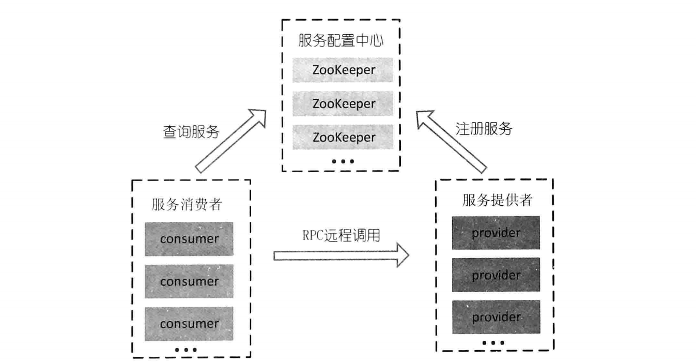

# 分布式系统相关知识点

## 1. 服务路由和负载均衡架构

对于负载较高的服务器来说，提供服务的往往是一个集群。在请求到来的时候，负载均衡程序将从服务对应的列表中通过相应的负载均衡算法以及规则，选取一台服务器进行访问，这个过程就是**负载均衡**。

通常一个SOA架构的系统结构如图所示：

首先我们需要一个能够动态注册和获取服务信息的地方，来统一管理服务名称和其对应的服务器列表，也就是**服务配置中心**。下图是一个基于ZooKeeper的路由和负载均衡架构：

服务注册：服务提供者在启动的时候先想服务配置中心进行服务注册，配置中心将其服务名称以及地址保存起来。

服务调用：服务消费者在请求服务的时候，需要通过服务配置中心获得服务的机器列表，通过相应的负载均衡算法，选取一台服务器进行服务调用。

服务移除：当一台提供服务的服务器下线或者宕机的时候，服务配置中心应该动态的从机器列表中移除相应的机器，并**通知相应服务消费者**。

在这种架构中，避免了使用中心化的负载均衡设备导致一旦负载均衡设备单点故障会导致整个服务不可用的情况。且根据上述描述，涉及到服务配置中心的步骤只有**服务提供者启动的时候**、**服务消费第一次请求服务的时候**和**服务提供者下线的时候**，这也大大减小了服务配置中心的压力。

## 2. 负载均衡算法

在服务消费者从服务配置中心那获得了服务的机器列表之后，需要根据一定的负载均衡算法从列表中选取一台服务器进行调用，常用的负载均衡算法有一下几种：

1. 轮询法(Round Robin)：就是按照顺序将请求轮流分配到机器列表中的机器上。另外轮询法还有一个变种就是加权轮询法，很好理解。轮询法的优点是可以将请求公平的分配到每一台服务器，但是由于需要保证轮询的有序，所以需要加锁，事的同一时间内只有一个线程可以改变指向服务器的指针，这妞导致了请求吞吐量的下降；
2. 随机法：这种方法是使用随机函数从列表中选取一台服务器进行调用，根据统计学原理，调用的次数足够多的情况下，负载也是近乎均匀分配的，另外，这种方法的开销比轮询法要小，因为不需要进行加锁处理；同时，随机法也有一个变种，就是加权随机法；
3. 原地址哈希法：这种方式是将请求原地址进行哈希计算，计算的结果根据服务机器列表中的机器数量进行取模，选出一台服务器进行调用，这种调用方式可以将同一台服务消费者的请求全部映射到一台服务提供者机器上；
4. 最小连接数法：有不同配置的不同服务器的任务处理能力不同，因此在同一时间内就有的服务器连接数多，有的服务器连接数少，这种方法可以使得各个机器能够尽量高效率的使用其资源，但是实现较为复杂；
5. 一致性哈希：见[这里](https://www.cnblogs.com/moonandstar08/p/5405991.html)。
