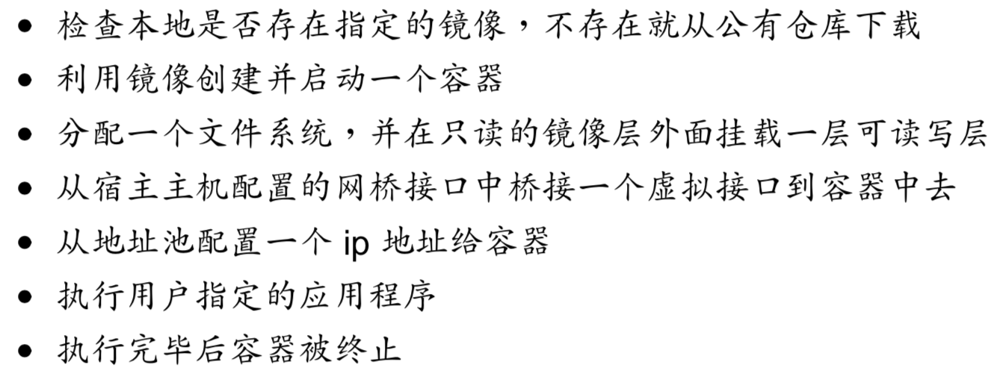

# Docker 基本知识笔记

## 1. Docker 的基本要素

Docker 有三大基本要素：镜像（Image）/容器（Container）/仓库（Registry）。

### 1.1 Docker 镜像

Docker 的镜像就相当于一个 `root` 文件系统，除了提供容器运行的时候提供所需的程序/库/资源和配置文件外，还包含了一些为运行时准备的配置参数（如匿名卷/环境变量和用户等）。镜像内不包含任何动态数据，其内容在镜像被构建之后就不会被改变。

**分层存储**

Docker 在构建的时候，前一层的存储是后一层的基础，任何一层上的改变只会影响到这一层，而不会影响到上一层。

### 1.2 Docker 容器

容器和镜像的关系就像是 Java 中对象和类的关系。

容器的本质是一个进程，但它与直接运行在宿主的进程不同，每个镜像都运行在各自独立的[命名空间](https://en.wikipedia.org/wiki/Linux_namespaces)中，这一点为容器提供了良好的隔离性。

容器存储层的生命周期与容器的生命周期是相同的，容器销毁的同时，容器的存储层也会被销毁。任何保存在容器存储层的信息也都不会保留。

### 1.3 Registry 仓库

略过。

## 2. 镜像的使用

### 2.1 获取镜像

官方的 Docker Hub 上有大量的高质量官方镜像可以使用，所用到的命令：

    docker pull [选项] [仓库地址：端口号] 仓库名：标签

> 这里的仓库名通常是由两端构成： <用户名>/软件名，对于 Docker Hub 来说，如果用户名不填的话就是默认的 libaray 用户，也就是官方镜像。而标签的默认值是 `latest`。

比如说我想下载一个 Ubuntu 的镜像，就可以使用：

    docker pull ubuntu:16.04

在下载的过程中，我们可以看到会有好几个 `pull complete` 的提示出现，这就是我们之前说到的分层存储的体现，根据依赖的镜像层层构建，并会显示出每一层镜像的 ID 和 sha256 的值。这两个值是会改变的，因为镜像一直在维护。

### 2.2 基本操作

**运行**

使用 `docker run [选项] 镜像名` 命令运行。

在运行的时候可以通过 `--name` 选项来制定运行的容器的名称，`-p <外部端口>:<docker 端口>` 参数可以用来进行端口映射。

**查看镜像**

使用 `docker images ls [镜像名:<标签>]` 可以列出所有[/部分]已经下载下来的镜像，可以看到 `仓库名`/`标签`/`镜像 ID`/`创建时间`以及`占用空间`。

这种方式只能看到顶层的镜像，但是中间镜像是无法看到的。如果想看中间层的镜像，可以加一个 `-a` 选项。

其中，镜像 ID 是一个镜像的唯一标识。

而镜像体积比我们在 Docker Hub 上看到的要大，因为 Docker Hub 上显示的是压缩过后的体积。但是本地显示的是解压之后的体积。要注意，本地看到的镜像体积的总和不一定是所有镜像的体积加起来，因为分层存储的存在，很多镜像是可以复用的，因此实际体积会小很多。

想查看所有镜像的实际体积可以使用一下指令：

    docker system df

**虚悬镜像**

有时候我们可以看到镜像列表中有的镜像光有体积，但是没有镜像名等信息，这种情况是由于前后两次 `docker pull` 相同版本的相同镜像，而随着官方的维护，旧的镜像已经被废除，从而导致镜像名转移到了新 pull 下来的镜像上，而以前的镜像就变成了没有存在价值的 **虚悬镜像** 。可以使用一下指令查看这种镜像：

    docker images ls -f dangling=true

对于这种镜像，可以使用 `docker image prune` 来删除。

**删除镜像**

可以使用如下指令删除镜像：

    docker images rm <镜像>

这里的镜像有很多种表示方式：镜像名/镜像 ID/镜像摘要。

可以通过 `docker images ls --digests` 来看到镜像的摘要。

> 有一点需要注意，使用了 rm 指令之后，相应的镜像不一定会在物理层面被删除，可能只是删除了指向这个镜像的一个标签，但是还有可能有其他标签指向这个镜像，或是有上层的镜像依赖于这个镜像。只有当这个镜像已经没有标签，且没有上层镜像依赖于这个镜像，且这个镜像没有相应的容器在运行的时候，这个镜像才会被真正删除。

同时可以使用 ls 指令配合 -p 参数实现删除：

    docker images rm $(docker images ls -q redis)
    docker images rm $(docker images ls -q -f before=mongo:3.2)

**交互方式进入容器**

可以通过一下方式进入容器的交互模式，可以使用容器中的 bash 进行操作：

    docker exec -it <容器> bash

其中，<容器> 可以填容器 ID 也可以填运行容器的时候指定的容器名。

如果我们在容器中改动了容器存储层中的文件，此时镜像是不会改变的。这个时候可以用如下指令查看我们对容器的改动：

    docker diff <容器>

对于容器的修改，我们可以通过如下命令将修改后的容器打成镜像保存起来：

    docker commit [选项] <容器 ID 或容器名> [<仓库名>:[标签]]

但是由于管理不方便，并不推荐使用这种方法来制作镜像。

## 3. Docker 的定制

Docker 的定制实际上就是对每一层的 Docker 的配置以及文件进行修改。而如果我们把这些修改写到一个脚本中，我们即可以实现对镜像的定制，这个脚本就是我们这节要介绍的 Dockerfile 。

首先，在我们定制镜像的时候，一定是需要一个镜像作为基础的，所以在 Dockerfile 的一开始，我们就需要指定一个基础镜像，指定镜像可以使用 `FROM` 指令：

    FROM <镜像名>[:<标签>]

当然，你也可以将镜像名设定为 `scratch` 来表明你要以空白的镜像为基础进行后面的操作。这在一些只通过静态编译就能完成的程序，比如 etcd 等，在运行时并不需要操作系统提供支持。

### 3.1 RUN 命令

RUN 命令后面可以跟一条 SHELL 指令，而 Dockerfile中的每一条指令都会新建一层，在新的一层上执行指令，执行完成后 commit 这一条指令的修改，构成新的镜像。

**而为每条 SHELL 指令都开一个 RUN 是很不划算的，由于 Union FS 支持的最大层数是 127， AUFS 是 42，所以层数是很宝贵的资源。**

通过 `\` 指令换行以及 `&&` 分割多条指令，将多条指令放在同一个 RUN 指令后面，实现多条指令的执行，才是一种可用的方法。可以在这条指令中执行编译，编译完成后清理不需要的文件是一种比较好的实践，可以避免生成臃肿的镜像文件。

### 3.2 构建镜像

可以使用：

    docker build [-t <镜像名>] <上下文路径（Dockerfile）>

构建镜像。

**上下文路径**

这里就涉及到了 Docker 的运行机制：

**我们装的 Docker 分为两部分：服务端和客户端。客户端通过调用服务端的 REST API 进行 Docker 的操作。我们在命令行中运行的 `docker xxx` 命令其实使用的是客户端命令，而真正执行 docker 操作的是作为服务端守护进程的 Docker 运行引擎。**

我们在 build 指令中指定的上下文路径会在指令的执行过程中，打成一个包发到服务端，然后服务端在依照 Dockerfile 中的指令进行相应的操作，这也就是为什么 `COPY ../file /file` 无法运行的原因，因为它已经超出了上下文路径的范围，所以没有被发送到 Docker 的服务端。

实际上 Dockerfile 是可以改变文件名和路径的，但是需要在 build 指令中使用 `-f` 参数指明新的 Dockerfile 的路径以及文件名。

**其他方式构建镜像**

使用 Git Repo/tar 包以及网络传输的方式都可以构建 Docker 镜像。这里不再细说。

### 3.3 其他指令

常用的指令除了 RUN 之外还有很多：

* COPY：将上下文中的文件考入到 Docker 中；
* ADD：大致和 COPY 相同，但是他的源地址可以是一个远程地址，且如果源文件是一个 tar 的压缩包的话，它还可以自动解压；
* CMD：用来指定 Docker 容器在启动时（就是在执行 `docker run` 的时候默认会执行的容器中的指令，而这个指令在执行 `docker run` 后面显示指定而覆盖的）执行的程序；

> 这里需要强调一下，容器不是虚拟机，容器的存在意义是执行前台应用，如果前台应用被停止，这个容器就失去了存在的意义，所以我们想要 Docker 容器运行的程序都要在前台，而不要运行在后台。比如我们如果让启动程序是 `service nginx start` 的话容器就会马上退出。

* ENTRYPOINT：和 CMD 差不多，但是它可以作为 `docker run` 的一个切入点，可以将 CMD 的内容作为参数传递给 ENTRYPOINT 脚本并执行。
* ENV：设置环境变量；
* ARG：同样是设置环境变量，但是在容器运行的时候不会存在；
* VOLUME：挂载匿名卷；
* EXPOSE：声明开放的端口，但是不会真正开放这个端口，只是做一个标记，但是如果在 run 的时候使用了 `-P` 参数的话会自动开启这个端口；
* WORKDIR：改变下一层容器的工作路径（记得吗，每一个 RUN 都是在一层新的容器中进行的，所以如果在上一层容器中使用了 cd ，其效果是不会带到下一层的容器的，这个时候就要使用 WORKDIR 来调整工作路径）；
* USER：指定当前用户，其思想和 WORKDIR 一样；
* HEALTHCHECK：用来指定判断容器是否正常运行的方法；

## 4. 容器操作

**新建并启动容器**

使用 `docker run -it <镜像名> bash` 可以获得一个容器的伪终端，进入交互模式。

同时可以通过参数 `-d` 来让容器运行在后台，且返回其容器的 ID。后台 Docker 的输出结果可以通过 `docker container logs <容器>` 来进行查看。

在运行 `docker run` 的时候，Docker 在后台进行的标准操作如下：

**运行已经停止的容器**

使用 `docker container start` 来启动。

而使用 `docker container restart` 可以用来重启容器。

**停止容器**

使用 `docker container stop` 。

**进入容器**

进入容器有两种方法：attach 和 exec。比较推荐使用 exec ，因为在 exec 的时候使用 exit 不会导致容器的退出。

    docker exec -it <容器> bash
    docker attach <容器>
