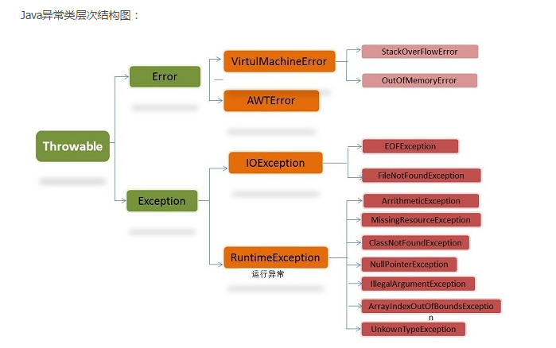

# Java基础知识

## 1. 异常的分类

Java中的异常继承体系如下图所示（只列出了部分异常）：

错误：Error类以及他的子类的实例，代表了JVM本身的错误。错误不能被程序员通过代码处理，Error很少出现。因此，程序员应该关注Exception为父类的分支下的各种异常类。

异常：Exception以及他的子类，代表程序运行时发送的各种不期望发生的事件。可以被Java异常处理机制使用，是异常处理的核心。

异常又分为**受检查异常**和**非受检查异常**。

非检查异常（unckecked exception）：Error 和 RuntimeException 以及他们的子类。javac在编译时，不会提示和发现这样的异常，不要求在程序处理这些异常。所以如果愿意，我们可以编写代码处理（使用try...catch...finally）这样的异常，也可以不处理。对于这些异常，我们应该修正代码，而不是去通过异常处理器处理 。这样的异常发生的原因多半是代码写的有问题。

检查异常（checked exception）：除了Error 和 RuntimeException的其它异常。javac强制要求程序员为这样的异常做预备处理工作（使用try...catch...finally或者throws）。在方法中要么用try-catch语句捕获它并处理，要么用throws子句声明抛出它，否则编译不会通过。这样的异常一般是由程序的运行环境导致的。因为程序可能被运行在各种未知的环境下，而程序员无法干预用户如何使用他编写的程序，于是程序员就应该为这样的异常时刻准备着。

常见的非受检异常：ArithmeticException、ArrayIndexOutOfBoundsException、ClassCastException、IllegalArgumentException、NullPointerException、NumberFormatException等。

常见的受检异常：ClassNotFoundException、InterruptedException、NoSuchFieldException、NoSuchMethodException、FileNotFoundException

对于覆盖方法来说，子类方法的异常说明里只能比父类方法的异常说明更少。

## 2. finally语句

注意，finally语句中的语句一定会被执行。

如果finally块中有return，则返回值都以finally块中的为准，而不会执行try块或者catch块中的return语句。

如果在finally语句中也抛出异常，则可能导致try块中的异常被忽略。

如果finally块之前的try块中含有return语句，那么finally块中的语句在执行的时候会被插到return的紧跟前（这个时候return后跟的表达式已经执行完了）。

## 3. 小知识

1. Java中使用的字节序是大端法，和网络字节序相同。
